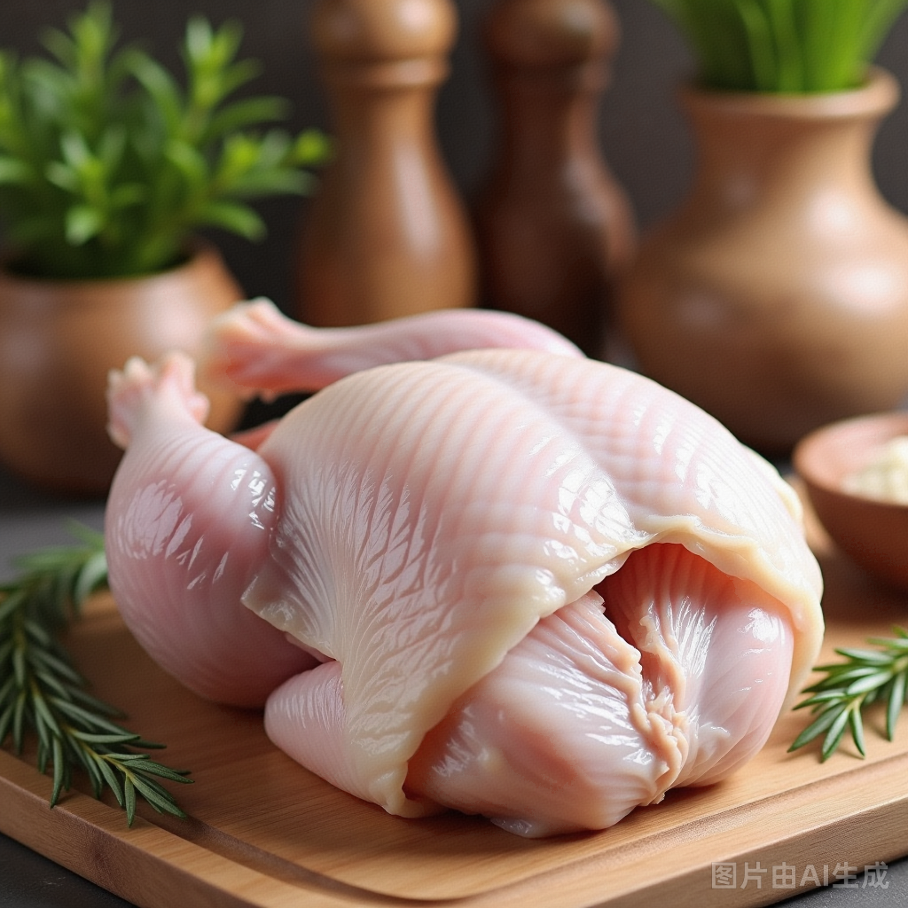
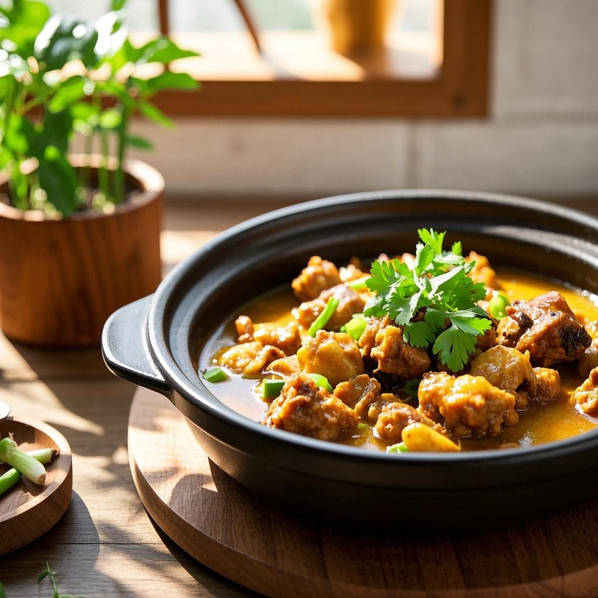

# 食物数据
# 提示词 
### 生成菜品  [ 食材名称 ]  的图片， 背景是温馨的厨房环境，配有清新绿植和自然原木色的装饰，营造出家常烹饪的氛围。整个画面采用微距拍摄，细节清晰可见，光线柔和自然，使食物看起来更加诱人。
## 红烧肉
- 混元: 19.92
- 轻量: 4.67

**图片名称: 红烧肉.png**  

**图片名称: 红烧肉_轻量.jpg**  

**图片名称: 红烧肉_豆包.jpg**  

## 白切鸡
- 混元: 17.71
- 轻量: 4.03

**图片名称: 白切鸡.png**  

**图片名称: 白切鸡_轻量.jpg**  

**图片名称: 白切鸡_豆包.jpg**  

## 宫保鸡丁
- 混元: 18.21
- 轻量: 3.88

**图片名称: 宫爆鸡丁.png**  

**图片名称: 宫保鸡丁_轻量.jpg**  

**图片名称: 宫保鸡丁_豆包.jpg**  

## 黄焖鸡
- 混元: 18.13
- 轻量: 4.01

**图片名称: 黄焖鸡.png**  

**图片名称: 黄焖鸡_轻量.jpg**  

**图片名称: 黄焖鸡_豆包.jpg**  

