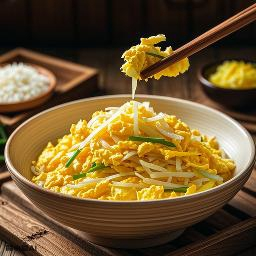
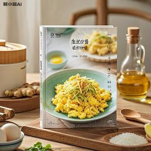
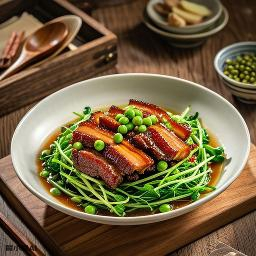
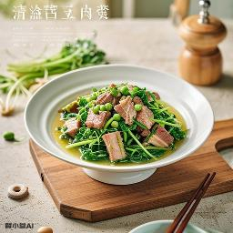
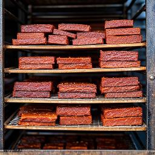
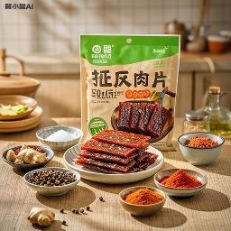
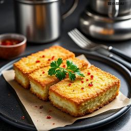
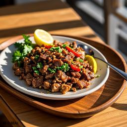
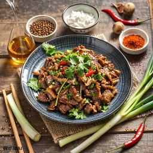
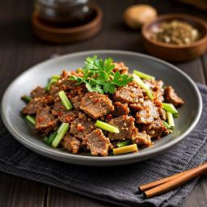

| 'prompt_type' |  'prompt' |  'req_key' |  'model' |  'conf' | 'width' |  'height' |  'pre_llm' |  'image_urls' | 'image_paths' |  'llm_result' |  'status' |  'time_elapsed' |
|---|---|---|---|---|---|---|---|---|---|---|---|---|
| name_only | 姜丝炒蛋 | high_aes_general_v21_L | general_v2.1_L | general_v20_9B_pe | 256 | 256 | True |  | create_data/general_v2.1_L/dde84f02-348e-4402-8749-4f28f863a5f0.png | 美食摄影风格，展现食物的诱人质感；画面中心是一盘金黄色的姜丝炒蛋，鸡蛋被切成细丝状与生姜一起炒制，炒蛋表面金黄酥脆，放置在白色瓷盘中，瓷盘置于木质托盘上，背景是模糊的厨房环境；俯视拍摄，阳光透过窗户照射形成光斑效果，暖色调的橙黄色系主导，色彩饱和度高，画面明亮且富有食欲感；通过近景构图和浅景深技术使炒蛋细节清晰突出，背景虚化，强调了菜品的质感和色泽。 | 10000 | 4.817961347s |
| name_only | 姜丝炒蛋 | high_aes_general_v21_L | general_v2.1_L | general_v20_9B_pe | 256 | 256 | False |  | create_data/general_v2.1_L/717456b3-ad96-4919-a587-028787cf981c.png | nan | 10000 | 3.306896131s |
| name_only | 姜丝炒蛋 | high_aes_general_v21_L | general_v2.1_L | general_v20_9B_rephraser | 256 | 256 | True |  | create_data/general_v2.1_L/363fc280-b1c0-432b-bb49-0ae3ffd5ca6e.png | 现代美食摄影风格，明亮的厨房灯光。一盘姜丝炒蛋正冒着热气；鸡蛋金黄且均匀地散布着细碎的姜丝。炒锅在火焰上微微摇晃，油烟机上方的灯光照亮了整个烹饪过程。背景是简洁的厨房台面和一些调料瓶，强调了食物的新鲜感和家常风味。光线柔和而集中，特写镜头捕捉细节，展现烹饪的艺术与美味。 | 10000 | 4.36336572s |
| name_only | 姜丝炒蛋 | high_aes_general_v21_L | general_v2.1_L | general_v20_9B_rephraser | 256 | 256 | False |  | create_data/general_v2.1_L/ee29cc8b-0661-4925-9f6e-24a45e50eea8.png | nan | 10000 | 3.31316104s |
| name_only | 姜丝炒蛋 | high_aes_general_v20_L | general_v2.0_L | general_v20_9B_pe | 256 | 256 | True |  | create_data/general_v2.0_L/ed2ce49c-06bc-4baa-9264-e25ecfead9af.png | 美食摄影风格，以暖色调和柔和光线营造温馨诱人的氛围；姜丝炒蛋这道菜品呈现金黄色的鸡蛋中散布着细长的姜丝，被摆放在精美黑色盘子里，增添了几分优雅感；在自然光的照射下，食物的质感得以突出；餐桌上还有其他精致的佳肴，拍摄于一个有植物的厨房环境，从侧面进入的自然光形成辉光效果，背景模糊使主体更显突出。俯视角度捕捉，展现了细腻的食物纹理和色彩搭配；整个画面色彩和谐，光影交织下的姜丝炒蛋显得格外诱人； | 10000 | 9.841946534s |
| name_only | 姜丝炒蛋 | high_aes_general_v20_L | general_v2.0_L | general_v20_9B_pe | 256 | 256 | False |  | create_data/general_v2.0_L/3460341c-da7d-47dc-8e2e-03c4b33221b4.png | nan | 10000 | 7.859233127s |
| name_only | 姜丝炒蛋 | high_aes_general_v20_L | general_v2.0_L | general_v20_9B_rephraser | 256 | 256 | True |  | create_data/general_v2.0_L/140cfaeb-d380-43a6-928f-43c6cbb9a528.png | 美食摄影风格，一道姜丝炒蛋。嫩滑的鸡蛋与细长的姜丝在锅中翻炒，呈现出金黄色和淡黄色的诱人色泽。整个场景设置在厨房内，光线从侧面投射过来，营造出一种温馨而诱人的氛围。画面以俯视角度展示，背景则被巧妙地虚化处理，使得观者的视线完全聚焦在这道色彩鲜艳、令人垂涎欲滴的菜肴上。 | 10000 | 8.878598128s |
| name_only | 姜丝炒蛋 | high_aes_general_v20_L | general_v2.0_L | general_v20_9B_rephraser | 256 | 256 | False |  | create_data/general_v2.0_L/6b55b910-cda1-4c55-a457-ad9b289139b8.png | nan | 10000 | 6.487892355s |
| name_only | 姜丝炒蛋 | high_aes_general_v20 | general_v2.0 | general_v20_9B_pe | 256 | 256 | True | No Image | nan | nan | Error occurred | nan |
| name_only | 姜丝炒蛋 | high_aes_general_v20 | general_v2.0 | general_v20_9B_pe | 256 | 256 | False | No Image | nan | nan | Error occurred | nan |
| name_only | 姜丝炒蛋 | high_aes_general_v20 | general_v2.0 | general_v20_9B_rephraser | 256 | 256 | True | No Image | nan | nan | Error occurred | nan |
| name_only | 姜丝炒蛋 | high_aes_general_v20 | general_v2.0 | general_v20_9B_rephraser | 256 | 256 | False |  | create_data/general_v2.0/07b5a7da-06ba-44af-9561-9ad29e04b349.png | nan | 10000 | 3.835177256s |
| name_only | 姜丝炒蛋 | high_aes_general_v14 | general_v1.4 | general_v20_9B_pe | 256 | 256 | True | No Image | nan | nan | Error occurred | nan |
| name_only | 姜丝炒蛋 | high_aes_general_v14 | general_v1.4 | general_v20_9B_pe | 256 | 256 | False | No Image | nan | nan | Error occurred | nan |
| name_only | 姜丝炒蛋 | high_aes_general_v14 | general_v1.4 | general_v20_9B_rephraser | 256 | 256 | True |  | create_data/general_v1.4/ed041515-6d36-4bf1-8cc3-176a8d4faeaa.png | nan | 10000 | 9.885889355s |
| name_only | 姜丝炒蛋 | high_aes_general_v14 | general_v1.4 | general_v20_9B_rephraser | 256 | 256 | False |  | create_data/general_v1.4/b602bcd5-7cf3-4173-bbca-b4eab1d64f50.png | nan | 10000 | 10.850210445s |
| name_ingredients_accessories_seasoning | 姜丝炒蛋, 鸡蛋150克、, 姜50克、, 植物油15克、江米酒10克、盐3克、各适量 | high_aes_general_v21_L | general_v2.1_L | general_v20_9B_pe | 256 | 256 | True |  | create_data/general_v2.1_L/18c2b3d4-18c4-4699-91e7-d89f73fa3175.png | 美食摄影风格，姜丝炒蛋主题，俯视视角，金黄色蛋液与细姜丝翻炒，展示食材和调料的诱人色彩；背景为厨房环境，包含鸡蛋150克、姜50克、植物油15克、江米酒10克、盐3克等配料，美食摄影风格，暖色调，浅景深聚焦于炒锅内的细节，自然光侧照产生光斑效果，画面生动活泼。 | 10000 | 5.13551124s |
| name_ingredients_accessories_seasoning | 姜丝炒蛋, 鸡蛋150克、, 姜50克、, 植物油15克、江米酒10克、盐3克、各适量 | high_aes_general_v21_L | general_v2.1_L | general_v20_9B_pe | 256 | 256 | False |  | create_data/general_v2.1_L/2ecb92c6-9f91-41b6-8dc9-de407cdadc23.png | nan | 10000 | 3.122994912s |
| name_ingredients_accessories_seasoning | 姜丝炒蛋, 鸡蛋150克、, 姜50克、, 植物油15克、江米酒10克、盐3克、各适量 | high_aes_general_v21_L | general_v2.1_L | general_v20_9B_rephraser | 256 | 256 | True |  | create_data/general_v2.1_L/36b69e36-3577-4190-83fe-bac50f36dfd5.png | 美食摄影风格，一份姜丝炒蛋。这道菜由150克鸡蛋和50克姜丝组成，使用了15克植物油、10克江米酒和3克盐进行调味。鸡蛋被炒得金黄蓬松，姜丝则保持了其特有的翠绿色泽。背景是一个现代厨房，厨房台面干净整洁，光线柔和。俯视视角，近景，顶光光影。 | 10000 | 4.365843765s |
| name_ingredients_accessories_seasoning | 姜丝炒蛋, 鸡蛋150克、, 姜50克、, 植物油15克、江米酒10克、盐3克、各适量 | high_aes_general_v21_L | general_v2.1_L | general_v20_9B_rephraser | 256 | 256 | False |  | create_data/general_v2.1_L/ea99248c-2d5f-4923-b198-1eb29f106794.png | nan | 10000 | 3.551067838s |
| name_ingredients_accessories_seasoning | 姜丝炒蛋, 鸡蛋150克、, 姜50克、, 植物油15克、江米酒10克、盐3克、各适量 | high_aes_general_v20_L | general_v2.0_L | general_v20_9B_pe | 256 | 256 | True |  | create_data/general_v2.0_L/1f6afa17-089d-4d56-a864-13fd65e61dba.png | 美食摄影风格，展现食物的质感和色彩美；姜丝炒蛋，鸡蛋150克，鲜嫩的姜丝50克，15克植物油，10克江米酒，3克盐。炒蛋盛在碗中，上面撒着葱花，特写镜头下，主体位于画面中心，背景模糊，突出食物细节；厨房环境中，自然光从侧面照射，暖色调搭配低饱和度色彩，增添温馨氛围；静物摄影风格，拍摄角度俯视，光线柔和，使得食物质感显得格外诱人。 | 10000 | 9.582795606s |
| name_ingredients_accessories_seasoning | 姜丝炒蛋, 鸡蛋150克、, 姜50克、, 植物油15克、江米酒10克、盐3克、各适量 | high_aes_general_v20_L | general_v2.0_L | general_v20_9B_pe | 256 | 256 | False |  | create_data/general_v2.0_L/5200490f-e6a2-4308-b6d6-716b27505f6f.png | nan | 10000 | 6.287194803s |
| name_ingredients_accessories_seasoning | 姜丝炒蛋, 鸡蛋150克、, 姜50克、, 植物油15克、江米酒10克、盐3克、各适量 | high_aes_general_v20_L | general_v2.0_L | general_v20_9B_rephraser | 256 | 256 | True |  | create_data/general_v2.0_L/6524c446-bc03-4aff-a20a-b678f036bce8.png | 美食摄影风格，一道姜丝炒蛋。画面中，150克的鸡蛋和50克的新鲜姜丝在15克植物油的烹调下，呈现出金黄色的诱人色泽。最后，淋上10克江米酒和3克盐，使得菜肴更加美味。整个场景设置在厨房的木质餐桌上，光线柔和地从窗户照进来，营造出温馨舒适的氛围。这是一幅色彩鲜明且细节丰富的图像，完美地展示了食物的质感和烹饪过程中的细微变化。 | 10000 | 8.735033303s |
| name_ingredients_accessories_seasoning | 姜丝炒蛋, 鸡蛋150克、, 姜50克、, 植物油15克、江米酒10克、盐3克、各适量 | high_aes_general_v20_L | general_v2.0_L | general_v20_9B_rephraser | 256 | 256 | False |  | create_data/general_v2.0_L/a2289067-2d11-4a16-9946-a51118e02c0a.png | nan | 10000 | 6.629625038s |
| name_ingredients_accessories_seasoning | 姜丝炒蛋, 鸡蛋150克、, 姜50克、, 植物油15克、江米酒10克、盐3克、各适量 | high_aes_general_v20 | general_v2.0 | general_v20_9B_pe | 256 | 256 | True | No Image | nan | nan | Error occurred | nan |
| name_ingredients_accessories_seasoning | 姜丝炒蛋, 鸡蛋150克、, 姜50克、, 植物油15克、江米酒10克、盐3克、各适量 | high_aes_general_v20 | general_v2.0 | general_v20_9B_pe | 256 | 256 | False | No Image | nan | nan | Error occurred | nan |
| name_ingredients_accessories_seasoning | 姜丝炒蛋, 鸡蛋150克、, 姜50克、, 植物油15克、江米酒10克、盐3克、各适量 | high_aes_general_v20 | general_v2.0 | general_v20_9B_rephraser | 256 | 256 | True | No Image | nan | nan | Error occurred | nan |
| name_ingredients_accessories_seasoning | 姜丝炒蛋, 鸡蛋150克、, 姜50克、, 植物油15克、江米酒10克、盐3克、各适量 | high_aes_general_v20 | general_v2.0 | general_v20_9B_rephraser | 256 | 256 | False | No Image | nan | nan | Error occurred | nan |
| name_ingredients_accessories_seasoning | 姜丝炒蛋, 鸡蛋150克、, 姜50克、, 植物油15克、江米酒10克、盐3克、各适量 | high_aes_general_v14 | general_v1.4 | general_v20_9B_pe | 256 | 256 | True | No Image | nan | nan | Error occurred | nan |
| name_ingredients_accessories_seasoning | 姜丝炒蛋, 鸡蛋150克、, 姜50克、, 植物油15克、江米酒10克、盐3克、各适量 | high_aes_general_v14 | general_v1.4 | general_v20_9B_pe | 256 | 256 | False | No Image | nan | nan | Error occurred | nan |
| name_ingredients_accessories_seasoning | 姜丝炒蛋, 鸡蛋150克、, 姜50克、, 植物油15克、江米酒10克、盐3克、各适量 | high_aes_general_v14 | general_v1.4 | general_v20_9B_rephraser | 256 | 256 | True |  | create_data/general_v1.4/247d9689-9cdc-47df-a797-5d6f6f85903a.png | nan | 10000 | 10.604170237s |
| name_ingredients_accessories_seasoning | 姜丝炒蛋, 鸡蛋150克、, 姜50克、, 植物油15克、江米酒10克、盐3克、各适量 | high_aes_general_v14 | general_v1.4 | general_v20_9B_rephraser | 256 | 256 | False |  | create_data/general_v1.4/8cc5d5cd-f7e3-4c86-8d72-562217ec86d0.png | nan | 10000 | 8.905645567s |
| name_method | 姜丝炒蛋, 1.将鸡蛋磕入碗内，加少许精盐打散；2.鲜姜去皮洗净，切成细丝；3.炒锅注油烧热，下入姜丝炒出香味，倒入蛋液翻炒，加入江米酒，小火5分钟即可。 | high_aes_general_v21_L | general_v2.1_L | general_v20_9B_pe | 256 | 256 | True |  | create_data/general_v2.1_L/418cb650-47ef-4314-aa3f-34e16880dc3a.png | 美食摄影风格，暖色调，俯视视角，姜丝炒蛋的制作过程，画面中心展示了一个装有鸡蛋液的碗，旁边放着切好的姜丝，锅里正在烹调，鸡蛋液与姜丝混合翻炒，散发出香气，加入江米酒，小火5分钟即可。背景是厨房的操作台，周围摆放着食材和调料，阳光透过窗户照射进来，光影斑驳；纪实摄影风格，近景拍摄，背景虚化，色彩鲜艳，质感细腻。
 | 10000 | 4.655947526s |
| name_method | 姜丝炒蛋, 1.将鸡蛋磕入碗内，加少许精盐打散；2.鲜姜去皮洗净，切成细丝；3.炒锅注油烧热，下入姜丝炒出香味，倒入蛋液翻炒，加入江米酒，小火5分钟即可。 | high_aes_general_v21_L | general_v2.1_L | general_v20_9B_pe | 256 | 256 | False |  | create_data/general_v2.1_L/4002faec-201f-4d60-8eed-8aa465f9a967.png | nan | 10000 | 3.478673417s |
| name_method | 姜丝炒蛋, 1.将鸡蛋磕入碗内，加少许精盐打散；2.鲜姜去皮洗净，切成细丝；3.炒锅注油烧热，下入姜丝炒出香味，倒入蛋液翻炒，加入江米酒，小火5分钟即可。 | high_aes_general_v21_L | general_v2.1_L | general_v20_9B_rephraser | 256 | 256 | True |  | create_data/general_v2.1_L/9c57b438-be77-4863-9406-03ebcc7a8611.png | 美食摄影风格，一份姜丝炒蛋的烹饪过程。首先，将鸡蛋打入碗中，加入少许精盐搅拌均匀；接着，新鲜的生姜去皮洗净后切丝备用。然后，在炒锅中加油烧热，放入姜丝炒香，倒入蛋液快速翻炒，最后加入江米酒，用小火慢炖5分钟。整个场景设置在一个明亮且简洁的厨房内，背景是淡雅的木质橱柜和干净的白色台面，营造出温馨舒适的烹饪氛围。画面以高饱和度的色彩展现食材的新鲜感，通过浅景深技术使焦点集中在炒锅中的姜丝炒蛋上，强调了烹饪过程中的细节与质感。 | 10000 | 4.962150815s |
| name_method | 姜丝炒蛋, 1.将鸡蛋磕入碗内，加少许精盐打散；2.鲜姜去皮洗净，切成细丝；3.炒锅注油烧热，下入姜丝炒出香味，倒入蛋液翻炒，加入江米酒，小火5分钟即可。 | high_aes_general_v21_L | general_v2.1_L | general_v20_9B_rephraser | 256 | 256 | False |  | create_data/general_v2.1_L/62198b35-167a-4c56-ae68-0e8880fd941e.png | nan | 10000 | 3.371156935s |
| name_method | 姜丝炒蛋, 1.将鸡蛋磕入碗内，加少许精盐打散；2.鲜姜去皮洗净，切成细丝；3.炒锅注油烧热，下入姜丝炒出香味，倒入蛋液翻炒，加入江米酒，小火5分钟即可。 | high_aes_general_v20_L | general_v2.0_L | general_v20_9B_pe | 256 | 256 | True |  | create_data/general_v2.0_L/169a3bdc-8054-4c3f-9d51-72a2332e3e9e.png | 美食摄影风格，画面中一碗新鲜的姜丝炒蛋，碗里是打好散的鸡蛋，旁边有切好的姜丝，背景是一桌饭菜，窗外透进的自然光，整体色调以温暖的暖色系为主，主体位于中央，清晰展示烹饪过程：将鸡蛋磕入碗内，加少许精盐打散；鲜姜去皮洗净，切成细丝；炒锅注油烧热，下入姜丝炒出香味，倒入蛋液翻炒，加入江米酒，烹饪过程中弥漫的热气和香气尤为突出，小火5分钟即可。静物摄影风格，窗光照射进来，整个场景在柔和光影中展现出家庭菜肴制作时温馨而简朴的感受。 | 10000 | 10.113927785s |
| name_method | 姜丝炒蛋, 1.将鸡蛋磕入碗内，加少许精盐打散；2.鲜姜去皮洗净，切成细丝；3.炒锅注油烧热，下入姜丝炒出香味，倒入蛋液翻炒，加入江米酒，小火5分钟即可。 | high_aes_general_v20_L | general_v2.0_L | general_v20_9B_pe | 256 | 256 | False |  | create_data/general_v2.0_L/bfd3f096-7a09-4051-9ca6-a3720f7f2a15.png | nan | 10000 | 6.484235601s |
| name_method | 姜丝炒蛋, 1.将鸡蛋磕入碗内，加少许精盐打散；2.鲜姜去皮洗净，切成细丝；3.炒锅注油烧热，下入姜丝炒出香味，倒入蛋液翻炒，加入江米酒，小火5分钟即可。 | high_aes_general_v20_L | general_v2.0_L | general_v20_9B_rephraser | 256 | 256 | True |  | create_data/general_v2.0_L/8b6d8d0b-ad3b-487b-bcb7-cec1093f4e5d.png | 美食摄影风格，一道姜丝炒蛋。画面中，新鲜的鸡蛋经过精细搅拌后，与切好的姜丝一起在炒锅中翻炒。炒制过程中，香气四溢，令人垂涎欲滴。整个场景设置在厨房的木质桌面上，背景是模糊的厨房用具和淡雅的色彩，营造出一种温馨的家庭氛围。光线从侧面照射过来，使得食物的颜色更加鲜艳，质感也更为明显。 | 10000 | 8.492688076s |
| name_method | 姜丝炒蛋, 1.将鸡蛋磕入碗内，加少许精盐打散；2.鲜姜去皮洗净，切成细丝；3.炒锅注油烧热，下入姜丝炒出香味，倒入蛋液翻炒，加入江米酒，小火5分钟即可。 | high_aes_general_v20_L | general_v2.0_L | general_v20_9B_rephraser | 256 | 256 | False |  | create_data/general_v2.0_L/3a41dfc4-fb88-42ff-b173-05467ace061c.png | nan | 10000 | 6.59525937s |
| name_method | 姜丝炒蛋, 1.将鸡蛋磕入碗内，加少许精盐打散；2.鲜姜去皮洗净，切成细丝；3.炒锅注油烧热，下入姜丝炒出香味，倒入蛋液翻炒，加入江米酒，小火5分钟即可。 | high_aes_general_v20 | general_v2.0 | general_v20_9B_pe | 256 | 256 | True | No Image | nan | nan | Error occurred | nan |
| name_method | 姜丝炒蛋, 1.将鸡蛋磕入碗内，加少许精盐打散；2.鲜姜去皮洗净，切成细丝；3.炒锅注油烧热，下入姜丝炒出香味，倒入蛋液翻炒，加入江米酒，小火5分钟即可。 | high_aes_general_v20 | general_v2.0 | general_v20_9B_pe | 256 | 256 | False | No Image | nan | nan | Error occurred | nan |
| name_method | 姜丝炒蛋, 1.将鸡蛋磕入碗内，加少许精盐打散；2.鲜姜去皮洗净，切成细丝；3.炒锅注油烧热，下入姜丝炒出香味，倒入蛋液翻炒，加入江米酒，小火5分钟即可。 | high_aes_general_v20 | general_v2.0 | general_v20_9B_rephraser | 256 | 256 | True |  | create_data/general_v2.0/38a7127c-f268-4097-945f-a87004fc2d80.png | nan | 10000 | 4.164220524s |
| name_method | 姜丝炒蛋, 1.将鸡蛋磕入碗内，加少许精盐打散；2.鲜姜去皮洗净，切成细丝；3.炒锅注油烧热，下入姜丝炒出香味，倒入蛋液翻炒，加入江米酒，小火5分钟即可。 | high_aes_general_v20 | general_v2.0 | general_v20_9B_rephraser | 256 | 256 | False |  | create_data/general_v2.0/b9077574-2214-4124-b9cb-0049285b9dba.png | nan | 10000 | 4.355825815s |
| name_method | 姜丝炒蛋, 1.将鸡蛋磕入碗内，加少许精盐打散；2.鲜姜去皮洗净，切成细丝；3.炒锅注油烧热，下入姜丝炒出香味，倒入蛋液翻炒，加入江米酒，小火5分钟即可。 | high_aes_general_v14 | general_v1.4 | general_v20_9B_pe | 256 | 256 | True | No Image | nan | nan | Error occurred | nan |
| name_method | 姜丝炒蛋, 1.将鸡蛋磕入碗内，加少许精盐打散；2.鲜姜去皮洗净，切成细丝；3.炒锅注油烧热，下入姜丝炒出香味，倒入蛋液翻炒，加入江米酒，小火5分钟即可。 | high_aes_general_v14 | general_v1.4 | general_v20_9B_pe | 256 | 256 | False | No Image | nan | nan | Error occurred | nan |
| name_method | 姜丝炒蛋, 1.将鸡蛋磕入碗内，加少许精盐打散；2.鲜姜去皮洗净，切成细丝；3.炒锅注油烧热，下入姜丝炒出香味，倒入蛋液翻炒，加入江米酒，小火5分钟即可。 | high_aes_general_v14 | general_v1.4 | general_v20_9B_rephraser | 256 | 256 | True |  | create_data/general_v1.4/958a3336-ac79-4896-ae4b-26004455a002.png | nan | 10000 | 12.101990873s |
| name_method | 姜丝炒蛋, 1.将鸡蛋磕入碗内，加少许精盐打散；2.鲜姜去皮洗净，切成细丝；3.炒锅注油烧热，下入姜丝炒出香味，倒入蛋液翻炒，加入江米酒，小火5分钟即可。 | high_aes_general_v14 | general_v1.4 | general_v20_9B_rephraser | 256 | 256 | False |  | create_data/general_v1.4/6b660ff2-0fc2-4fa7-8944-58efb254a0a7.png | nan | 10000 | 12.319619129s |
| all_fields | 姜丝炒蛋, 鸡蛋150克、, 姜50克、, 植物油15克、江米酒10克、盐3克、各适量, 1.将鸡蛋磕入碗内，加少许精盐打散；2.鲜姜去皮洗净，切成细丝；3.炒锅注油烧热，下入姜丝炒出香味，倒入蛋液翻炒，加入江米酒，小火5分钟即可。 | high_aes_general_v21_L | general_v2.1_L | general_v20_9B_pe | 256 | 256 | True |  | create_data/general_v2.1_L/173f61aa-b886-484e-ab79-1b19fb8995a2.png | 美食摄影风格，俯视视角，姜丝炒蛋主题，鸡蛋150克、姜50克、植物油15克、江米酒10克、盐3克，正在烹饪中的场景；炒锅内金黄蛋液与姜丝翻炒，香气四溢，旁边摆放着食材和调料，木质桌面上有瓷盘装着美食，周围环绕着热气，背景是厨房环境，美食摄影风格，暖色调，背景虚化，聚焦于炒锅内的动作和质感。
 | 10000 | 4.769024258s |
| all_fields | 姜丝炒蛋, 鸡蛋150克、, 姜50克、, 植物油15克、江米酒10克、盐3克、各适量, 1.将鸡蛋磕入碗内，加少许精盐打散；2.鲜姜去皮洗净，切成细丝；3.炒锅注油烧热，下入姜丝炒出香味，倒入蛋液翻炒，加入江米酒，小火5分钟即可。 | high_aes_general_v21_L | general_v2.1_L | general_v20_9B_pe | 256 | 256 | False |  | create_data/general_v2.1_L/f196e477-f4a8-450e-9952-8c591222c216.png | nan | 10000 | 3.662246997s |
| all_fields | 姜丝炒蛋, 鸡蛋150克、, 姜50克、, 植物油15克、江米酒10克、盐3克、各适量, 1.将鸡蛋磕入碗内，加少许精盐打散；2.鲜姜去皮洗净，切成细丝；3.炒锅注油烧热，下入姜丝炒出香味，倒入蛋液翻炒，加入江米酒，小火5分钟即可。 | high_aes_general_v21_L | general_v2.1_L | general_v20_9B_rephraser | 256 | 256 | True |  | create_data/general_v2.1_L/2f2fa019-ae8c-4bba-bbb5-4fbcef01182a.png | 美食摄影风格，一份姜丝炒蛋的菜肴，展示其金黄色泽和细腻的质地。鸡蛋150克与50克新鲜姜丝在15克植物油中翻炒，佐以10克江米酒和3克盐，营造出诱人的香气。整个过程在厨房内进行，背景模糊，聚焦于炒锅中的食材互动，强调烹饪过程中的动态美。画面采用近景视角，光线柔和，突出了食物的新鲜感和色泽。 | 10000 | 4.516984202s |
| all_fields | 姜丝炒蛋, 鸡蛋150克、, 姜50克、, 植物油15克、江米酒10克、盐3克、各适量, 1.将鸡蛋磕入碗内，加少许精盐打散；2.鲜姜去皮洗净，切成细丝；3.炒锅注油烧热，下入姜丝炒出香味，倒入蛋液翻炒，加入江米酒，小火5分钟即可。 | high_aes_general_v21_L | general_v2.1_L | general_v20_9B_rephraser | 256 | 256 | False |  | create_data/general_v2.1_L/1d4ae5af-9e83-4be1-b551-e429205eca8d.png | nan | 10000 | 3.365171233s |
| all_fields | 姜丝炒蛋, 鸡蛋150克、, 姜50克、, 植物油15克、江米酒10克、盐3克、各适量, 1.将鸡蛋磕入碗内，加少许精盐打散；2.鲜姜去皮洗净，切成细丝；3.炒锅注油烧热，下入姜丝炒出香味，倒入蛋液翻炒，加入江米酒，小火5分钟即可。 | high_aes_general_v20_L | general_v2.0_L | general_v20_9B_pe | 256 | 256 | True |  | create_data/general_v2.0_L/6a612d87-cd28-4153-b8b7-4272cf8ef0a2.png | 美食摄影风格，画面主体为姜丝炒蛋，展示制作过程；将鸡蛋磕入碗内，加少许精盐打散；鲜姜去皮洗净，切成细丝；锅注油烧热，下入姜丝炒出香味，倒入蛋液翻炒，加入江米酒，小火5分钟即可，盛盘撒葱花；拍摄环境使用自然光，从旁边照射营造出柔和光线效果；整个场景以暖色调为主，黄色的鸡蛋和橙色的姜丝在绿色背景上形成鲜明对比；采用俯视角度，近景聚焦于菜品细节，背景虚化突出主题；食材表面光泽诱人，展现出食物本身的质感与美味；整体色彩饱和度高，引人食欲。 | 10000 | 10.25203095s |
| all_fields | 姜丝炒蛋, 鸡蛋150克、, 姜50克、, 植物油15克、江米酒10克、盐3克、各适量, 1.将鸡蛋磕入碗内，加少许精盐打散；2.鲜姜去皮洗净，切成细丝；3.炒锅注油烧热，下入姜丝炒出香味，倒入蛋液翻炒，加入江米酒，小火5分钟即可。 | high_aes_general_v20_L | general_v2.0_L | general_v20_9B_pe | 256 | 256 | False |  | create_data/general_v2.0_L/f91647ce-8cb4-4033-815b-0d39f234bd59.png | nan | 10000 | 6.398179914s |
| all_fields | 姜丝炒蛋, 鸡蛋150克、, 姜50克、, 植物油15克、江米酒10克、盐3克、各适量, 1.将鸡蛋磕入碗内，加少许精盐打散；2.鲜姜去皮洗净，切成细丝；3.炒锅注油烧热，下入姜丝炒出香味，倒入蛋液翻炒，加入江米酒，小火5分钟即可。 | high_aes_general_v20_L | general_v2.0_L | general_v20_9B_rephraser | 256 | 256 | True |  | create_data/general_v2.0_L/48a937f1-c106-4382-95a0-e456627f2300.png | 美食摄影风格，一道姜丝炒蛋的烹饪过程。画面中，新鲜的鸡蛋和嫩姜丝在炒锅中翻炒，最后撒上适量的盐进行调味。整个场景设置在厨房的炉灶旁，阳光从窗户洒落下来，给食物增添了温暖的色调。图片的色彩以金黄色的鸡蛋和浅黄色的姜丝为主，背景是模糊的厨房用具，营造出一种温馨的家庭氛围。 | 10000 | 8.921954857s |
| all_fields | 姜丝炒蛋, 鸡蛋150克、, 姜50克、, 植物油15克、江米酒10克、盐3克、各适量, 1.将鸡蛋磕入碗内，加少许精盐打散；2.鲜姜去皮洗净，切成细丝；3.炒锅注油烧热，下入姜丝炒出香味，倒入蛋液翻炒，加入江米酒，小火5分钟即可。 | high_aes_general_v20_L | general_v2.0_L | general_v20_9B_rephraser | 256 | 256 | False |  | create_data/general_v2.0_L/61634220-700a-475a-b085-5148d3453d09.png | nan | 10000 | 6.691805526s |
| all_fields | 姜丝炒蛋, 鸡蛋150克、, 姜50克、, 植物油15克、江米酒10克、盐3克、各适量, 1.将鸡蛋磕入碗内，加少许精盐打散；2.鲜姜去皮洗净，切成细丝；3.炒锅注油烧热，下入姜丝炒出香味，倒入蛋液翻炒，加入江米酒，小火5分钟即可。 | high_aes_general_v20 | general_v2.0 | general_v20_9B_pe | 256 | 256 | True | No Image | nan | nan | Error occurred | nan |
| all_fields | 姜丝炒蛋, 鸡蛋150克、, 姜50克、, 植物油15克、江米酒10克、盐3克、各适量, 1.将鸡蛋磕入碗内，加少许精盐打散；2.鲜姜去皮洗净，切成细丝；3.炒锅注油烧热，下入姜丝炒出香味，倒入蛋液翻炒，加入江米酒，小火5分钟即可。 | high_aes_general_v20 | general_v2.0 | general_v20_9B_pe | 256 | 256 | False | No Image | nan | nan | Error occurred | nan |
| all_fields | 姜丝炒蛋, 鸡蛋150克、, 姜50克、, 植物油15克、江米酒10克、盐3克、各适量, 1.将鸡蛋磕入碗内，加少许精盐打散；2.鲜姜去皮洗净，切成细丝；3.炒锅注油烧热，下入姜丝炒出香味，倒入蛋液翻炒，加入江米酒，小火5分钟即可。 | high_aes_general_v20 | general_v2.0 | general_v20_9B_rephraser | 256 | 256 | True |  | create_data/general_v2.0/ecd663a6-7846-4e72-89b2-26df5d5ee160.png | nan | 10000 | 4.652961557s |
| all_fields | 姜丝炒蛋, 鸡蛋150克、, 姜50克、, 植物油15克、江米酒10克、盐3克、各适量, 1.将鸡蛋磕入碗内，加少许精盐打散；2.鲜姜去皮洗净，切成细丝；3.炒锅注油烧热，下入姜丝炒出香味，倒入蛋液翻炒，加入江米酒，小火5分钟即可。 | high_aes_general_v20 | general_v2.0 | general_v20_9B_rephraser | 256 | 256 | False |  | create_data/general_v2.0/d24318d2-3a84-455b-95a9-2bc39707203e.png | nan | 10000 | 4.74905455s |
| all_fields | 姜丝炒蛋, 鸡蛋150克、, 姜50克、, 植物油15克、江米酒10克、盐3克、各适量, 1.将鸡蛋磕入碗内，加少许精盐打散；2.鲜姜去皮洗净，切成细丝；3.炒锅注油烧热，下入姜丝炒出香味，倒入蛋液翻炒，加入江米酒，小火5分钟即可。 | high_aes_general_v14 | general_v1.4 | general_v20_9B_pe | 256 | 256 | True | No Image | nan | nan | Error occurred | nan |
| all_fields | 姜丝炒蛋, 鸡蛋150克、, 姜50克、, 植物油15克、江米酒10克、盐3克、各适量, 1.将鸡蛋磕入碗内，加少许精盐打散；2.鲜姜去皮洗净，切成细丝；3.炒锅注油烧热，下入姜丝炒出香味，倒入蛋液翻炒，加入江米酒，小火5分钟即可。 | high_aes_general_v14 | general_v1.4 | general_v20_9B_pe | 256 | 256 | False | No Image | nan | nan | Error occurred | nan |
| all_fields | 姜丝炒蛋, 鸡蛋150克、, 姜50克、, 植物油15克、江米酒10克、盐3克、各适量, 1.将鸡蛋磕入碗内，加少许精盐打散；2.鲜姜去皮洗净，切成细丝；3.炒锅注油烧热，下入姜丝炒出香味，倒入蛋液翻炒，加入江米酒，小火5分钟即可。 | high_aes_general_v14 | general_v1.4 | general_v20_9B_rephraser | 256 | 256 | True |  | create_data/general_v1.4/24086fdb-0b6f-4aaa-8fd1-ac03802b84c7.png | nan | 10000 | 13.533842803s |
| all_fields | 姜丝炒蛋, 鸡蛋150克、, 姜50克、, 植物油15克、江米酒10克、盐3克、各适量, 1.将鸡蛋磕入碗内，加少许精盐打散；2.鲜姜去皮洗净，切成细丝；3.炒锅注油烧热，下入姜丝炒出香味，倒入蛋液翻炒，加入江米酒，小火5分钟即可。 | high_aes_general_v14 | general_v1.4 | general_v20_9B_rephraser | 256 | 256 | False |  | create_data/general_v1.4/2cc20747-cc67-471d-90b3-09f0c1f2809d.png | nan | 10000 | 11.600762806s |
| recipe_cover_design | 食谱封面设计，标题：『姜丝炒蛋』，核心食材：鸡蛋150克、，包含[姜50克、][植物油15克、江米酒10克、盐3克、各适量]，展现[私家菜]中[]的氛围；
画面风格简洁大气，构图突出主菜，背景可带有清新厨房场景或与菜系风格相呼应的元素；
色彩搭配健康且有食欲感（如暖色调、清新绿、自然原木色等）；
使用微距拍摄质感，强调细节；
Lighting: soft and natural, bright and appetizing； | high_aes_general_v21_L | general_v2.1_L | general_v20_9B_pe | 256 | 256 | True |  | create_data/general_v2.1_L/a0e3f490-ec5e-4d5e-a653-baaa699fd859.png | 美食杂志风格，食谱主题，俯视视角，“姜丝炒蛋”为标题，鸡蛋150克、姜50克、植物油15克、江米酒10克、盐3克，背景带有清新厨房场景，阳光透过窗户照射在食物上，旁边有食材标签，包括姜、植物油、江米酒和盐；现代简约风格，暖色调，清新绿色调，自然原木色，微距镜头，明亮柔和光线，色彩健康有食欲感，构图突出主菜。 | 10000 | 4.864508148s |
| recipe_cover_design | 食谱封面设计，标题：『姜丝炒蛋』，核心食材：鸡蛋150克、，包含[姜50克、][植物油15克、江米酒10克、盐3克、各适量]，展现[私家菜]中[]的氛围；
画面风格简洁大气，构图突出主菜，背景可带有清新厨房场景或与菜系风格相呼应的元素；
色彩搭配健康且有食欲感（如暖色调、清新绿、自然原木色等）；
使用微距拍摄质感，强调细节；
Lighting: soft and natural, bright and appetizing； | high_aes_general_v21_L | general_v2.1_L | general_v20_9B_pe | 256 | 256 | False |  | create_data/general_v2.1_L/a9ace5bd-b649-4dbc-a969-4679430dda1c.png | nan | 10000 | 4.0438821s |
| recipe_cover_design | 食谱封面设计，标题：『姜丝炒蛋』，核心食材：鸡蛋150克、，包含[姜50克、][植物油15克、江米酒10克、盐3克、各适量]，展现[私家菜]中[]的氛围；
画面风格简洁大气，构图突出主菜，背景可带有清新厨房场景或与菜系风格相呼应的元素；
色彩搭配健康且有食欲感（如暖色调、清新绿、自然原木色等）；
使用微距拍摄质感，强调细节；
Lighting: soft and natural, bright and appetizing； | high_aes_general_v21_L | general_v2.1_L | general_v20_9B_rephraser | 256 | 256 | True |  | create_data/general_v2.1_L/185ee763-0ea8-42a5-8933-a9ef90dd5f0a.png | 美食摄影风格，一张食谱封面设计，以“姜丝炒蛋”为主体。封面中央展示一份色彩鲜明的姜丝炒蛋，其中包含150克鸡蛋、50克姜、15克植物油、10克江米酒、3克盐，这些食材均匀分布，呈现出诱人的色泽和质感。背景是温馨的厨房环境，配有清新绿植和自然原木色的装饰，营造出家常烹饪的氛围。整个画面采用微距拍摄，细节清晰可见，光线柔和自然，使食物看起来更加诱人。 | 10000 | 5.137737984s |
| recipe_cover_design | 食谱封面设计，标题：『姜丝炒蛋』，核心食材：鸡蛋150克、，包含[姜50克、][植物油15克、江米酒10克、盐3克、各适量]，展现[私家菜]中[]的氛围；
画面风格简洁大气，构图突出主菜，背景可带有清新厨房场景或与菜系风格相呼应的元素；
色彩搭配健康且有食欲感（如暖色调、清新绿、自然原木色等）；
使用微距拍摄质感，强调细节；
Lighting: soft and natural, bright and appetizing； | high_aes_general_v21_L | general_v2.1_L | general_v20_9B_rephraser | 256 | 256 | False |  | create_data/general_v2.1_L/6e5a05d1-6155-4288-9db5-e6bf74ceeb51.png | nan | 10000 | 3.421180527s |
| recipe_cover_design | 食谱封面设计，标题：『姜丝炒蛋』，核心食材：鸡蛋150克、，包含[姜50克、][植物油15克、江米酒10克、盐3克、各适量]，展现[私家菜]中[]的氛围；
画面风格简洁大气，构图突出主菜，背景可带有清新厨房场景或与菜系风格相呼应的元素；
色彩搭配健康且有食欲感（如暖色调、清新绿、自然原木色等）；
使用微距拍摄质感，强调细节；
Lighting: soft and natural, bright and appetizing； | high_aes_general_v20_L | general_v2.0_L | general_v20_9B_pe | 256 | 256 | True |  | create_data/general_v2.0_L/251e1046-fbe4-4a39-9869-abb91ca53bc0.png | 美食摄影风格，清晰明亮的画面，一个食谱书籍的封面设计，书名是『姜丝炒蛋』，展示了一道核心食材是鸡蛋，辅助食材包括50克姜丝、15克植物油、江米酒10克、和3克盐。背景是一个木质桌面，配以简约而温馨的厨房用品，营造出一种亲切和谐的感觉。采用暖色调为主，辅之以清新绿和自然的原木色，呼应私家菜的氛围，同时通过微距拍摄强调食物的质感和细节，光源柔和自然，整体设计简洁大气，旨在唤起读者对烹饪美食的热情和好奇心。 | 10000 | 9.683535525s |
| recipe_cover_design | 食谱封面设计，标题：『姜丝炒蛋』，核心食材：鸡蛋150克、，包含[姜50克、][植物油15克、江米酒10克、盐3克、各适量]，展现[私家菜]中[]的氛围；
画面风格简洁大气，构图突出主菜，背景可带有清新厨房场景或与菜系风格相呼应的元素；
色彩搭配健康且有食欲感（如暖色调、清新绿、自然原木色等）；
使用微距拍摄质感，强调细节；
Lighting: soft and natural, bright and appetizing； | high_aes_general_v20_L | general_v2.0_L | general_v20_9B_pe | 256 | 256 | False |  | create_data/general_v2.0_L/13e3d25b-4f4e-43ad-bcdf-d50df92ecbc3.png | nan | 10000 | 6.532388397s |
| recipe_cover_design | 食谱封面设计，标题：『姜丝炒蛋』，核心食材：鸡蛋150克、，包含[姜50克、][植物油15克、江米酒10克、盐3克、各适量]，展现[私家菜]中[]的氛围；
画面风格简洁大气，构图突出主菜，背景可带有清新厨房场景或与菜系风格相呼应的元素；
色彩搭配健康且有食欲感（如暖色调、清新绿、自然原木色等）；
使用微距拍摄质感，强调细节；
Lighting: soft and natural, bright and appetizing； | high_aes_general_v20_L | general_v2.0_L | general_v20_9B_rephraser | 256 | 256 | True |  | create_data/general_v2.0_L/dcbad5ab-c188-4fef-ab37-c6cb3059db08.png | 简洁大气的食谱封面设计，主题为“姜丝炒蛋”。封面中央位置是150克的鸡蛋，周围环绕着50克的新鲜姜丝和15克的植物油。此外，还加入了10克的江米酒和3克的盐作为调料。整个设计以暖色调为主，配以清新绿色和自然原木色，营造出健康且诱人的视觉效果。背景是清新的厨房场景，强调了私家菜的温馨氛围。整体设计通过微距拍摄，突出了食物的质感和细节，光线柔和自然，明亮而诱人。 | 10000 | 10.489977037s |
| recipe_cover_design | 食谱封面设计，标题：『姜丝炒蛋』，核心食材：鸡蛋150克、，包含[姜50克、][植物油15克、江米酒10克、盐3克、各适量]，展现[私家菜]中[]的氛围；
画面风格简洁大气，构图突出主菜，背景可带有清新厨房场景或与菜系风格相呼应的元素；
色彩搭配健康且有食欲感（如暖色调、清新绿、自然原木色等）；
使用微距拍摄质感，强调细节；
Lighting: soft and natural, bright and appetizing； | high_aes_general_v20_L | general_v2.0_L | general_v20_9B_rephraser | 256 | 256 | False |  | create_data/general_v2.0_L/24b9fb76-2adc-4c03-adcd-fcfa7e2b2f21.png | nan | 10000 | 6.457719163s |
| recipe_cover_design | 食谱封面设计，标题：『姜丝炒蛋』，核心食材：鸡蛋150克、，包含[姜50克、][植物油15克、江米酒10克、盐3克、各适量]，展现[私家菜]中[]的氛围；
画面风格简洁大气，构图突出主菜，背景可带有清新厨房场景或与菜系风格相呼应的元素；
色彩搭配健康且有食欲感（如暖色调、清新绿、自然原木色等）；
使用微距拍摄质感，强调细节；
Lighting: soft and natural, bright and appetizing； | high_aes_general_v20 | general_v2.0 | general_v20_9B_pe | 256 | 256 | True | No Image | nan | nan | Error occurred | nan |
| recipe_cover_design | 食谱封面设计，标题：『姜丝炒蛋』，核心食材：鸡蛋150克、，包含[姜50克、][植物油15克、江米酒10克、盐3克、各适量]，展现[私家菜]中[]的氛围；
画面风格简洁大气，构图突出主菜，背景可带有清新厨房场景或与菜系风格相呼应的元素；
色彩搭配健康且有食欲感（如暖色调、清新绿、自然原木色等）；
使用微距拍摄质感，强调细节；
Lighting: soft and natural, bright and appetizing； | high_aes_general_v20 | general_v2.0 | general_v20_9B_pe | 256 | 256 | False | No Image | nan | nan | Error occurred | nan |
| recipe_cover_design | 食谱封面设计，标题：『姜丝炒蛋』，核心食材：鸡蛋150克、，包含[姜50克、][植物油15克、江米酒10克、盐3克、各适量]，展现[私家菜]中[]的氛围；
画面风格简洁大气，构图突出主菜，背景可带有清新厨房场景或与菜系风格相呼应的元素；
色彩搭配健康且有食欲感（如暖色调、清新绿、自然原木色等）；
使用微距拍摄质感，强调细节；
Lighting: soft and natural, bright and appetizing； | high_aes_general_v20 | general_v2.0 | general_v20_9B_rephraser | 256 | 256 | True |  | create_data/general_v2.0/427be4ad-47a3-483e-b1f2-d04a105fbdd8.png | nan | 10000 | 4.897916967s |
| recipe_cover_design | 食谱封面设计，标题：『姜丝炒蛋』，核心食材：鸡蛋150克、，包含[姜50克、][植物油15克、江米酒10克、盐3克、各适量]，展现[私家菜]中[]的氛围；
画面风格简洁大气，构图突出主菜，背景可带有清新厨房场景或与菜系风格相呼应的元素；
色彩搭配健康且有食欲感（如暖色调、清新绿、自然原木色等）；
使用微距拍摄质感，强调细节；
Lighting: soft and natural, bright and appetizing； | high_aes_general_v20 | general_v2.0 | general_v20_9B_rephraser | 256 | 256 | False |  | create_data/general_v2.0/19c54de0-65e1-4428-aaab-446712d112a8.png | nan | 10000 | 4.77832052s |
| recipe_cover_design | 食谱封面设计，标题：『姜丝炒蛋』，核心食材：鸡蛋150克、，包含[姜50克、][植物油15克、江米酒10克、盐3克、各适量]，展现[私家菜]中[]的氛围；
画面风格简洁大气，构图突出主菜，背景可带有清新厨房场景或与菜系风格相呼应的元素；
色彩搭配健康且有食欲感（如暖色调、清新绿、自然原木色等）；
使用微距拍摄质感，强调细节；
Lighting: soft and natural, bright and appetizing； | high_aes_general_v14 | general_v1.4 | general_v20_9B_pe | 256 | 256 | True | No Image | nan | nan | Error occurred | nan |
| recipe_cover_design | 食谱封面设计，标题：『姜丝炒蛋』，核心食材：鸡蛋150克、，包含[姜50克、][植物油15克、江米酒10克、盐3克、各适量]，展现[私家菜]中[]的氛围；
画面风格简洁大气，构图突出主菜，背景可带有清新厨房场景或与菜系风格相呼应的元素；
色彩搭配健康且有食欲感（如暖色调、清新绿、自然原木色等）；
使用微距拍摄质感，强调细节；
Lighting: soft and natural, bright and appetizing； | high_aes_general_v14 | general_v1.4 | general_v20_9B_pe | 256 | 256 | False | No Image | nan | nan | Error occurred | nan |
| recipe_cover_design | 食谱封面设计，标题：『姜丝炒蛋』，核心食材：鸡蛋150克、，包含[姜50克、][植物油15克、江米酒10克、盐3克、各适量]，展现[私家菜]中[]的氛围；
画面风格简洁大气，构图突出主菜，背景可带有清新厨房场景或与菜系风格相呼应的元素；
色彩搭配健康且有食欲感（如暖色调、清新绿、自然原木色等）；
使用微距拍摄质感，强调细节；
Lighting: soft and natural, bright and appetizing； | high_aes_general_v14 | general_v1.4 | general_v20_9B_rephraser | 256 | 256 | True |  | create_data/general_v1.4/1e95387a-8847-4090-abad-833f8754f928.png | nan | 10000 | 12.454929866s |
| recipe_cover_design | 食谱封面设计，标题：『姜丝炒蛋』，核心食材：鸡蛋150克、，包含[姜50克、][植物油15克、江米酒10克、盐3克、各适量]，展现[私家菜]中[]的氛围；
画面风格简洁大气，构图突出主菜，背景可带有清新厨房场景或与菜系风格相呼应的元素；
色彩搭配健康且有食欲感（如暖色调、清新绿、自然原木色等）；
使用微距拍摄质感，强调细节；
Lighting: soft and natural, bright and appetizing； | high_aes_general_v14 | general_v1.4 | general_v20_9B_rephraser | 256 | 256 | False |  | create_data/general_v1.4/6676b7ac-aff7-4d3f-90e4-03d8d280109e.png | nan | 10000 | 13.499945256s |
| name_only | 清烫豆苗烧肉 | high_aes_general_v21_L | general_v2.1_L | general_v20_9B_pe | 256 | 256 | True |  | create_data/general_v2.1_L/9ec12e03-a1a0-4e06-9bf1-c0a836e2900f.png | 美食摄影风格，清烫豆苗烧肉主题，特写镜头，豆苗与烧肉相碰撞，豆苗鲜嫩，烧肉油花分明，汤汁浓郁，放置于瓷盘上，放在木质托盘上，旁边放着筷子，背景是玻璃窗，阳光透过窗户洒在桌面上；商业广告摄影风格，俯视视角，光线柔和，色调明亮。 | 10000 | 5.705940843s |
| name_only | 清烫豆苗烧肉 | high_aes_general_v21_L | general_v2.1_L | general_v20_9B_pe | 256 | 256 | False |  | create_data/general_v2.1_L/d8f45891-85ee-43d2-aab2-b10e45edbc3a.png | nan | 10000 | 3.379953991s |
| name_only | 清烫豆苗烧肉 | high_aes_general_v21_L | general_v2.1_L | general_v20_9B_rephraser | 256 | 256 | True |  | create_data/general_v2.1_L/c5f8afb0-0257-4b88-8d29-c4d8876364a9.png | 清烫豆苗烧肉：新鲜的豆苗与香嫩的猪肉一起烹饪，豆苗的翠绿与猪肉的红润相互映衬，口感清新爽口，营养丰富。 | 10000 | 3.833363815s |
| name_only | 清烫豆苗烧肉 | high_aes_general_v21_L | general_v2.1_L | general_v20_9B_rephraser | 256 | 256 | False |  | create_data/general_v2.1_L/dee98784-b20f-4bee-b3a9-1db7e287a33d.png | nan | 10000 | 3.192220829s |
| name_only | 清烫豆苗烧肉 | high_aes_general_v20_L | general_v2.0_L | general_v20_9B_pe | 256 | 256 | True |  | create_data/general_v2.0_L/bee934d2-0f82-4afe-9237-02a0b9c828fd.png | 美食摄影风格，温暖的光线从一侧照射，照亮一盘清烫豆苗和烧肉，撒上葱花，摆放在古色古香的石锅内，肉肥瘦相间，质感鲜明，豆苗鲜嫩清新，配上酱汁，静物摄影风格，拍摄于温馨的家庭餐桌环境，棕色系，暖色调，背景模糊，营造出一种舒适和诱人的氛围； | 10000 | 8.243174307s |
| name_only | 清烫豆苗烧肉 | high_aes_general_v20_L | general_v2.0_L | general_v20_9B_pe | 256 | 256 | False |  | create_data/general_v2.0_L/e8840d0b-6364-4c1c-a89d-aec0bb915f2e.png | nan | 10000 | 6.510563978s |
| name_only | 清烫豆苗烧肉 | high_aes_general_v20_L | general_v2.0_L | general_v20_9B_rephraser | 256 | 256 | True |  | create_data/general_v2.0_L/23c592fb-21dd-4657-ae3d-68451003136d.png | 一道清烫豆苗烧肉，豆苗翠绿鲜嫩，与肥瘦相间的红烧肉搭配在一起，色泽诱人，散发出诱人的香气。 | 10000 | 7.747569025s |
| name_only | 清烫豆苗烧肉 | high_aes_general_v20_L | general_v2.0_L | general_v20_9B_rephraser | 256 | 256 | False |  | create_data/general_v2.0_L/60b36601-cacc-43f5-92cd-4157b24e3304.png | nan | 10000 | 6.844381337s |
| name_only | 清烫豆苗烧肉 | high_aes_general_v20 | general_v2.0 | general_v20_9B_pe | 256 | 256 | True | No Image | nan | nan | Error occurred | nan |
| name_only | 清烫豆苗烧肉 | high_aes_general_v20 | general_v2.0 | general_v20_9B_pe | 256 | 256 | False | No Image | nan | nan | Error occurred | nan |
| name_only | 清烫豆苗烧肉 | high_aes_general_v20 | general_v2.0 | general_v20_9B_rephraser | 256 | 256 | True |  | create_data/general_v2.0/52813b14-7e21-4598-901e-94191f51ccc7.png | nan | 10000 | 4.456255287s |
| name_only | 清烫豆苗烧肉 | high_aes_general_v20 | general_v2.0 | general_v20_9B_rephraser | 256 | 256 | False |  | create_data/general_v2.0/1aa722bb-958f-4421-8533-4d3f89f29e1b.png | nan | 10000 | 4.201989297s |
| name_only | 清烫豆苗烧肉 | high_aes_general_v14 | general_v1.4 | general_v20_9B_pe | 256 | 256 | True | No Image | nan | nan | Error occurred | nan |
| name_only | 清烫豆苗烧肉 | high_aes_general_v14 | general_v1.4 | general_v20_9B_pe | 256 | 256 | False | No Image | nan | nan | Error occurred | nan |
| name_only | 清烫豆苗烧肉 | high_aes_general_v14 | general_v1.4 | general_v20_9B_rephraser | 256 | 256 | True |  | create_data/general_v1.4/3f128c64-4132-43ef-80f2-212183424129.png | nan | 10000 | 9.782072969s |
| name_only | 清烫豆苗烧肉 | high_aes_general_v14 | general_v1.4 | general_v20_9B_rephraser | 256 | 256 | False |  | create_data/general_v1.4/148eae3d-5033-468c-a970-ad9b8131c61d.png | nan | 10000 | 9.558258561s |
| name_ingredients_accessories_seasoning | 清烫豆苗烧肉, 豌豆苗150克、猪肋条肉500克、, , 盐3克、姜10克、色拉油50克、料酒50克、酱油30克、白砂糖15克、各适量 | high_aes_general_v21_L | general_v2.1_L | general_v20_9B_pe | 256 | 256 | True |  | create_data/general_v2.1_L/89779243-96d7-4c79-9dc6-5b3909ee1364.png | 美食摄影风格，俯视视角，清烫豆苗烧肉主题，豌豆苗150克与猪肋条肉500克的搭配，调料包括盐3克、姜10克、色拉油50克、料酒50克、酱油30克、白砂糖15克，菜品展示在瓷盘中，放置于木桌上，背景是厨房环境；广告摄影风格，暖色调，色彩饱和度高，光影丰富，画面明亮。 | 10000 | 4.648678441s |
| name_ingredients_accessories_seasoning | 清烫豆苗烧肉, 豌豆苗150克、猪肋条肉500克、, , 盐3克、姜10克、色拉油50克、料酒50克、酱油30克、白砂糖15克、各适量 | high_aes_general_v21_L | general_v2.1_L | general_v20_9B_pe | 256 | 256 | False |  | create_data/general_v2.1_L/3aebdcb3-dbad-48c2-8be1-17eb7880e7c4.png | nan | 10000 | 3.452687614s |
| name_ingredients_accessories_seasoning | 清烫豆苗烧肉, 豌豆苗150克、猪肋条肉500克、, , 盐3克、姜10克、色拉油50克、料酒50克、酱油30克、白砂糖15克、各适量 | high_aes_general_v21_L | general_v2.1_L | general_v20_9B_rephraser | 256 | 256 | True |  | create_data/general_v2.1_L/9d250ca2-e144-40ef-8c53-cbca15e32991.png | 菜品：清烫豆苗烧肉。主料：豌豆苗 150 克，猪肋条肉 500 克。调料：盐 3 克，姜 10 克，色拉油 50 克，料酒 50 克，酱油 30 克，白砂糖 15 克，各适量。做法：1.将猪肋条肉切成块；2.锅中加水烧开，放入肉块焯水去血沫；3.另起锅加油烧热，放入姜片爆香，加入肉块翻炒至表面微焦黄；4.加入料酒、酱油、白砂糖和适量清水，大火烧开后转小火慢炖至肉烂；5.将豌豆苗洗净，放入沸水中焯水至断生；6.将焯好的豌豆苗捞出，放入烧好的肉汤中，加盐调味即可。 | 10000 | 5.943878144s |
| name_ingredients_accessories_seasoning | 清烫豆苗烧肉, 豌豆苗150克、猪肋条肉500克、, , 盐3克、姜10克、色拉油50克、料酒50克、酱油30克、白砂糖15克、各适量 | high_aes_general_v21_L | general_v2.1_L | general_v20_9B_rephraser | 256 | 256 | False |  | create_data/general_v2.1_L/5ec9558f-7c5a-4255-8499-7d79d90e80ca.png | nan | 10000 | 3.360009964s |
| name_ingredients_accessories_seasoning | 清烫豆苗烧肉, 豌豆苗150克、猪肋条肉500克、, , 盐3克、姜10克、色拉油50克、料酒50克、酱油30克、白砂糖15克、各适量 | high_aes_general_v20_L | general_v2.0_L | general_v20_9B_pe | 256 | 256 | True |  | create_data/general_v2.0_L/1d9154cf-5330-4afd-aae8-f76a931193b3.png | 美食摄影风格，温馨诱人的氛围；展现了清烫豆苗烧肉的美味，豌豆苗和猪肉完美融合；猪肋条肉与新鲜豆苗搭配，辅以适量盐、姜、色拉油、料酒、酱油和白砂糖烹饪而成；自然光线下，暖色调照亮食物质感，绿色豆苗与棕色猪肉相得益彰；通过俯视角度拍摄，这道菜被置于画面中央，焦点清晰，背景虚化突出主体； | 10000 | 8.695180505s |
| name_ingredients_accessories_seasoning | 清烫豆苗烧肉, 豌豆苗150克、猪肋条肉500克、, , 盐3克、姜10克、色拉油50克、料酒50克、酱油30克、白砂糖15克、各适量 | high_aes_general_v20_L | general_v2.0_L | general_v20_9B_pe | 256 | 256 | False |  | create_data/general_v2.0_L/405843fa-9882-4d5c-9d90-9d11d792d86e.png | nan | 10000 | 6.486430419s |
| name_ingredients_accessories_seasoning | 清烫豆苗烧肉, 豌豆苗150克、猪肋条肉500克、, , 盐3克、姜10克、色拉油50克、料酒50克、酱油30克、白砂糖15克、各适量 | high_aes_general_v20_L | general_v2.0_L | general_v20_9B_rephraser | 256 | 256 | True |  | create_data/general_v2.0_L/24a37fae-f619-4334-b07e-d90c4502e6de.png | 美食摄影风格，一道清烫豆苗烧肉被精心摆放在餐盘中。新鲜的豌豆苗和滑嫩的猪肋条肉完美结合，色彩鲜艳且诱人。豌豆苗翠绿欲滴，猪肉色泽鲜亮。整个菜肴在自然光的照射下，更显食物的质感和层次。画面以暖色调为主，营造出温馨舒适的氛围。从俯视角度拍摄，背景模糊，使得主体菜肴更加突出。 | 10000 | 8.627033586s |
| name_ingredients_accessories_seasoning | 清烫豆苗烧肉, 豌豆苗150克、猪肋条肉500克、, , 盐3克、姜10克、色拉油50克、料酒50克、酱油30克、白砂糖15克、各适量 | high_aes_general_v20_L | general_v2.0_L | general_v20_9B_rephraser | 256 | 256 | False |  | create_data/general_v2.0_L/be82108b-f89a-4eaa-9eeb-e1adc7da41d4.png | nan | 10000 | 6.654394515s |
| name_ingredients_accessories_seasoning | 清烫豆苗烧肉, 豌豆苗150克、猪肋条肉500克、, , 盐3克、姜10克、色拉油50克、料酒50克、酱油30克、白砂糖15克、各适量 | high_aes_general_v20 | general_v2.0 | general_v20_9B_pe | 256 | 256 | True | No Image | nan | nan | Error occurred | nan |
| name_ingredients_accessories_seasoning | 清烫豆苗烧肉, 豌豆苗150克、猪肋条肉500克、, , 盐3克、姜10克、色拉油50克、料酒50克、酱油30克、白砂糖15克、各适量 | high_aes_general_v20 | general_v2.0 | general_v20_9B_pe | 256 | 256 | False | No Image | nan | nan | Error occurred | nan |
| name_ingredients_accessories_seasoning | 清烫豆苗烧肉, 豌豆苗150克、猪肋条肉500克、, , 盐3克、姜10克、色拉油50克、料酒50克、酱油30克、白砂糖15克、各适量 | high_aes_general_v20 | general_v2.0 | general_v20_9B_rephraser | 256 | 256 | True |  | create_data/general_v2.0/20df55c1-a68f-42e7-a8f8-18b06f4d33fe.png | nan | 10000 | 5.335306542s |
| name_ingredients_accessories_seasoning | 清烫豆苗烧肉, 豌豆苗150克、猪肋条肉500克、, , 盐3克、姜10克、色拉油50克、料酒50克、酱油30克、白砂糖15克、各适量 | high_aes_general_v20 | general_v2.0 | general_v20_9B_rephraser | 256 | 256 | False |  | create_data/general_v2.0/337d660c-773d-44e3-ba43-294bbedf2444.png | nan | 10000 | 4.394374512s |
| name_ingredients_accessories_seasoning | 清烫豆苗烧肉, 豌豆苗150克、猪肋条肉500克、, , 盐3克、姜10克、色拉油50克、料酒50克、酱油30克、白砂糖15克、各适量 | high_aes_general_v14 | general_v1.4 | general_v20_9B_pe | 256 | 256 | True | No Image | nan | nan | Error occurred | nan |
| name_ingredients_accessories_seasoning | 清烫豆苗烧肉, 豌豆苗150克、猪肋条肉500克、, , 盐3克、姜10克、色拉油50克、料酒50克、酱油30克、白砂糖15克、各适量 | high_aes_general_v14 | general_v1.4 | general_v20_9B_pe | 256 | 256 | False | No Image | nan | nan | Error occurred | nan |
| name_ingredients_accessories_seasoning | 清烫豆苗烧肉, 豌豆苗150克、猪肋条肉500克、, , 盐3克、姜10克、色拉油50克、料酒50克、酱油30克、白砂糖15克、各适量 | high_aes_general_v14 | general_v1.4 | general_v20_9B_rephraser | 256 | 256 | True |  | create_data/general_v1.4/a53b747c-d99a-4084-a90d-2ffda50e6376.png | nan | 10000 | 12.227602449s |
| name_ingredients_accessories_seasoning | 清烫豆苗烧肉, 豌豆苗150克、猪肋条肉500克、, , 盐3克、姜10克、色拉油50克、料酒50克、酱油30克、白砂糖15克、各适量 | high_aes_general_v14 | general_v1.4 | general_v20_9B_rephraser | 256 | 256 | False |  | create_data/general_v1.4/a1e68b40-3bbd-45aa-a91c-6c53d93a39c9.png | nan | 10000 | 14.804470668s |
| name_method | 清烫豆苗烧肉, 1.将锅中的清水煮沸，加少许盐；2.把洗净的豆苗放入沸水中；3.用筷子翻动豆苗烫熟；4.捞出豆苗沥干装盘；5.五花肉洗净后放入冷水锅中大火烧开；6.烧沸后略煮一会儿捞出，再用冷水洗净；7.把烫过且洗净的肉切成小块沥干；8.用大火将锅烧热入油，放入姜片爆香；9.放下肉块，煸炒肉块至出油；10.加入料酒翻炒；11.加酱油炒匀肉块；12.加水至肉块刚淹没；13.加锅盖，用大火将水煮沸；14.加糖，用勺炒匀；15.转小火锅盖焖烧；16.15分钟掀盖翻炒后，再焖烧；17.约15分钟左右肉已转色，再加糖15克、炒匀后继续焖烧；18.转大火用勺不断翻炒至收汁至肉汁粘稠肉块红润；19.将已烧好的红烧肉放在豆苗上。 | high_aes_general_v21_L | general_v2.1_L | general_v20_9B_pe | 256 | 256 | True |  | create_data/general_v2.1_L/97fe0c8d-3eff-4c63-95e7-e47d03d0f7f1.png | 美食摄影风格，展现烹饪过程与成品之美；清烫豆苗烧肉作为主体，展示其诱人色泽和质地。背景是厨房环境，自然光从侧面照射形成光影效果，俯视角度拍摄，近景构图聚焦于菜品，背景模糊以突出主题；画面色彩鲜明，红肉与绿豆苗形成对比，展示烹饪过程中的色泽变化和食物的诱人质感，光线柔和，色彩饱和度高。 | 10000 | 4.890496454s |
| name_method | 清烫豆苗烧肉, 1.将锅中的清水煮沸，加少许盐；2.把洗净的豆苗放入沸水中；3.用筷子翻动豆苗烫熟；4.捞出豆苗沥干装盘；5.五花肉洗净后放入冷水锅中大火烧开；6.烧沸后略煮一会儿捞出，再用冷水洗净；7.把烫过且洗净的肉切成小块沥干；8.用大火将锅烧热入油，放入姜片爆香；9.放下肉块，煸炒肉块至出油；10.加入料酒翻炒；11.加酱油炒匀肉块；12.加水至肉块刚淹没；13.加锅盖，用大火将水煮沸；14.加糖，用勺炒匀；15.转小火锅盖焖烧；16.15分钟掀盖翻炒后，再焖烧；17.约15分钟左右肉已转色，再加糖15克、炒匀后继续焖烧；18.转大火用勺不断翻炒至收汁至肉汁粘稠肉块红润；19.将已烧好的红烧肉放在豆苗上。 | high_aes_general_v21_L | general_v2.1_L | general_v20_9B_pe | 256 | 256 | False |  | create_data/general_v2.1_L/daabd4d3-523f-4408-a301-4495fce0bd6b.png | nan | 10000 | 3.746776327s |
| name_method | 清烫豆苗烧肉, 1.将锅中的清水煮沸，加少许盐；2.把洗净的豆苗放入沸水中；3.用筷子翻动豆苗烫熟；4.捞出豆苗沥干装盘；5.五花肉洗净后放入冷水锅中大火烧开；6.烧沸后略煮一会儿捞出，再用冷水洗净；7.把烫过且洗净的肉切成小块沥干；8.用大火将锅烧热入油，放入姜片爆香；9.放下肉块，煸炒肉块至出油；10.加入料酒翻炒；11.加酱油炒匀肉块；12.加水至肉块刚淹没；13.加锅盖，用大火将水煮沸；14.加糖，用勺炒匀；15.转小火锅盖焖烧；16.15分钟掀盖翻炒后，再焖烧；17.约15分钟左右肉已转色，再加糖15克、炒匀后继续焖烧；18.转大火用勺不断翻炒至收汁至肉汁粘稠肉块红润；19.将已烧好的红烧肉放在豆苗上。 | high_aes_general_v21_L | general_v2.1_L | general_v20_9B_rephraser | 256 | 256 | True |  | create_data/general_v2.1_L/bd70af32-3191-435e-a599-6124de71900c.png | 美食摄影风格，清烫豆苗烧肉。这道菜以五花肉为主料，与新鲜的豆苗一同烹饪。五花肉先经过焯水和煎炒，使其色泽红润，肉质酥软；豆苗则在热水中快速烫熟，保持其脆嫩口感。两者搭配在一起，形成一道色香味俱全的佳肴。背景是一个现代厨房，厨房台面干净整洁，光线柔和，强调了食物的新鲜感和烹饪过程的细节。俯视视角，近景，顶光光影。 | 10000 | 4.957861194s |
| name_method | 清烫豆苗烧肉, 1.将锅中的清水煮沸，加少许盐；2.把洗净的豆苗放入沸水中；3.用筷子翻动豆苗烫熟；4.捞出豆苗沥干装盘；5.五花肉洗净后放入冷水锅中大火烧开；6.烧沸后略煮一会儿捞出，再用冷水洗净；7.把烫过且洗净的肉切成小块沥干；8.用大火将锅烧热入油，放入姜片爆香；9.放下肉块，煸炒肉块至出油；10.加入料酒翻炒；11.加酱油炒匀肉块；12.加水至肉块刚淹没；13.加锅盖，用大火将水煮沸；14.加糖，用勺炒匀；15.转小火锅盖焖烧；16.15分钟掀盖翻炒后，再焖烧；17.约15分钟左右肉已转色，再加糖15克、炒匀后继续焖烧；18.转大火用勺不断翻炒至收汁至肉汁粘稠肉块红润；19.将已烧好的红烧肉放在豆苗上。 | high_aes_general_v21_L | general_v2.1_L | general_v20_9B_rephraser | 256 | 256 | False |  | create_data/general_v2.1_L/057667ed-6bc2-41ad-be1a-20b591b72238.png | nan | 10000 | 3.245886774s |
| name_method | 清烫豆苗烧肉, 1.将锅中的清水煮沸，加少许盐；2.把洗净的豆苗放入沸水中；3.用筷子翻动豆苗烫熟；4.捞出豆苗沥干装盘；5.五花肉洗净后放入冷水锅中大火烧开；6.烧沸后略煮一会儿捞出，再用冷水洗净；7.把烫过且洗净的肉切成小块沥干；8.用大火将锅烧热入油，放入姜片爆香；9.放下肉块，煸炒肉块至出油；10.加入料酒翻炒；11.加酱油炒匀肉块；12.加水至肉块刚淹没；13.加锅盖，用大火将水煮沸；14.加糖，用勺炒匀；15.转小火锅盖焖烧；16.15分钟掀盖翻炒后，再焖烧；17.约15分钟左右肉已转色，再加糖15克、炒匀后继续焖烧；18.转大火用勺不断翻炒至收汁至肉汁粘稠肉块红润；19.将已烧好的红烧肉放在豆苗上。 | high_aes_general_v20_L | general_v2.0_L | general_v20_9B_pe | 256 | 256 | True |  | create_data/general_v2.0_L/09bc36f6-4655-4e2a-b286-efede4a6e13a.png | 美食摄影风格，突出温暖舒适美学；展示清烫豆苗烧肉的画面，五花肉切块与新鲜豆苗搭配，下面是青菜和红椒点缀，上面是汤汁；豆苗焯水方法可见步骤二至四，烧制过程如步骤十五至十八。背景在厨房里，下面铺着桌布，旁边放着姜片、八角等调料，铁锅置于木质餐桌上，下面有木质托盘；自然光透过窗户侧面照射，创造出柔和光影效果；画面采暖色调，红棕五花肉与绿色豆苗对比鲜明，色彩饱和度适中；通过俯视角度捕捉，焦点构图强调菜肴，背景浅景深模糊，展现食物质感及细节。 | 10000 | 10.470791581s |
| name_method | 清烫豆苗烧肉, 1.将锅中的清水煮沸，加少许盐；2.把洗净的豆苗放入沸水中；3.用筷子翻动豆苗烫熟；4.捞出豆苗沥干装盘；5.五花肉洗净后放入冷水锅中大火烧开；6.烧沸后略煮一会儿捞出，再用冷水洗净；7.把烫过且洗净的肉切成小块沥干；8.用大火将锅烧热入油，放入姜片爆香；9.放下肉块，煸炒肉块至出油；10.加入料酒翻炒；11.加酱油炒匀肉块；12.加水至肉块刚淹没；13.加锅盖，用大火将水煮沸；14.加糖，用勺炒匀；15.转小火锅盖焖烧；16.15分钟掀盖翻炒后，再焖烧；17.约15分钟左右肉已转色，再加糖15克、炒匀后继续焖烧；18.转大火用勺不断翻炒至收汁至肉汁粘稠肉块红润；19.将已烧好的红烧肉放在豆苗上。 | high_aes_general_v20_L | general_v2.0_L | general_v20_9B_pe | 256 | 256 | False |  | create_data/general_v2.0_L/3605b892-7779-474c-8c71-96808ae6f1f4.png | nan | 10000 | 6.906524427s |
| name_method | 清烫豆苗烧肉, 1.将锅中的清水煮沸，加少许盐；2.把洗净的豆苗放入沸水中；3.用筷子翻动豆苗烫熟；4.捞出豆苗沥干装盘；5.五花肉洗净后放入冷水锅中大火烧开；6.烧沸后略煮一会儿捞出，再用冷水洗净；7.把烫过且洗净的肉切成小块沥干；8.用大火将锅烧热入油，放入姜片爆香；9.放下肉块，煸炒肉块至出油；10.加入料酒翻炒；11.加酱油炒匀肉块；12.加水至肉块刚淹没；13.加锅盖，用大火将水煮沸；14.加糖，用勺炒匀；15.转小火锅盖焖烧；16.15分钟掀盖翻炒后，再焖烧；17.约15分钟左右肉已转色，再加糖15克、炒匀后继续焖烧；18.转大火用勺不断翻炒至收汁至肉汁粘稠肉块红润；19.将已烧好的红烧肉放在豆苗上。 | high_aes_general_v20_L | general_v2.0_L | general_v20_9B_rephraser | 256 | 256 | True |  | create_data/general_v2.0_L/3eb6c79b-966c-4c84-a70b-0c561dff18f9.png | 美食摄影风格，一道清汤豆苗烧肉被精心摆放在餐桌上。新鲜的豆苗和色泽诱人的五花肉在明亮的灯光下显得格外诱人。豆苗翠绿，五花肉则呈现出金黄色，两者颜色对比鲜明。整个画面以俯视角度拍摄，背景模糊，使得焦点完全集中在食物本身。画面中的光线柔和，营造出一种温馨的氛围。 | 10000 | 8.251899644s |
| name_method | 清烫豆苗烧肉, 1.将锅中的清水煮沸，加少许盐；2.把洗净的豆苗放入沸水中；3.用筷子翻动豆苗烫熟；4.捞出豆苗沥干装盘；5.五花肉洗净后放入冷水锅中大火烧开；6.烧沸后略煮一会儿捞出，再用冷水洗净；7.把烫过且洗净的肉切成小块沥干；8.用大火将锅烧热入油，放入姜片爆香；9.放下肉块，煸炒肉块至出油；10.加入料酒翻炒；11.加酱油炒匀肉块；12.加水至肉块刚淹没；13.加锅盖，用大火将水煮沸；14.加糖，用勺炒匀；15.转小火锅盖焖烧；16.15分钟掀盖翻炒后，再焖烧；17.约15分钟左右肉已转色，再加糖15克、炒匀后继续焖烧；18.转大火用勺不断翻炒至收汁至肉汁粘稠肉块红润；19.将已烧好的红烧肉放在豆苗上。 | high_aes_general_v20_L | general_v2.0_L | general_v20_9B_rephraser | 256 | 256 | False |  | create_data/general_v2.0_L/4ea46308-f43d-46b1-a548-071ff8717eb3.png | nan | 10000 | 6.973660245s |
| name_method | 清烫豆苗烧肉, 1.将锅中的清水煮沸，加少许盐；2.把洗净的豆苗放入沸水中；3.用筷子翻动豆苗烫熟；4.捞出豆苗沥干装盘；5.五花肉洗净后放入冷水锅中大火烧开；6.烧沸后略煮一会儿捞出，再用冷水洗净；7.把烫过且洗净的肉切成小块沥干；8.用大火将锅烧热入油，放入姜片爆香；9.放下肉块，煸炒肉块至出油；10.加入料酒翻炒；11.加酱油炒匀肉块；12.加水至肉块刚淹没；13.加锅盖，用大火将水煮沸；14.加糖，用勺炒匀；15.转小火锅盖焖烧；16.15分钟掀盖翻炒后，再焖烧；17.约15分钟左右肉已转色，再加糖15克、炒匀后继续焖烧；18.转大火用勺不断翻炒至收汁至肉汁粘稠肉块红润；19.将已烧好的红烧肉放在豆苗上。 | high_aes_general_v20 | general_v2.0 | general_v20_9B_pe | 256 | 256 | True | No Image | nan | nan | Error occurred | nan |
| name_method | 清烫豆苗烧肉, 1.将锅中的清水煮沸，加少许盐；2.把洗净的豆苗放入沸水中；3.用筷子翻动豆苗烫熟；4.捞出豆苗沥干装盘；5.五花肉洗净后放入冷水锅中大火烧开；6.烧沸后略煮一会儿捞出，再用冷水洗净；7.把烫过且洗净的肉切成小块沥干；8.用大火将锅烧热入油，放入姜片爆香；9.放下肉块，煸炒肉块至出油；10.加入料酒翻炒；11.加酱油炒匀肉块；12.加水至肉块刚淹没；13.加锅盖，用大火将水煮沸；14.加糖，用勺炒匀；15.转小火锅盖焖烧；16.15分钟掀盖翻炒后，再焖烧；17.约15分钟左右肉已转色，再加糖15克、炒匀后继续焖烧；18.转大火用勺不断翻炒至收汁至肉汁粘稠肉块红润；19.将已烧好的红烧肉放在豆苗上。 | high_aes_general_v20 | general_v2.0 | general_v20_9B_pe | 256 | 256 | False | No Image | nan | nan | Error occurred | nan |
| name_method | 清烫豆苗烧肉, 1.将锅中的清水煮沸，加少许盐；2.把洗净的豆苗放入沸水中；3.用筷子翻动豆苗烫熟；4.捞出豆苗沥干装盘；5.五花肉洗净后放入冷水锅中大火烧开；6.烧沸后略煮一会儿捞出，再用冷水洗净；7.把烫过且洗净的肉切成小块沥干；8.用大火将锅烧热入油，放入姜片爆香；9.放下肉块，煸炒肉块至出油；10.加入料酒翻炒；11.加酱油炒匀肉块；12.加水至肉块刚淹没；13.加锅盖，用大火将水煮沸；14.加糖，用勺炒匀；15.转小火锅盖焖烧；16.15分钟掀盖翻炒后，再焖烧；17.约15分钟左右肉已转色，再加糖15克、炒匀后继续焖烧；18.转大火用勺不断翻炒至收汁至肉汁粘稠肉块红润；19.将已烧好的红烧肉放在豆苗上。 | high_aes_general_v20 | general_v2.0 | general_v20_9B_rephraser | 256 | 256 | True | No Image | nan | nan | Error occurred | nan |
| name_method | 清烫豆苗烧肉, 1.将锅中的清水煮沸，加少许盐；2.把洗净的豆苗放入沸水中；3.用筷子翻动豆苗烫熟；4.捞出豆苗沥干装盘；5.五花肉洗净后放入冷水锅中大火烧开；6.烧沸后略煮一会儿捞出，再用冷水洗净；7.把烫过且洗净的肉切成小块沥干；8.用大火将锅烧热入油，放入姜片爆香；9.放下肉块，煸炒肉块至出油；10.加入料酒翻炒；11.加酱油炒匀肉块；12.加水至肉块刚淹没；13.加锅盖，用大火将水煮沸；14.加糖，用勺炒匀；15.转小火锅盖焖烧；16.15分钟掀盖翻炒后，再焖烧；17.约15分钟左右肉已转色，再加糖15克、炒匀后继续焖烧；18.转大火用勺不断翻炒至收汁至肉汁粘稠肉块红润；19.将已烧好的红烧肉放在豆苗上。 | high_aes_general_v20 | general_v2.0 | general_v20_9B_rephraser | 256 | 256 | False |  | create_data/general_v2.0/9431e9a8-02cb-476c-8141-3338ecf959a2.png | nan | 10000 | 6.577577888s |
| name_method | 清烫豆苗烧肉, 1.将锅中的清水煮沸，加少许盐；2.把洗净的豆苗放入沸水中；3.用筷子翻动豆苗烫熟；4.捞出豆苗沥干装盘；5.五花肉洗净后放入冷水锅中大火烧开；6.烧沸后略煮一会儿捞出，再用冷水洗净；7.把烫过且洗净的肉切成小块沥干；8.用大火将锅烧热入油，放入姜片爆香；9.放下肉块，煸炒肉块至出油；10.加入料酒翻炒；11.加酱油炒匀肉块；12.加水至肉块刚淹没；13.加锅盖，用大火将水煮沸；14.加糖，用勺炒匀；15.转小火锅盖焖烧；16.15分钟掀盖翻炒后，再焖烧；17.约15分钟左右肉已转色，再加糖15克、炒匀后继续焖烧；18.转大火用勺不断翻炒至收汁至肉汁粘稠肉块红润；19.将已烧好的红烧肉放在豆苗上。 | high_aes_general_v14 | general_v1.4 | general_v20_9B_pe | 256 | 256 | True | No Image | nan | nan | Error occurred | nan |
| name_method | 清烫豆苗烧肉, 1.将锅中的清水煮沸，加少许盐；2.把洗净的豆苗放入沸水中；3.用筷子翻动豆苗烫熟；4.捞出豆苗沥干装盘；5.五花肉洗净后放入冷水锅中大火烧开；6.烧沸后略煮一会儿捞出，再用冷水洗净；7.把烫过且洗净的肉切成小块沥干；8.用大火将锅烧热入油，放入姜片爆香；9.放下肉块，煸炒肉块至出油；10.加入料酒翻炒；11.加酱油炒匀肉块；12.加水至肉块刚淹没；13.加锅盖，用大火将水煮沸；14.加糖，用勺炒匀；15.转小火锅盖焖烧；16.15分钟掀盖翻炒后，再焖烧；17.约15分钟左右肉已转色，再加糖15克、炒匀后继续焖烧；18.转大火用勺不断翻炒至收汁至肉汁粘稠肉块红润；19.将已烧好的红烧肉放在豆苗上。 | high_aes_general_v14 | general_v1.4 | general_v20_9B_pe | 256 | 256 | False | No Image | nan | nan | Error occurred | nan |
| name_method | 清烫豆苗烧肉, 1.将锅中的清水煮沸，加少许盐；2.把洗净的豆苗放入沸水中；3.用筷子翻动豆苗烫熟；4.捞出豆苗沥干装盘；5.五花肉洗净后放入冷水锅中大火烧开；6.烧沸后略煮一会儿捞出，再用冷水洗净；7.把烫过且洗净的肉切成小块沥干；8.用大火将锅烧热入油，放入姜片爆香；9.放下肉块，煸炒肉块至出油；10.加入料酒翻炒；11.加酱油炒匀肉块；12.加水至肉块刚淹没；13.加锅盖，用大火将水煮沸；14.加糖，用勺炒匀；15.转小火锅盖焖烧；16.15分钟掀盖翻炒后，再焖烧；17.约15分钟左右肉已转色，再加糖15克、炒匀后继续焖烧；18.转大火用勺不断翻炒至收汁至肉汁粘稠肉块红润；19.将已烧好的红烧肉放在豆苗上。 | high_aes_general_v14 | general_v1.4 | general_v20_9B_rephraser | 256 | 256 | True |  | create_data/general_v1.4/ce257bc0-99e5-4292-be86-6f77052a6586.png | nan | 10000 | 13.10153269s |
| name_method | 清烫豆苗烧肉, 1.将锅中的清水煮沸，加少许盐；2.把洗净的豆苗放入沸水中；3.用筷子翻动豆苗烫熟；4.捞出豆苗沥干装盘；5.五花肉洗净后放入冷水锅中大火烧开；6.烧沸后略煮一会儿捞出，再用冷水洗净；7.把烫过且洗净的肉切成小块沥干；8.用大火将锅烧热入油，放入姜片爆香；9.放下肉块，煸炒肉块至出油；10.加入料酒翻炒；11.加酱油炒匀肉块；12.加水至肉块刚淹没；13.加锅盖，用大火将水煮沸；14.加糖，用勺炒匀；15.转小火锅盖焖烧；16.15分钟掀盖翻炒后，再焖烧；17.约15分钟左右肉已转色，再加糖15克、炒匀后继续焖烧；18.转大火用勺不断翻炒至收汁至肉汁粘稠肉块红润；19.将已烧好的红烧肉放在豆苗上。 | high_aes_general_v14 | general_v1.4 | general_v20_9B_rephraser | 256 | 256 | False |  | create_data/general_v1.4/0267cd13-5e77-44e7-aeca-c5d1045b0552.png | nan | 10000 | 13.461460872s |
| all_fields | 清烫豆苗烧肉, 豌豆苗150克、猪肋条肉500克、, , 盐3克、姜10克、色拉油50克、料酒50克、酱油30克、白砂糖15克、各适量, 1.将锅中的清水煮沸，加少许盐；2.把洗净的豆苗放入沸水中；3.用筷子翻动豆苗烫熟；4.捞出豆苗沥干装盘；5.五花肉洗净后放入冷水锅中大火烧开；6.烧沸后略煮一会儿捞出，再用冷水洗净；7.把烫过且洗净的肉切成小块沥干；8.用大火将锅烧热入油，放入姜片爆香；9.放下肉块，煸炒肉块至出油；10.加入料酒翻炒；11.加酱油炒匀肉块；12.加水至肉块刚淹没；13.加锅盖，用大火将水煮沸；14.加糖，用勺炒匀；15.转小火锅盖焖烧；16.15分钟掀盖翻炒后，再焖烧；17.约15分钟左右肉已转色，再加糖15克、炒匀后继续焖烧；18.转大火用勺不断翻炒至收汁至肉汁粘稠肉块红润；19.将已烧好的红烧肉放在豆苗上。 | high_aes_general_v21_L | general_v2.1_L | general_v20_9B_pe | 256 | 256 | True |  | create_data/general_v2.1_L/ca2366fa-01de-406a-b308-b292f3e29442.png | 美食摄影风格，清新主题，俯视视角，清烫豆苗烧肉，豌豆苗150克与猪肋条肉500克搭配，切块的猪肉和鲜绿豌豆苗相映成趣，周围摆放着调料如盐3克、姜10克、色拉油50克、料酒50克、酱油30克、白砂糖15克等，背景是餐桌上的陶瓷碗盘，旁边有银色筷子，阳光透过窗户照射在餐桌上，旁边放着绿色的豆苗，画面右侧展示烹饪过程，光影斑驳，食物诱人质感；纪实摄影风格，特写镜头，背景模糊，色彩鲜明，构图集中。 | 10000 | 5.250378348s |
| all_fields | 清烫豆苗烧肉, 豌豆苗150克、猪肋条肉500克、, , 盐3克、姜10克、色拉油50克、料酒50克、酱油30克、白砂糖15克、各适量, 1.将锅中的清水煮沸，加少许盐；2.把洗净的豆苗放入沸水中；3.用筷子翻动豆苗烫熟；4.捞出豆苗沥干装盘；5.五花肉洗净后放入冷水锅中大火烧开；6.烧沸后略煮一会儿捞出，再用冷水洗净；7.把烫过且洗净的肉切成小块沥干；8.用大火将锅烧热入油，放入姜片爆香；9.放下肉块，煸炒肉块至出油；10.加入料酒翻炒；11.加酱油炒匀肉块；12.加水至肉块刚淹没；13.加锅盖，用大火将水煮沸；14.加糖，用勺炒匀；15.转小火锅盖焖烧；16.15分钟掀盖翻炒后，再焖烧；17.约15分钟左右肉已转色，再加糖15克、炒匀后继续焖烧；18.转大火用勺不断翻炒至收汁至肉汁粘稠肉块红润；19.将已烧好的红烧肉放在豆苗上。 | high_aes_general_v21_L | general_v2.1_L | general_v20_9B_pe | 256 | 256 | False |  | create_data/general_v2.1_L/eef8cd21-f2e0-4870-ac27-519e065fe860.png | nan | 10000 | 3.437877886s |
| all_fields | 清烫豆苗烧肉, 豌豆苗150克、猪肋条肉500克、, , 盐3克、姜10克、色拉油50克、料酒50克、酱油30克、白砂糖15克、各适量, 1.将锅中的清水煮沸，加少许盐；2.把洗净的豆苗放入沸水中；3.用筷子翻动豆苗烫熟；4.捞出豆苗沥干装盘；5.五花肉洗净后放入冷水锅中大火烧开；6.烧沸后略煮一会儿捞出，再用冷水洗净；7.把烫过且洗净的肉切成小块沥干；8.用大火将锅烧热入油，放入姜片爆香；9.放下肉块，煸炒肉块至出油；10.加入料酒翻炒；11.加酱油炒匀肉块；12.加水至肉块刚淹没；13.加锅盖，用大火将水煮沸；14.加糖，用勺炒匀；15.转小火锅盖焖烧；16.15分钟掀盖翻炒后，再焖烧；17.约15分钟左右肉已转色，再加糖15克、炒匀后继续焖烧；18.转大火用勺不断翻炒至收汁至肉汁粘稠肉块红润；19.将已烧好的红烧肉放在豆苗上。 | high_aes_general_v21_L | general_v2.1_L | general_v20_9B_rephraser | 256 | 256 | True |  | create_data/general_v2.1_L/0b6ab111-8c2a-4471-b1a4-a1befdbfea41.png | 美食摄影风格，清新美学。清烫豆苗烧肉，豌豆苗150克与猪肋条肉500克烹制而成。盐3克、姜10克、色拉油50克、料酒50克、酱油30克、白砂糖15克调味；先将豆苗和五花肉分别处理干净，豆苗焯水后铺盘，五花肉切块后煸炒至出油。在热油中爆香姜片，下肉块煸炒，加水焖烧至肉块红润，收汁至肉汁粘稠。最后，将烧好的红烧肉盛放在豆苗上，呈现一道色香味俱全的佳肴。烹饪过程中的每一个细节都被精心捕捉，展现了食物从生到熟的变化之美，暖色调的灯光下，菜肴色泽诱人，营造出温馨的家庭用餐氛围。 | 10000 | 6.338166856s |
| all_fields | 清烫豆苗烧肉, 豌豆苗150克、猪肋条肉500克、, , 盐3克、姜10克、色拉油50克、料酒50克、酱油30克、白砂糖15克、各适量, 1.将锅中的清水煮沸，加少许盐；2.把洗净的豆苗放入沸水中；3.用筷子翻动豆苗烫熟；4.捞出豆苗沥干装盘；5.五花肉洗净后放入冷水锅中大火烧开；6.烧沸后略煮一会儿捞出，再用冷水洗净；7.把烫过且洗净的肉切成小块沥干；8.用大火将锅烧热入油，放入姜片爆香；9.放下肉块，煸炒肉块至出油；10.加入料酒翻炒；11.加酱油炒匀肉块；12.加水至肉块刚淹没；13.加锅盖，用大火将水煮沸；14.加糖，用勺炒匀；15.转小火锅盖焖烧；16.15分钟掀盖翻炒后，再焖烧；17.约15分钟左右肉已转色，再加糖15克、炒匀后继续焖烧；18.转大火用勺不断翻炒至收汁至肉汁粘稠肉块红润；19.将已烧好的红烧肉放在豆苗上。 | high_aes_general_v21_L | general_v2.1_L | general_v20_9B_rephraser | 256 | 256 | False |  | create_data/general_v2.1_L/4935042b-6e3f-4139-adb8-6f59e7fe6c07.png | nan | 10000 | 3.46306252s |
| all_fields | 清烫豆苗烧肉, 豌豆苗150克、猪肋条肉500克、, , 盐3克、姜10克、色拉油50克、料酒50克、酱油30克、白砂糖15克、各适量, 1.将锅中的清水煮沸，加少许盐；2.把洗净的豆苗放入沸水中；3.用筷子翻动豆苗烫熟；4.捞出豆苗沥干装盘；5.五花肉洗净后放入冷水锅中大火烧开；6.烧沸后略煮一会儿捞出，再用冷水洗净；7.把烫过且洗净的肉切成小块沥干；8.用大火将锅烧热入油，放入姜片爆香；9.放下肉块，煸炒肉块至出油；10.加入料酒翻炒；11.加酱油炒匀肉块；12.加水至肉块刚淹没；13.加锅盖，用大火将水煮沸；14.加糖，用勺炒匀；15.转小火锅盖焖烧；16.15分钟掀盖翻炒后，再焖烧；17.约15分钟左右肉已转色，再加糖15克、炒匀后继续焖烧；18.转大火用勺不断翻炒至收汁至肉汁粘稠肉块红润；19.将已烧好的红烧肉放在豆苗上。 | high_aes_general_v20_L | general_v2.0_L | general_v20_9B_pe | 256 | 256 | True |  | create_data/general_v2.0_L/49860d33-cd8a-482b-9661-239fdf05bf45.png | 美食摄影风格，温暖舒适的美学氛围；一盘清烫豆苗烧肉，豌豆苗嫩绿，猪肋条肉深棕，撒有香葱点缀，旁边有一碗米饭，放置在木质桌面上；自然光下，光线柔和地照射，强调食物质感和色彩鲜明；画面以暖色调为主，营造温馨和谐之感；通过俯视角捕捉细节，背景模糊使主体更突出；透明的汤汁，肥而不腻的五花肉与脆嫩的豆苗互相映衬，呈现出一道色香味俱全的佳肴。 | 10000 | 9.647149458s |
| all_fields | 清烫豆苗烧肉, 豌豆苗150克、猪肋条肉500克、, , 盐3克、姜10克、色拉油50克、料酒50克、酱油30克、白砂糖15克、各适量, 1.将锅中的清水煮沸，加少许盐；2.把洗净的豆苗放入沸水中；3.用筷子翻动豆苗烫熟；4.捞出豆苗沥干装盘；5.五花肉洗净后放入冷水锅中大火烧开；6.烧沸后略煮一会儿捞出，再用冷水洗净；7.把烫过且洗净的肉切成小块沥干；8.用大火将锅烧热入油，放入姜片爆香；9.放下肉块，煸炒肉块至出油；10.加入料酒翻炒；11.加酱油炒匀肉块；12.加水至肉块刚淹没；13.加锅盖，用大火将水煮沸；14.加糖，用勺炒匀；15.转小火锅盖焖烧；16.15分钟掀盖翻炒后，再焖烧；17.约15分钟左右肉已转色，再加糖15克、炒匀后继续焖烧；18.转大火用勺不断翻炒至收汁至肉汁粘稠肉块红润；19.将已烧好的红烧肉放在豆苗上。 | high_aes_general_v20_L | general_v2.0_L | general_v20_9B_pe | 256 | 256 | False |  | create_data/general_v2.0_L/7258bad0-565d-4bb1-83c5-f57364792030.png | nan | 10000 | 6.725775562s |
| all_fields | 清烫豆苗烧肉, 豌豆苗150克、猪肋条肉500克、, , 盐3克、姜10克、色拉油50克、料酒50克、酱油30克、白砂糖15克、各适量, 1.将锅中的清水煮沸，加少许盐；2.把洗净的豆苗放入沸水中；3.用筷子翻动豆苗烫熟；4.捞出豆苗沥干装盘；5.五花肉洗净后放入冷水锅中大火烧开；6.烧沸后略煮一会儿捞出，再用冷水洗净；7.把烫过且洗净的肉切成小块沥干；8.用大火将锅烧热入油，放入姜片爆香；9.放下肉块，煸炒肉块至出油；10.加入料酒翻炒；11.加酱油炒匀肉块；12.加水至肉块刚淹没；13.加锅盖，用大火将水煮沸；14.加糖，用勺炒匀；15.转小火锅盖焖烧；16.15分钟掀盖翻炒后，再焖烧；17.约15分钟左右肉已转色，再加糖15克、炒匀后继续焖烧；18.转大火用勺不断翻炒至收汁至肉汁粘稠肉块红润；19.将已烧好的红烧肉放在豆苗上。 | high_aes_general_v20_L | general_v2.0_L | general_v20_9B_rephraser | 256 | 256 | True |  | create_data/general_v2.0_L/8c257ed8-953d-4fbc-ac68-f3387893529a.png | 美食摄影风格，一道清汤豆苗烧肉被摆放在画面中央，烧肉色泽红润，散发出诱人的香气。烧肉旁边是新鲜的豌豆苗，绿色鲜艳，与烧肉形成鲜明对比。整个画面以木质桌面为背景，营造出温馨的家庭氛围。自然光从一侧照射过来，使食物的颜色更加丰富和生动。这是一幅色彩鲜艳、质感丰富的画面，充满了家的温暖和食物的美味。 | 10000 | 8.675502461s |
| all_fields | 清烫豆苗烧肉, 豌豆苗150克、猪肋条肉500克、, , 盐3克、姜10克、色拉油50克、料酒50克、酱油30克、白砂糖15克、各适量, 1.将锅中的清水煮沸，加少许盐；2.把洗净的豆苗放入沸水中；3.用筷子翻动豆苗烫熟；4.捞出豆苗沥干装盘；5.五花肉洗净后放入冷水锅中大火烧开；6.烧沸后略煮一会儿捞出，再用冷水洗净；7.把烫过且洗净的肉切成小块沥干；8.用大火将锅烧热入油，放入姜片爆香；9.放下肉块，煸炒肉块至出油；10.加入料酒翻炒；11.加酱油炒匀肉块；12.加水至肉块刚淹没；13.加锅盖，用大火将水煮沸；14.加糖，用勺炒匀；15.转小火锅盖焖烧；16.15分钟掀盖翻炒后，再焖烧；17.约15分钟左右肉已转色，再加糖15克、炒匀后继续焖烧；18.转大火用勺不断翻炒至收汁至肉汁粘稠肉块红润；19.将已烧好的红烧肉放在豆苗上。 | high_aes_general_v20_L | general_v2.0_L | general_v20_9B_rephraser | 256 | 256 | False |  | create_data/general_v2.0_L/0d5ae715-42b4-4b08-accb-f709b62f7ff2.png | nan | 10000 | 6.70582687s |
| all_fields | 清烫豆苗烧肉, 豌豆苗150克、猪肋条肉500克、, , 盐3克、姜10克、色拉油50克、料酒50克、酱油30克、白砂糖15克、各适量, 1.将锅中的清水煮沸，加少许盐；2.把洗净的豆苗放入沸水中；3.用筷子翻动豆苗烫熟；4.捞出豆苗沥干装盘；5.五花肉洗净后放入冷水锅中大火烧开；6.烧沸后略煮一会儿捞出，再用冷水洗净；7.把烫过且洗净的肉切成小块沥干；8.用大火将锅烧热入油，放入姜片爆香；9.放下肉块，煸炒肉块至出油；10.加入料酒翻炒；11.加酱油炒匀肉块；12.加水至肉块刚淹没；13.加锅盖，用大火将水煮沸；14.加糖，用勺炒匀；15.转小火锅盖焖烧；16.15分钟掀盖翻炒后，再焖烧；17.约15分钟左右肉已转色，再加糖15克、炒匀后继续焖烧；18.转大火用勺不断翻炒至收汁至肉汁粘稠肉块红润；19.将已烧好的红烧肉放在豆苗上。 | high_aes_general_v20 | general_v2.0 | general_v20_9B_pe | 256 | 256 | True | No Image | nan | nan | Error occurred | nan |
| all_fields | 清烫豆苗烧肉, 豌豆苗150克、猪肋条肉500克、, , 盐3克、姜10克、色拉油50克、料酒50克、酱油30克、白砂糖15克、各适量, 1.将锅中的清水煮沸，加少许盐；2.把洗净的豆苗放入沸水中；3.用筷子翻动豆苗烫熟；4.捞出豆苗沥干装盘；5.五花肉洗净后放入冷水锅中大火烧开；6.烧沸后略煮一会儿捞出，再用冷水洗净；7.把烫过且洗净的肉切成小块沥干；8.用大火将锅烧热入油，放入姜片爆香；9.放下肉块，煸炒肉块至出油；10.加入料酒翻炒；11.加酱油炒匀肉块；12.加水至肉块刚淹没；13.加锅盖，用大火将水煮沸；14.加糖，用勺炒匀；15.转小火锅盖焖烧；16.15分钟掀盖翻炒后，再焖烧；17.约15分钟左右肉已转色，再加糖15克、炒匀后继续焖烧；18.转大火用勺不断翻炒至收汁至肉汁粘稠肉块红润；19.将已烧好的红烧肉放在豆苗上。 | high_aes_general_v20 | general_v2.0 | general_v20_9B_pe | 256 | 256 | False | No Image | nan | nan | Error occurred | nan |
| all_fields | 清烫豆苗烧肉, 豌豆苗150克、猪肋条肉500克、, , 盐3克、姜10克、色拉油50克、料酒50克、酱油30克、白砂糖15克、各适量, 1.将锅中的清水煮沸，加少许盐；2.把洗净的豆苗放入沸水中；3.用筷子翻动豆苗烫熟；4.捞出豆苗沥干装盘；5.五花肉洗净后放入冷水锅中大火烧开；6.烧沸后略煮一会儿捞出，再用冷水洗净；7.把烫过且洗净的肉切成小块沥干；8.用大火将锅烧热入油，放入姜片爆香；9.放下肉块，煸炒肉块至出油；10.加入料酒翻炒；11.加酱油炒匀肉块；12.加水至肉块刚淹没；13.加锅盖，用大火将水煮沸；14.加糖，用勺炒匀；15.转小火锅盖焖烧；16.15分钟掀盖翻炒后，再焖烧；17.约15分钟左右肉已转色，再加糖15克、炒匀后继续焖烧；18.转大火用勺不断翻炒至收汁至肉汁粘稠肉块红润；19.将已烧好的红烧肉放在豆苗上。 | high_aes_general_v20 | general_v2.0 | general_v20_9B_rephraser | 256 | 256 | True |  | create_data/general_v2.0/180f98ad-6a98-427e-a88b-2d50e89777a8.png | nan | 10000 | 6.344179645s |
| all_fields | 清烫豆苗烧肉, 豌豆苗150克、猪肋条肉500克、, , 盐3克、姜10克、色拉油50克、料酒50克、酱油30克、白砂糖15克、各适量, 1.将锅中的清水煮沸，加少许盐；2.把洗净的豆苗放入沸水中；3.用筷子翻动豆苗烫熟；4.捞出豆苗沥干装盘；5.五花肉洗净后放入冷水锅中大火烧开；6.烧沸后略煮一会儿捞出，再用冷水洗净；7.把烫过且洗净的肉切成小块沥干；8.用大火将锅烧热入油，放入姜片爆香；9.放下肉块，煸炒肉块至出油；10.加入料酒翻炒；11.加酱油炒匀肉块；12.加水至肉块刚淹没；13.加锅盖，用大火将水煮沸；14.加糖，用勺炒匀；15.转小火锅盖焖烧；16.15分钟掀盖翻炒后，再焖烧；17.约15分钟左右肉已转色，再加糖15克、炒匀后继续焖烧；18.转大火用勺不断翻炒至收汁至肉汁粘稠肉块红润；19.将已烧好的红烧肉放在豆苗上。 | high_aes_general_v20 | general_v2.0 | general_v20_9B_rephraser | 256 | 256 | False |  | create_data/general_v2.0/126c95c8-eb46-48d5-90f4-2b36686c82b9.png | nan | 10000 | 7.171947179s |
| all_fields | 清烫豆苗烧肉, 豌豆苗150克、猪肋条肉500克、, , 盐3克、姜10克、色拉油50克、料酒50克、酱油30克、白砂糖15克、各适量, 1.将锅中的清水煮沸，加少许盐；2.把洗净的豆苗放入沸水中；3.用筷子翻动豆苗烫熟；4.捞出豆苗沥干装盘；5.五花肉洗净后放入冷水锅中大火烧开；6.烧沸后略煮一会儿捞出，再用冷水洗净；7.把烫过且洗净的肉切成小块沥干；8.用大火将锅烧热入油，放入姜片爆香；9.放下肉块，煸炒肉块至出油；10.加入料酒翻炒；11.加酱油炒匀肉块；12.加水至肉块刚淹没；13.加锅盖，用大火将水煮沸；14.加糖，用勺炒匀；15.转小火锅盖焖烧；16.15分钟掀盖翻炒后，再焖烧；17.约15分钟左右肉已转色，再加糖15克、炒匀后继续焖烧；18.转大火用勺不断翻炒至收汁至肉汁粘稠肉块红润；19.将已烧好的红烧肉放在豆苗上。 | high_aes_general_v14 | general_v1.4 | general_v20_9B_pe | 256 | 256 | True | No Image | nan | nan | Error occurred | nan |
| all_fields | 清烫豆苗烧肉, 豌豆苗150克、猪肋条肉500克、, , 盐3克、姜10克、色拉油50克、料酒50克、酱油30克、白砂糖15克、各适量, 1.将锅中的清水煮沸，加少许盐；2.把洗净的豆苗放入沸水中；3.用筷子翻动豆苗烫熟；4.捞出豆苗沥干装盘；5.五花肉洗净后放入冷水锅中大火烧开；6.烧沸后略煮一会儿捞出，再用冷水洗净；7.把烫过且洗净的肉切成小块沥干；8.用大火将锅烧热入油，放入姜片爆香；9.放下肉块，煸炒肉块至出油；10.加入料酒翻炒；11.加酱油炒匀肉块；12.加水至肉块刚淹没；13.加锅盖，用大火将水煮沸；14.加糖，用勺炒匀；15.转小火锅盖焖烧；16.15分钟掀盖翻炒后，再焖烧；17.约15分钟左右肉已转色，再加糖15克、炒匀后继续焖烧；18.转大火用勺不断翻炒至收汁至肉汁粘稠肉块红润；19.将已烧好的红烧肉放在豆苗上。 | high_aes_general_v14 | general_v1.4 | general_v20_9B_pe | 256 | 256 | False | No Image | nan | nan | Error occurred | nan |
| all_fields | 清烫豆苗烧肉, 豌豆苗150克、猪肋条肉500克、, , 盐3克、姜10克、色拉油50克、料酒50克、酱油30克、白砂糖15克、各适量, 1.将锅中的清水煮沸，加少许盐；2.把洗净的豆苗放入沸水中；3.用筷子翻动豆苗烫熟；4.捞出豆苗沥干装盘；5.五花肉洗净后放入冷水锅中大火烧开；6.烧沸后略煮一会儿捞出，再用冷水洗净；7.把烫过且洗净的肉切成小块沥干；8.用大火将锅烧热入油，放入姜片爆香；9.放下肉块，煸炒肉块至出油；10.加入料酒翻炒；11.加酱油炒匀肉块；12.加水至肉块刚淹没；13.加锅盖，用大火将水煮沸；14.加糖，用勺炒匀；15.转小火锅盖焖烧；16.15分钟掀盖翻炒后，再焖烧；17.约15分钟左右肉已转色，再加糖15克、炒匀后继续焖烧；18.转大火用勺不断翻炒至收汁至肉汁粘稠肉块红润；19.将已烧好的红烧肉放在豆苗上。 | high_aes_general_v14 | general_v1.4 | general_v20_9B_rephraser | 256 | 256 | True |  | create_data/general_v1.4/dc4a5f50-b914-4e01-918f-8fbc3a1e3ce1.png | nan | 10000 | 14.614966457s |
| all_fields | 清烫豆苗烧肉, 豌豆苗150克、猪肋条肉500克、, , 盐3克、姜10克、色拉油50克、料酒50克、酱油30克、白砂糖15克、各适量, 1.将锅中的清水煮沸，加少许盐；2.把洗净的豆苗放入沸水中；3.用筷子翻动豆苗烫熟；4.捞出豆苗沥干装盘；5.五花肉洗净后放入冷水锅中大火烧开；6.烧沸后略煮一会儿捞出，再用冷水洗净；7.把烫过且洗净的肉切成小块沥干；8.用大火将锅烧热入油，放入姜片爆香；9.放下肉块，煸炒肉块至出油；10.加入料酒翻炒；11.加酱油炒匀肉块；12.加水至肉块刚淹没；13.加锅盖，用大火将水煮沸；14.加糖，用勺炒匀；15.转小火锅盖焖烧；16.15分钟掀盖翻炒后，再焖烧；17.约15分钟左右肉已转色，再加糖15克、炒匀后继续焖烧；18.转大火用勺不断翻炒至收汁至肉汁粘稠肉块红润；19.将已烧好的红烧肉放在豆苗上。 | high_aes_general_v14 | general_v1.4 | general_v20_9B_rephraser | 256 | 256 | False |  | create_data/general_v1.4/54d3b47d-b9e7-48d2-a85b-78e0fe3ad839.png | nan | 10000 | 15.071621818s |
| recipe_cover_design | 食谱封面设计，标题：『清烫豆苗烧肉』，核心食材：豌豆苗150克、猪肋条肉500克、，包含[][盐3克、姜10克、色拉油50克、料酒50克、酱油30克、白砂糖15克、各适量]，展现[私家菜]中[水嫩甜美风]的氛围；
画面风格简洁大气，构图突出主菜，背景可带有清新厨房场景或与菜系风格相呼应的元素；
色彩搭配健康且有食欲感（如暖色调、清新绿、自然原木色等）；
使用微距拍摄质感，强调细节；
Lighting: soft and natural, bright and appetizing； | high_aes_general_v21_L | general_v2.1_L | general_v20_9B_pe | 256 | 256 | True |  | create_data/general_v2.1_L/11c44da6-fa15-45dd-8cfa-9fa80958779b.png | 美食摄影风格，食谱封面设计主题，暖色调，标题为“清烫豆苗烧肉”，主体是清烫豆苗烧肉的食材和烹饪步骤，包括150克豌豆苗、500克猪肋条肉、盐3克、姜10克、色拉油50克、料酒50克、酱油30克、白砂糖15克。环境是清新厨房，背景带有绿色蔬菜和木质餐具，光影下食物色泽诱人，展现私家菜中的水嫩甜美风。现代简约风格，色彩健康，自然光线照射，画面通过微距镜头捕捉到清晰的食物质感，俯视视角展示菜品细节。 | 10000 | 5.43872967s |
| recipe_cover_design | 食谱封面设计，标题：『清烫豆苗烧肉』，核心食材：豌豆苗150克、猪肋条肉500克、，包含[][盐3克、姜10克、色拉油50克、料酒50克、酱油30克、白砂糖15克、各适量]，展现[私家菜]中[水嫩甜美风]的氛围；
画面风格简洁大气，构图突出主菜，背景可带有清新厨房场景或与菜系风格相呼应的元素；
色彩搭配健康且有食欲感（如暖色调、清新绿、自然原木色等）；
使用微距拍摄质感，强调细节；
Lighting: soft and natural, bright and appetizing； | high_aes_general_v21_L | general_v2.1_L | general_v20_9B_pe | 256 | 256 | False |  | create_data/general_v2.1_L/d9018f76-0d8f-4923-ac37-f5bb84035caa.png | nan | 10000 | 3.405958379s |
| recipe_cover_design | 食谱封面设计，标题：『清烫豆苗烧肉』，核心食材：豌豆苗150克、猪肋条肉500克、，包含[][盐3克、姜10克、色拉油50克、料酒50克、酱油30克、白砂糖15克、各适量]，展现[私家菜]中[水嫩甜美风]的氛围；
画面风格简洁大气，构图突出主菜，背景可带有清新厨房场景或与菜系风格相呼应的元素；
色彩搭配健康且有食欲感（如暖色调、清新绿、自然原木色等）；
使用微距拍摄质感，强调细节；
Lighting: soft and natural, bright and appetizing； | high_aes_general_v21_L | general_v2.1_L | general_v20_9B_rephraser | 256 | 256 | True |  | create_data/general_v2.1_L/0df5e3de-d48c-4463-92e1-6a07332cdbbe.png | 美食摄影风格，封面设计以“清烫豆苗烧肉”为主题。主体为500克猪肋条肉和150克豌豆苗，配以适量的盐、姜、色拉油、料酒、酱油、白砂糖等调料。背景是简洁的厨房环境，色调清新自然，营造出私家菜的水嫩甜美风格。整个画面采用微距拍摄，突出食物的质感和细节，光线柔和自然，增强视觉的吸引力和食欲感。 | 10000 | 5.103027982s |
| recipe_cover_design | 食谱封面设计，标题：『清烫豆苗烧肉』，核心食材：豌豆苗150克、猪肋条肉500克、，包含[][盐3克、姜10克、色拉油50克、料酒50克、酱油30克、白砂糖15克、各适量]，展现[私家菜]中[水嫩甜美风]的氛围；
画面风格简洁大气，构图突出主菜，背景可带有清新厨房场景或与菜系风格相呼应的元素；
色彩搭配健康且有食欲感（如暖色调、清新绿、自然原木色等）；
使用微距拍摄质感，强调细节；
Lighting: soft and natural, bright and appetizing； | high_aes_general_v21_L | general_v2.1_L | general_v20_9B_rephraser | 256 | 256 | False |  | create_data/general_v2.1_L/6aa1158a-8852-41de-b792-e71012af5bcd.png | nan | 10000 | 3.744725208s |
| recipe_cover_design | 食谱封面设计，标题：『清烫豆苗烧肉』，核心食材：豌豆苗150克、猪肋条肉500克、，包含[][盐3克、姜10克、色拉油50克、料酒50克、酱油30克、白砂糖15克、各适量]，展现[私家菜]中[水嫩甜美风]的氛围；
画面风格简洁大气，构图突出主菜，背景可带有清新厨房场景或与菜系风格相呼应的元素；
色彩搭配健康且有食欲感（如暖色调、清新绿、自然原木色等）；
使用微距拍摄质感，强调细节；
Lighting: soft and natural, bright and appetizing； | high_aes_general_v20_L | general_v2.0_L | general_v20_9B_pe | 256 | 256 | True |  | create_data/general_v2.0_L/6dbbd4e1-656c-4354-8047-05528b9a1dcb.png | 美食摄影风格，清晰简约大气的设计，以“清烫豆苗烧肉”为核心菜品的封面食谱书。书中标注了核心食材：豌豆苗150克、猪肋条肉500克，并罗列了配料表包括盐3克、姜10克、色拉油50克、料酒50克、酱油30克、白砂糖15克，照片采用俯视角度和近景构图，配色使用暖色调、清新绿、自然原木色，营造出温馨和谐之感。整体设计简洁而具吸引力，同时展示了食材的新鲜质感，反映出一道私家菜中的水嫩甜美风味。背景是一个木质桌面，摆放着所需食材，光线柔和自然，强调了食物的诱人色泽和细致质感。 | 10000 | 10.636356261s |
| recipe_cover_design | 食谱封面设计，标题：『清烫豆苗烧肉』，核心食材：豌豆苗150克、猪肋条肉500克、，包含[][盐3克、姜10克、色拉油50克、料酒50克、酱油30克、白砂糖15克、各适量]，展现[私家菜]中[水嫩甜美风]的氛围；
画面风格简洁大气，构图突出主菜，背景可带有清新厨房场景或与菜系风格相呼应的元素；
色彩搭配健康且有食欲感（如暖色调、清新绿、自然原木色等）；
使用微距拍摄质感，强调细节；
Lighting: soft and natural, bright and appetizing； | high_aes_general_v20_L | general_v2.0_L | general_v20_9B_pe | 256 | 256 | False |  | create_data/general_v2.0_L/e40419c8-777a-4f49-8b11-d3b6df1a5266.png | nan | 10000 | 6.618849556s |
| recipe_cover_design | 食谱封面设计，标题：『清烫豆苗烧肉』，核心食材：豌豆苗150克、猪肋条肉500克、，包含[][盐3克、姜10克、色拉油50克、料酒50克、酱油30克、白砂糖15克、各适量]，展现[私家菜]中[水嫩甜美风]的氛围；
画面风格简洁大气，构图突出主菜，背景可带有清新厨房场景或与菜系风格相呼应的元素；
色彩搭配健康且有食欲感（如暖色调、清新绿、自然原木色等）；
使用微距拍摄质感，强调细节；
Lighting: soft and natural, bright and appetizing； | high_aes_general_v20_L | general_v2.0_L | general_v20_9B_rephraser | 256 | 256 | True |  | create_data/general_v2.0_L/0444b5be-9690-41c8-93e3-3672aa6ecf96.png | 美食摄影风格，私家菜食谱封面设计，主题为“清烫豆苗烧肉”。封面中央位置是一道精心烹制的豆苗烧肉，旁边摆放着用于制作这道菜所需的配料：150克新鲜的豌豆苗和500克猪肋条肉。所有食材都以简洁明了的方式进行展示，营造出一种温馨舒适的氛围。背景是私家厨房的场景，色调主要以暖色为主，配以绿色的豌豆苗作为点缀，整体色彩搭配健康且诱人。此外，还有一张清晰的盐、姜、色拉油、料酒、酱油、白砂糖等调料的照片，它们被整齐地摆放在一旁，为这道菜增添了丰富的层次感。整个设计采用了微距拍摄技术，突出了食物的细腻质感和鲜亮色泽，让人看了就忍不住流口水。 | 10000 | 10.585399399s |
| recipe_cover_design | 食谱封面设计，标题：『清烫豆苗烧肉』，核心食材：豌豆苗150克、猪肋条肉500克、，包含[][盐3克、姜10克、色拉油50克、料酒50克、酱油30克、白砂糖15克、各适量]，展现[私家菜]中[水嫩甜美风]的氛围；
画面风格简洁大气，构图突出主菜，背景可带有清新厨房场景或与菜系风格相呼应的元素；
色彩搭配健康且有食欲感（如暖色调、清新绿、自然原木色等）；
使用微距拍摄质感，强调细节；
Lighting: soft and natural, bright and appetizing； | high_aes_general_v20_L | general_v2.0_L | general_v20_9B_rephraser | 256 | 256 | False |  | create_data/general_v2.0_L/eb112bf1-6ad4-4af6-a3d9-fe2082abe20c.png | nan | 10000 | 6.729257449s |
| recipe_cover_design | 食谱封面设计，标题：『清烫豆苗烧肉』，核心食材：豌豆苗150克、猪肋条肉500克、，包含[][盐3克、姜10克、色拉油50克、料酒50克、酱油30克、白砂糖15克、各适量]，展现[私家菜]中[水嫩甜美风]的氛围；
画面风格简洁大气，构图突出主菜，背景可带有清新厨房场景或与菜系风格相呼应的元素；
色彩搭配健康且有食欲感（如暖色调、清新绿、自然原木色等）；
使用微距拍摄质感，强调细节；
Lighting: soft and natural, bright and appetizing； | high_aes_general_v20 | general_v2.0 | general_v20_9B_pe | 256 | 256 | True | No Image | nan | nan | Error occurred | nan |
| recipe_cover_design | 食谱封面设计，标题：『清烫豆苗烧肉』，核心食材：豌豆苗150克、猪肋条肉500克、，包含[][盐3克、姜10克、色拉油50克、料酒50克、酱油30克、白砂糖15克、各适量]，展现[私家菜]中[水嫩甜美风]的氛围；
画面风格简洁大气，构图突出主菜，背景可带有清新厨房场景或与菜系风格相呼应的元素；
色彩搭配健康且有食欲感（如暖色调、清新绿、自然原木色等）；
使用微距拍摄质感，强调细节；
Lighting: soft and natural, bright and appetizing； | high_aes_general_v20 | general_v2.0 | general_v20_9B_pe | 256 | 256 | False | No Image | nan | nan | Error occurred | nan |
| recipe_cover_design | 食谱封面设计，标题：『清烫豆苗烧肉』，核心食材：豌豆苗150克、猪肋条肉500克、，包含[][盐3克、姜10克、色拉油50克、料酒50克、酱油30克、白砂糖15克、各适量]，展现[私家菜]中[水嫩甜美风]的氛围；
画面风格简洁大气，构图突出主菜，背景可带有清新厨房场景或与菜系风格相呼应的元素；
色彩搭配健康且有食欲感（如暖色调、清新绿、自然原木色等）；
使用微距拍摄质感，强调细节；
Lighting: soft and natural, bright and appetizing； | high_aes_general_v20 | general_v2.0 | general_v20_9B_rephraser | 256 | 256 | True |  | create_data/general_v2.0/a422c2bb-c802-420a-8a6b-cbc5119bfd80.png | nan | 10000 | 5.274396765s |
| recipe_cover_design | 食谱封面设计，标题：『清烫豆苗烧肉』，核心食材：豌豆苗150克、猪肋条肉500克、，包含[][盐3克、姜10克、色拉油50克、料酒50克、酱油30克、白砂糖15克、各适量]，展现[私家菜]中[水嫩甜美风]的氛围；
画面风格简洁大气，构图突出主菜，背景可带有清新厨房场景或与菜系风格相呼应的元素；
色彩搭配健康且有食欲感（如暖色调、清新绿、自然原木色等）；
使用微距拍摄质感，强调细节；
Lighting: soft and natural, bright and appetizing； | high_aes_general_v20 | general_v2.0 | general_v20_9B_rephraser | 256 | 256 | False |  | create_data/general_v2.0/10747fa9-4b3d-4adc-8f92-48b5ab2e9dc4.png | nan | 10000 | 6.782068592s |
| recipe_cover_design | 食谱封面设计，标题：『清烫豆苗烧肉』，核心食材：豌豆苗150克、猪肋条肉500克、，包含[][盐3克、姜10克、色拉油50克、料酒50克、酱油30克、白砂糖15克、各适量]，展现[私家菜]中[水嫩甜美风]的氛围；
画面风格简洁大气，构图突出主菜，背景可带有清新厨房场景或与菜系风格相呼应的元素；
色彩搭配健康且有食欲感（如暖色调、清新绿、自然原木色等）；
使用微距拍摄质感，强调细节；
Lighting: soft and natural, bright and appetizing； | high_aes_general_v14 | general_v1.4 | general_v20_9B_pe | 256 | 256 | True | No Image | nan | nan | Error occurred | nan |
| recipe_cover_design | 食谱封面设计，标题：『清烫豆苗烧肉』，核心食材：豌豆苗150克、猪肋条肉500克、，包含[][盐3克、姜10克、色拉油50克、料酒50克、酱油30克、白砂糖15克、各适量]，展现[私家菜]中[水嫩甜美风]的氛围；
画面风格简洁大气，构图突出主菜，背景可带有清新厨房场景或与菜系风格相呼应的元素；
色彩搭配健康且有食欲感（如暖色调、清新绿、自然原木色等）；
使用微距拍摄质感，强调细节；
Lighting: soft and natural, bright and appetizing； | high_aes_general_v14 | general_v1.4 | general_v20_9B_pe | 256 | 256 | False | No Image | nan | nan | Error occurred | nan |
| recipe_cover_design | 食谱封面设计，标题：『清烫豆苗烧肉』，核心食材：豌豆苗150克、猪肋条肉500克、，包含[][盐3克、姜10克、色拉油50克、料酒50克、酱油30克、白砂糖15克、各适量]，展现[私家菜]中[水嫩甜美风]的氛围；
画面风格简洁大气，构图突出主菜，背景可带有清新厨房场景或与菜系风格相呼应的元素；
色彩搭配健康且有食欲感（如暖色调、清新绿、自然原木色等）；
使用微距拍摄质感，强调细节；
Lighting: soft and natural, bright and appetizing； | high_aes_general_v14 | general_v1.4 | general_v20_9B_rephraser | 256 | 256 | True |  | create_data/general_v1.4/58b0fcd1-3a10-4830-9bb7-7699955a2154.png | nan | 10000 | 14.932694159s |
| recipe_cover_design | 食谱封面设计，标题：『清烫豆苗烧肉』，核心食材：豌豆苗150克、猪肋条肉500克、，包含[][盐3克、姜10克、色拉油50克、料酒50克、酱油30克、白砂糖15克、各适量]，展现[私家菜]中[水嫩甜美风]的氛围；
画面风格简洁大气，构图突出主菜，背景可带有清新厨房场景或与菜系风格相呼应的元素；
色彩搭配健康且有食欲感（如暖色调、清新绿、自然原木色等）；
使用微距拍摄质感，强调细节；
Lighting: soft and natural, bright and appetizing； | high_aes_general_v14 | general_v1.4 | general_v20_9B_rephraser | 256 | 256 | False |  | create_data/general_v1.4/df7ec807-1273-43ef-bf78-3c895e2754e1.png | nan | 10000 | 11.208671291s |
| name_only | 垫江肉干 | high_aes_general_v21_L | general_v2.1_L | general_v20_9B_pe | 256 | 256 | True |  | create_data/general_v2.1_L/e66b7e37-180b-4af5-ad5a-56c03d1226e5.png | 美食摄影风格，垫江肉干主题，俯视视角，一块垫江肉干被切成小块，放在木盘里，旁边有辣椒和香菜点缀，背景是中式餐厅，阳光透过窗户照射；产品摄影风格，暖色调，背景模糊。 | 10000 | 4.309006617s |
| name_only | 垫江肉干 | high_aes_general_v21_L | general_v2.1_L | general_v20_9B_pe | 256 | 256 | False |  | create_data/general_v2.1_L/2ea9126d-19a7-45de-a551-f32e83b19d34.png | nan | 10000 | 3.293925634s |
| name_only | 垫江肉干 | high_aes_general_v21_L | general_v2.1_L | general_v20_9B_rephraser | 256 | 256 | True |  | create_data/general_v2.1_L/833d0dcc-ae6a-4823-bf35-470c216bd1d4.png | 现代美食摄影风格，自然光，特写镜头。一块垫江肉干呈现在画面中央，色泽金黄且富有光泽；肉干表面纹理清晰可见，散发出诱人的香气。背景模糊，强调了肉干的质感和细节，光线柔和而均匀地照亮了食物，营造出温馨舒适的用餐氛围。美食静物摄影风，特写构图。 | 10000 | 4.104942557s |
| name_only | 垫江肉干 | high_aes_general_v21_L | general_v2.1_L | general_v20_9B_rephraser | 256 | 256 | False |  | create_data/general_v2.1_L/7dedaf6d-879c-4cd1-b711-650baf9d90e9.png | nan | 10000 | 3.80830243s |
| name_only | 垫江肉干 | high_aes_general_v20_L | general_v2.0_L | general_v20_9B_pe | 256 | 256 | True |  | create_data/general_v2.0_L/07cff6d7-ee68-4c25-a670-eb113887f9a8.png | 美食摄影风格，光影下的传统美食之美；一包垫江肉干，金黄色泽显得诱人；自然光柔和照射在细腻的包装纸上，增添美食诱惑；置于木质桌面上，暖色调背景中透出家的温暖；产品摄影风格，画面通过俯视角度捕捉，中心构图突出垫江肉干；整体画面清晰，色彩和谐。 | 10000 | 8.318331973s |
| name_only | 垫江肉干 | high_aes_general_v20_L | general_v2.0_L | general_v20_9B_pe | 256 | 256 | False |  | create_data/general_v2.0_L/934231ce-d8f1-4105-92a4-4d2e11cffc54.png | nan | 10000 | 6.471796881s |
| name_only | 垫江肉干 | high_aes_general_v20_L | general_v2.0_L | general_v20_9B_rephraser | 256 | 256 | True |  | create_data/general_v2.0_L/73e39717-766c-46f2-9f07-aa28705899b3.png | 垫江肉干，色泽深红，表面干燥光滑，散发出诱人的香气。 | 10000 | 6.95819929s |
| name_only | 垫江肉干 | high_aes_general_v20_L | general_v2.0_L | general_v20_9B_rephraser | 256 | 256 | False |  | create_data/general_v2.0_L/2c3f3b47-d723-48be-bcb8-ee3b030cc45b.png | nan | 10000 | 6.162160943s |
| name_only | 垫江肉干 | high_aes_general_v20 | general_v2.0 | general_v20_9B_pe | 256 | 256 | True | No Image | nan | nan | Error occurred | nan |
| name_only | 垫江肉干 | high_aes_general_v20 | general_v2.0 | general_v20_9B_pe | 256 | 256 | False | No Image | nan | nan | Error occurred | nan |
| name_only | 垫江肉干 | high_aes_general_v20 | general_v2.0 | general_v20_9B_rephraser | 256 | 256 | True | No Image | nan | nan | Error occurred | nan |
| name_only | 垫江肉干 | high_aes_general_v20 | general_v2.0 | general_v20_9B_rephraser | 256 | 256 | False |  | create_data/general_v2.0/86e8bbbb-7107-41a5-be74-ce05e47fb4b7.png | nan | 10000 | 3.319509397s |
| name_only | 垫江肉干 | high_aes_general_v14 | general_v1.4 | general_v20_9B_pe | 256 | 256 | True | No Image | nan | nan | Error occurred | nan |
| name_only | 垫江肉干 | high_aes_general_v14 | general_v1.4 | general_v20_9B_pe | 256 | 256 | False | No Image | nan | nan | Error occurred | nan |
| name_only | 垫江肉干 | high_aes_general_v14 | general_v1.4 | general_v20_9B_rephraser | 256 | 256 | True |  | create_data/general_v1.4/a4670d95-e159-4044-b25b-785989be58b1.png | nan | 10000 | 8.480793052s |
| name_only | 垫江肉干 | high_aes_general_v14 | general_v1.4 | general_v20_9B_rephraser | 256 | 256 | False |  | create_data/general_v1.4/bccad99e-a80e-4649-93cf-e3ca88139835.png | nan | 10000 | 8.353274341s |
| name_ingredients_accessories_seasoning | 垫江肉干, 猪肉5000克、, , 盐175克、酱油200克、姜25克、白砂糖100克、辣椒粉75克、白酒25克、花椒粉20克、味精5克、胡椒10克、五香粉10克、各适量 | high_aes_general_v21_L | general_v2.1_L | general_v20_9B_pe | 256 | 256 | True |  | create_data/general_v2.1_L/3fdd7237-7ea9-4c6a-98fe-cb23274865be.png | 美食摄影风格，产品介绍主题，俯视视角；垫江肉干制作流程图，包括5000克猪肉、175克盐、200克酱油、25克姜、100克白砂糖、75克辣椒粉、25克白酒、20克花椒粉、5克味精、10克胡椒、10克五香粉的详细配料信息，背景为厨房环境；商业广告风格，暖色调，自然光侧照，柔和光影。 | 10000 | 4.869500154s |
| name_ingredients_accessories_seasoning | 垫江肉干, 猪肉5000克、, , 盐175克、酱油200克、姜25克、白砂糖100克、辣椒粉75克、白酒25克、花椒粉20克、味精5克、胡椒10克、五香粉10克、各适量 | high_aes_general_v21_L | general_v2.1_L | general_v20_9B_pe | 256 | 256 | False |  | create_data/general_v2.1_L/229d84a4-84e1-452a-a63f-9b0336b401d2.png | nan | 10000 | 3.924911876s |
| name_ingredients_accessories_seasoning | 垫江肉干, 猪肉5000克、, , 盐175克、酱油200克、姜25克、白砂糖100克、辣椒粉75克、白酒25克、花椒粉20克、味精5克、胡椒10克、五香粉10克、各适量 | high_aes_general_v21_L | general_v2.1_L | general_v20_9B_rephraser | 256 | 256 | True |  | create_data/general_v2.1_L/d60309a7-699c-4a69-a420-1e2402e2abf0.png | 美食摄影风格，自然光，平视视角。一块垫江肉干，由5000克猪肉制成；表面撒有盐、酱油、姜、白砂糖、辣椒粉、白酒、花椒粉、味精、胡椒和五香粉。肉干呈现出诱人的棕红色调，细节清晰可见。背景为简洁的木质桌面，强调了食物的新鲜感和传统工艺。光线柔和，突出肉干的质感和色泽，美食静物摄影风，平视视角。 | 10000 | 5.128448884s |
| name_ingredients_accessories_seasoning | 垫江肉干, 猪肉5000克、, , 盐175克、酱油200克、姜25克、白砂糖100克、辣椒粉75克、白酒25克、花椒粉20克、味精5克、胡椒10克、五香粉10克、各适量 | high_aes_general_v21_L | general_v2.1_L | general_v20_9B_rephraser | 256 | 256 | False |  | create_data/general_v2.1_L/62ba4f17-7b8e-4306-9f7a-2c68633e8da9.png | nan | 10000 | 3.337799792s |
| name_ingredients_accessories_seasoning | 垫江肉干, 猪肉5000克、, , 盐175克、酱油200克、姜25克、白砂糖100克、辣椒粉75克、白酒25克、花椒粉20克、味精5克、胡椒10克、五香粉10克、各适量 | high_aes_general_v20_L | general_v2.0_L | general_v20_9B_pe | 256 | 256 | True |  | create_data/general_v2.0_L/6771224f-95a7-470e-adef-485d083b7485.png | 美食摄影风格，俯视构图展示制作过程；5000克猪肉制成的垫江肉干，辅以辣椒粉和其他调料。细节清晰可见，形成诱人色泽。整个制作过程中添加了175克盐、200克酱油、25克切碎的生姜、100克白砂糖、25克白酒、75克花椒粉和胡椒粉，以及五香粉各适量。环境为厨房工作台，自然光照射下的肉干呈现柔和光影效果，红橙色调与浅米色背景形成对比。食物摄影风格，明亮视角，展示了丰富的质感和层次。 | 10000 | 9.721226063s |
| name_ingredients_accessories_seasoning | 垫江肉干, 猪肉5000克、, , 盐175克、酱油200克、姜25克、白砂糖100克、辣椒粉75克、白酒25克、花椒粉20克、味精5克、胡椒10克、五香粉10克、各适量 | high_aes_general_v20_L | general_v2.0_L | general_v20_9B_pe | 256 | 256 | False |  | create_data/general_v2.0_L/7f0f65c4-a98a-4ebc-ac3a-9421c294d332.png | nan | 10000 | 6.457069964s |
| name_ingredients_accessories_seasoning | 垫江肉干, 猪肉5000克、, , 盐175克、酱油200克、姜25克、白砂糖100克、辣椒粉75克、白酒25克、花椒粉20克、味精5克、胡椒10克、五香粉10克、各适量 | high_aes_general_v20_L | general_v2.0_L | general_v20_9B_rephraser | 256 | 256 | True |  | create_data/general_v2.0_L/43733637-6a5f-415b-894c-535244df83a3.png | 美食摄影风格，展示了制作过程中的垫江肉干。画面中，穿着衣服的厨师正在精心调配调料：5000克猪肉，配上175克盐、200克酱油、25克姜、100克白砂糖、75克辣椒粉、25克白酒、20克花椒粉、5克味精、10克胡椒粉和10克五香粉，每一种都恰到好处。整个场景在自然光下进行，光线柔和地洒在食材上，突出了食物的质感和色泽。背景是简洁的厨房环境，强调了制作过程中的专注和细节。整幅图像以暖色调为主，营造出温馨诱人的氛围。 | 10000 | 10.123055542s |
| name_ingredients_accessories_seasoning | 垫江肉干, 猪肉5000克、, , 盐175克、酱油200克、姜25克、白砂糖100克、辣椒粉75克、白酒25克、花椒粉20克、味精5克、胡椒10克、五香粉10克、各适量 | high_aes_general_v20_L | general_v2.0_L | general_v20_9B_rephraser | 256 | 256 | False |  | create_data/general_v2.0_L/dc46d8b4-202f-4939-86b6-78967c26df08.png | nan | 10000 | 6.642541576s |
| name_ingredients_accessories_seasoning | 垫江肉干, 猪肉5000克、, , 盐175克、酱油200克、姜25克、白砂糖100克、辣椒粉75克、白酒25克、花椒粉20克、味精5克、胡椒10克、五香粉10克、各适量 | high_aes_general_v20 | general_v2.0 | general_v20_9B_pe | 256 | 256 | True | No Image | nan | nan | Error occurred | nan |
| name_ingredients_accessories_seasoning | 垫江肉干, 猪肉5000克、, , 盐175克、酱油200克、姜25克、白砂糖100克、辣椒粉75克、白酒25克、花椒粉20克、味精5克、胡椒10克、五香粉10克、各适量 | high_aes_general_v20 | general_v2.0 | general_v20_9B_pe | 256 | 256 | False | No Image | nan | nan | Error occurred | nan |
| name_ingredients_accessories_seasoning | 垫江肉干, 猪肉5000克、, , 盐175克、酱油200克、姜25克、白砂糖100克、辣椒粉75克、白酒25克、花椒粉20克、味精5克、胡椒10克、五香粉10克、各适量 | high_aes_general_v20 | general_v2.0 | general_v20_9B_rephraser | 256 | 256 | True |  | create_data/general_v2.0/6262fdfe-2f67-4bac-a665-2a9b8b89f372.png | nan | 10000 | 4.694955953s |
| name_ingredients_accessories_seasoning | 垫江肉干, 猪肉5000克、, , 盐175克、酱油200克、姜25克、白砂糖100克、辣椒粉75克、白酒25克、花椒粉20克、味精5克、胡椒10克、五香粉10克、各适量 | high_aes_general_v20 | general_v2.0 | general_v20_9B_rephraser | 256 | 256 | False |  | create_data/general_v2.0/35f02c74-5917-4a75-a0f2-858f3cdc4f07.png | nan | 10000 | 4.48740157s |
| name_ingredients_accessories_seasoning | 垫江肉干, 猪肉5000克、, , 盐175克、酱油200克、姜25克、白砂糖100克、辣椒粉75克、白酒25克、花椒粉20克、味精5克、胡椒10克、五香粉10克、各适量 | high_aes_general_v14 | general_v1.4 | general_v20_9B_pe | 256 | 256 | True | No Image | nan | nan | Error occurred | nan |
| name_ingredients_accessories_seasoning | 垫江肉干, 猪肉5000克、, , 盐175克、酱油200克、姜25克、白砂糖100克、辣椒粉75克、白酒25克、花椒粉20克、味精5克、胡椒10克、五香粉10克、各适量 | high_aes_general_v14 | general_v1.4 | general_v20_9B_pe | 256 | 256 | False | No Image | nan | nan | Error occurred | nan |
| name_ingredients_accessories_seasoning | 垫江肉干, 猪肉5000克、, , 盐175克、酱油200克、姜25克、白砂糖100克、辣椒粉75克、白酒25克、花椒粉20克、味精5克、胡椒10克、五香粉10克、各适量 | high_aes_general_v14 | general_v1.4 | general_v20_9B_rephraser | 256 | 256 | True |  | create_data/general_v1.4/2c75488c-2b63-4d6d-969e-9b9bd9c5f6bc.png | nan | 10000 | 12.122025034s |
| name_ingredients_accessories_seasoning | 垫江肉干, 猪肉5000克、, , 盐175克、酱油200克、姜25克、白砂糖100克、辣椒粉75克、白酒25克、花椒粉20克、味精5克、胡椒10克、五香粉10克、各适量 | high_aes_general_v14 | general_v1.4 | general_v20_9B_rephraser | 256 | 256 | False |  | create_data/general_v1.4/36bd61c5-ecde-4cbc-9f73-bf54855882b8.png | nan | 10000 | 11.998537905s |
| name_method | 垫江肉干, 1.选料：精选符合卫生标准的猪瘦肉，剔去筋腱和脂肪。切成1千克、左右的肉块，清水洗净，排除血污，捞起顺丝切成长3至5厘米的方条。2.煮卤：将原料中的不溶解调料投入原料肉的汁水中熬2小时左右，滤出料渣，再将糖、盐、酱油、味精等溶解调料与肉条一齐下锅。火力宜大，煮20到30分钟后，火力下降，小火煨1至2小时，待卤汁基本收干时即起锅。3.烘干：将肉坯放进烘筛，送入烘房的架上，温度60至80℃，筛层与筛层不宜过密，更不能重叠，以便四面受热均匀。烘烤时间约5至8小时，翻筛2至3次，出烘炉即成芳香的肉干。成品用陶瓷、塑料袋分散、装箱，放干燥通风、阴凉的仓库，可存放1至3个月。 | high_aes_general_v21_L | general_v2.1_L | general_v20_9B_pe | 256 | 256 | True |  | create_data/general_v2.1_L/1b2f91f3-7eec-4d9c-8cc0-2515d2bd9d99.png | 美食摄影风格，垫江肉干制作过程主题，俯视视角，特写镜头；画面展示了一个垫江肉干的制作场景，一块方条状的肉块在热水中煮着，旁边有调料瓶，筷子夹着肉片，陶瓷包装盒旁边放着塑料袋，旁边有烘筛和烘房的细节，烘房内部温度60至80℃，烘烤时间约5至8小时，翻筛2至3次；纪实摄影风格，阳光从侧面照射进来形成光斑效果，暖色调，浅景深使背景模糊。
 | 10000 | 5.103177959s |
| name_method | 垫江肉干, 1.选料：精选符合卫生标准的猪瘦肉，剔去筋腱和脂肪。切成1千克、左右的肉块，清水洗净，排除血污，捞起顺丝切成长3至5厘米的方条。2.煮卤：将原料中的不溶解调料投入原料肉的汁水中熬2小时左右，滤出料渣，再将糖、盐、酱油、味精等溶解调料与肉条一齐下锅。火力宜大，煮20到30分钟后，火力下降，小火煨1至2小时，待卤汁基本收干时即起锅。3.烘干：将肉坯放进烘筛，送入烘房的架上，温度60至80℃，筛层与筛层不宜过密，更不能重叠，以便四面受热均匀。烘烤时间约5至8小时，翻筛2至3次，出烘炉即成芳香的肉干。成品用陶瓷、塑料袋分散、装箱，放干燥通风、阴凉的仓库，可存放1至3个月。 | high_aes_general_v21_L | general_v2.1_L | general_v20_9B_pe | 256 | 256 | False |  | create_data/general_v2.1_L/7bf57369-d542-4101-8225-5534be851293.png | nan | 10000 | 3.165859532s |
| name_method | 垫江肉干, 1.选料：精选符合卫生标准的猪瘦肉，剔去筋腱和脂肪。切成1千克、左右的肉块，清水洗净，排除血污，捞起顺丝切成长3至5厘米的方条。2.煮卤：将原料中的不溶解调料投入原料肉的汁水中熬2小时左右，滤出料渣，再将糖、盐、酱油、味精等溶解调料与肉条一齐下锅。火力宜大，煮20到30分钟后，火力下降，小火煨1至2小时，待卤汁基本收干时即起锅。3.烘干：将肉坯放进烘筛，送入烘房的架上，温度60至80℃，筛层与筛层不宜过密，更不能重叠，以便四面受热均匀。烘烤时间约5至8小时，翻筛2至3次，出烘炉即成芳香的肉干。成品用陶瓷、塑料袋分散、装箱，放干燥通风、阴凉的仓库，可存放1至3个月。 | high_aes_general_v21_L | general_v2.1_L | general_v20_9B_rephraser | 256 | 256 | True |  | create_data/general_v2.1_L/fa184a36-3f5d-4687-a315-4a2ab6871b6b.png | 垫江肉干制作工艺，包括选料、煮卤和烘干三个步骤。首先，选择符合卫生标准的猪瘦肉，剔除筋腱和脂肪，切成1千克左右的肉块，清水洗净并排除血污，然后顺丝切成长3至5厘米的方条。接着，将不溶解调料放入肉汁中熬煮2小时，过滤料渣后加入糖、盐、酱油、味精等溶解调料与肉条一同下锅，大火煮20至30分钟，小火煨1至2小时，直至卤汁基本收干。最后，将肉坯放入烘筛，放置在温度为60至80℃的烘房架上，筛层之间保持一定距离，避免重叠，确保四面受热均匀。烘烤约5至8小时，期间翻筛2至3次，出炉即可制成芳香的肉干。成品应存放在干燥通风、阴凉的仓库中，可保存1至3个月。 | 10000 | 6.360708583s |
| name_method | 垫江肉干, 1.选料：精选符合卫生标准的猪瘦肉，剔去筋腱和脂肪。切成1千克、左右的肉块，清水洗净，排除血污，捞起顺丝切成长3至5厘米的方条。2.煮卤：将原料中的不溶解调料投入原料肉的汁水中熬2小时左右，滤出料渣，再将糖、盐、酱油、味精等溶解调料与肉条一齐下锅。火力宜大，煮20到30分钟后，火力下降，小火煨1至2小时，待卤汁基本收干时即起锅。3.烘干：将肉坯放进烘筛，送入烘房的架上，温度60至80℃，筛层与筛层不宜过密，更不能重叠，以便四面受热均匀。烘烤时间约5至8小时，翻筛2至3次，出烘炉即成芳香的肉干。成品用陶瓷、塑料袋分散、装箱，放干燥通风、阴凉的仓库，可存放1至3个月。 | high_aes_general_v21_L | general_v2.1_L | general_v20_9B_rephraser | 256 | 256 | False |  | create_data/general_v2.1_L/68fc4d08-bd63-487e-b8b3-cb5f51470a1f.png | nan | 10000 | 3.514434619s |
| name_method | 垫江肉干, 1.选料：精选符合卫生标准的猪瘦肉，剔去筋腱和脂肪。切成1千克、左右的肉块，清水洗净，排除血污，捞起顺丝切成长3至5厘米的方条。2.煮卤：将原料中的不溶解调料投入原料肉的汁水中熬2小时左右，滤出料渣，再将糖、盐、酱油、味精等溶解调料与肉条一齐下锅。火力宜大，煮20到30分钟后，火力下降，小火煨1至2小时，待卤汁基本收干时即起锅。3.烘干：将肉坯放进烘筛，送入烘房的架上，温度60至80℃，筛层与筛层不宜过密，更不能重叠，以便四面受热均匀。烘烤时间约5至8小时，翻筛2至3次，出烘炉即成芳香的肉干。成品用陶瓷、塑料袋分散、装箱，放干燥通风、阴凉的仓库，可存放1至3个月。 | high_aes_general_v20_L | general_v2.0_L | general_v20_9B_pe | 256 | 256 | True |  | create_data/general_v2.0_L/4360fcd9-e80e-4555-83fa-c4c8f120ee9d.png | 美食摄影风格，营造温馨的美学氛围；展示了一片色泽金黄、质感诱人的垫江肉干，其制作过程从选料至烘干一一呈现；主体为经过精心制作的猪肉条，被摆放在一张温暖色调的竹席上，在自然光照射下显得格外鲜亮；环境设定在一个简单的厨房背景，突出了食物的新鲜感；商业摄影风格，整个画面在暖色系中构建出和谐美感，通过俯视角度捕捉，使得观众能感受到每一条肉条的细腻质地和丰富层次。 | 10000 | 8.972807241s |
| name_method | 垫江肉干, 1.选料：精选符合卫生标准的猪瘦肉，剔去筋腱和脂肪。切成1千克、左右的肉块，清水洗净，排除血污，捞起顺丝切成长3至5厘米的方条。2.煮卤：将原料中的不溶解调料投入原料肉的汁水中熬2小时左右，滤出料渣，再将糖、盐、酱油、味精等溶解调料与肉条一齐下锅。火力宜大，煮20到30分钟后，火力下降，小火煨1至2小时，待卤汁基本收干时即起锅。3.烘干：将肉坯放进烘筛，送入烘房的架上，温度60至80℃，筛层与筛层不宜过密，更不能重叠，以便四面受热均匀。烘烤时间约5至8小时，翻筛2至3次，出烘炉即成芳香的肉干。成品用陶瓷、塑料袋分散、装箱，放干燥通风、阴凉的仓库，可存放1至3个月。 | high_aes_general_v20_L | general_v2.0_L | general_v20_9B_pe | 256 | 256 | False |  | create_data/general_v2.0_L/93b223dc-363d-4100-be3f-e3161df7bf25.png | nan | 10000 | 6.62764354s |
| name_method | 垫江肉干, 1.选料：精选符合卫生标准的猪瘦肉，剔去筋腱和脂肪。切成1千克、左右的肉块，清水洗净，排除血污，捞起顺丝切成长3至5厘米的方条。2.煮卤：将原料中的不溶解调料投入原料肉的汁水中熬2小时左右，滤出料渣，再将糖、盐、酱油、味精等溶解调料与肉条一齐下锅。火力宜大，煮20到30分钟后，火力下降，小火煨1至2小时，待卤汁基本收干时即起锅。3.烘干：将肉坯放进烘筛，送入烘房的架上，温度60至80℃，筛层与筛层不宜过密，更不能重叠，以便四面受热均匀。烘烤时间约5至8小时，翻筛2至3次，出烘炉即成芳香的肉干。成品用陶瓷、塑料袋分散、装箱，放干燥通风、阴凉的仓库，可存放1至3个月。 | high_aes_general_v20_L | general_v2.0_L | general_v20_9B_rephraser | 256 | 256 | True |  | create_data/general_v2.0_L/bba5bd76-9caa-4935-a001-2e835ba2bf18.png | 美食摄影风格，主体是精心制作的垫江肉干。画面中，肉干被切成1千克左右的块状，经过清洗后切成3至5厘米长的方条。这些方条在卤水中熬煮2小时，然后进行烘干处理。整个过程在明亮且干净的厨房内进行，自然光从窗户洒入，营造出温馨的氛围。画面色调以暖色为主，饱和度适中，呈现出诱人的光泽。画面构图巧妙，突出了肉干的质感和细节，背景则模糊处理，使观众的注意力更加集中在肉干上。最后，肉干被整齐地装入陶瓷或塑料袋中，放在干燥通风的地方，以保持其美味。 | 10000 | 9.598144306s |
| name_method | 垫江肉干, 1.选料：精选符合卫生标准的猪瘦肉，剔去筋腱和脂肪。切成1千克、左右的肉块，清水洗净，排除血污，捞起顺丝切成长3至5厘米的方条。2.煮卤：将原料中的不溶解调料投入原料肉的汁水中熬2小时左右，滤出料渣，再将糖、盐、酱油、味精等溶解调料与肉条一齐下锅。火力宜大，煮20到30分钟后，火力下降，小火煨1至2小时，待卤汁基本收干时即起锅。3.烘干：将肉坯放进烘筛，送入烘房的架上，温度60至80℃，筛层与筛层不宜过密，更不能重叠，以便四面受热均匀。烘烤时间约5至8小时，翻筛2至3次，出烘炉即成芳香的肉干。成品用陶瓷、塑料袋分散、装箱，放干燥通风、阴凉的仓库，可存放1至3个月。 | high_aes_general_v20_L | general_v2.0_L | general_v20_9B_rephraser | 256 | 256 | False |  | create_data/general_v2.0_L/4c763f43-f7fe-4319-a105-49fc38203197.png | nan | 10000 | 6.811036086s |
| name_method | 垫江肉干, 1.选料：精选符合卫生标准的猪瘦肉，剔去筋腱和脂肪。切成1千克、左右的肉块，清水洗净，排除血污，捞起顺丝切成长3至5厘米的方条。2.煮卤：将原料中的不溶解调料投入原料肉的汁水中熬2小时左右，滤出料渣，再将糖、盐、酱油、味精等溶解调料与肉条一齐下锅。火力宜大，煮20到30分钟后，火力下降，小火煨1至2小时，待卤汁基本收干时即起锅。3.烘干：将肉坯放进烘筛，送入烘房的架上，温度60至80℃，筛层与筛层不宜过密，更不能重叠，以便四面受热均匀。烘烤时间约5至8小时，翻筛2至3次，出烘炉即成芳香的肉干。成品用陶瓷、塑料袋分散、装箱，放干燥通风、阴凉的仓库，可存放1至3个月。 | high_aes_general_v20 | general_v2.0 | general_v20_9B_pe | 256 | 256 | True | No Image | nan | nan | Error occurred | nan |
| name_method | 垫江肉干, 1.选料：精选符合卫生标准的猪瘦肉，剔去筋腱和脂肪。切成1千克、左右的肉块，清水洗净，排除血污，捞起顺丝切成长3至5厘米的方条。2.煮卤：将原料中的不溶解调料投入原料肉的汁水中熬2小时左右，滤出料渣，再将糖、盐、酱油、味精等溶解调料与肉条一齐下锅。火力宜大，煮20到30分钟后，火力下降，小火煨1至2小时，待卤汁基本收干时即起锅。3.烘干：将肉坯放进烘筛，送入烘房的架上，温度60至80℃，筛层与筛层不宜过密，更不能重叠，以便四面受热均匀。烘烤时间约5至8小时，翻筛2至3次，出烘炉即成芳香的肉干。成品用陶瓷、塑料袋分散、装箱，放干燥通风、阴凉的仓库，可存放1至3个月。 | high_aes_general_v20 | general_v2.0 | general_v20_9B_pe | 256 | 256 | False | No Image | nan | nan | Error occurred | nan |
| name_method | 垫江肉干, 1.选料：精选符合卫生标准的猪瘦肉，剔去筋腱和脂肪。切成1千克、左右的肉块，清水洗净，排除血污，捞起顺丝切成长3至5厘米的方条。2.煮卤：将原料中的不溶解调料投入原料肉的汁水中熬2小时左右，滤出料渣，再将糖、盐、酱油、味精等溶解调料与肉条一齐下锅。火力宜大，煮20到30分钟后，火力下降，小火煨1至2小时，待卤汁基本收干时即起锅。3.烘干：将肉坯放进烘筛，送入烘房的架上，温度60至80℃，筛层与筛层不宜过密，更不能重叠，以便四面受热均匀。烘烤时间约5至8小时，翻筛2至3次，出烘炉即成芳香的肉干。成品用陶瓷、塑料袋分散、装箱，放干燥通风、阴凉的仓库，可存放1至3个月。 | high_aes_general_v20 | general_v2.0 | general_v20_9B_rephraser | 256 | 256 | True | No Image | nan | nan | Error occurred | nan |
| name_method | 垫江肉干, 1.选料：精选符合卫生标准的猪瘦肉，剔去筋腱和脂肪。切成1千克、左右的肉块，清水洗净，排除血污，捞起顺丝切成长3至5厘米的方条。2.煮卤：将原料中的不溶解调料投入原料肉的汁水中熬2小时左右，滤出料渣，再将糖、盐、酱油、味精等溶解调料与肉条一齐下锅。火力宜大，煮20到30分钟后，火力下降，小火煨1至2小时，待卤汁基本收干时即起锅。3.烘干：将肉坯放进烘筛，送入烘房的架上，温度60至80℃，筛层与筛层不宜过密，更不能重叠，以便四面受热均匀。烘烤时间约5至8小时，翻筛2至3次，出烘炉即成芳香的肉干。成品用陶瓷、塑料袋分散、装箱，放干燥通风、阴凉的仓库，可存放1至3个月。 | high_aes_general_v20 | general_v2.0 | general_v20_9B_rephraser | 256 | 256 | False | No Image | nan | nan | Error occurred | nan |
| name_method | 垫江肉干, 1.选料：精选符合卫生标准的猪瘦肉，剔去筋腱和脂肪。切成1千克、左右的肉块，清水洗净，排除血污，捞起顺丝切成长3至5厘米的方条。2.煮卤：将原料中的不溶解调料投入原料肉的汁水中熬2小时左右，滤出料渣，再将糖、盐、酱油、味精等溶解调料与肉条一齐下锅。火力宜大，煮20到30分钟后，火力下降，小火煨1至2小时，待卤汁基本收干时即起锅。3.烘干：将肉坯放进烘筛，送入烘房的架上，温度60至80℃，筛层与筛层不宜过密，更不能重叠，以便四面受热均匀。烘烤时间约5至8小时，翻筛2至3次，出烘炉即成芳香的肉干。成品用陶瓷、塑料袋分散、装箱，放干燥通风、阴凉的仓库，可存放1至3个月。 | high_aes_general_v14 | general_v1.4 | general_v20_9B_pe | 256 | 256 | True | No Image | nan | nan | Error occurred | nan |
| name_method | 垫江肉干, 1.选料：精选符合卫生标准的猪瘦肉，剔去筋腱和脂肪。切成1千克、左右的肉块，清水洗净，排除血污，捞起顺丝切成长3至5厘米的方条。2.煮卤：将原料中的不溶解调料投入原料肉的汁水中熬2小时左右，滤出料渣，再将糖、盐、酱油、味精等溶解调料与肉条一齐下锅。火力宜大，煮20到30分钟后，火力下降，小火煨1至2小时，待卤汁基本收干时即起锅。3.烘干：将肉坯放进烘筛，送入烘房的架上，温度60至80℃，筛层与筛层不宜过密，更不能重叠，以便四面受热均匀。烘烤时间约5至8小时，翻筛2至3次，出烘炉即成芳香的肉干。成品用陶瓷、塑料袋分散、装箱，放干燥通风、阴凉的仓库，可存放1至3个月。 | high_aes_general_v14 | general_v1.4 | general_v20_9B_pe | 256 | 256 | False | No Image | nan | nan | Error occurred | nan |
| name_method | 垫江肉干, 1.选料：精选符合卫生标准的猪瘦肉，剔去筋腱和脂肪。切成1千克、左右的肉块，清水洗净，排除血污，捞起顺丝切成长3至5厘米的方条。2.煮卤：将原料中的不溶解调料投入原料肉的汁水中熬2小时左右，滤出料渣，再将糖、盐、酱油、味精等溶解调料与肉条一齐下锅。火力宜大，煮20到30分钟后，火力下降，小火煨1至2小时，待卤汁基本收干时即起锅。3.烘干：将肉坯放进烘筛，送入烘房的架上，温度60至80℃，筛层与筛层不宜过密，更不能重叠，以便四面受热均匀。烘烤时间约5至8小时，翻筛2至3次，出烘炉即成芳香的肉干。成品用陶瓷、塑料袋分散、装箱，放干燥通风、阴凉的仓库，可存放1至3个月。 | high_aes_general_v14 | general_v1.4 | general_v20_9B_rephraser | 256 | 256 | True |  | create_data/general_v1.4/199ddf50-3c37-43a9-8a65-c7b9905ea09f.png | nan | 10000 | 14.704231888s |
| name_method | 垫江肉干, 1.选料：精选符合卫生标准的猪瘦肉，剔去筋腱和脂肪。切成1千克、左右的肉块，清水洗净，排除血污，捞起顺丝切成长3至5厘米的方条。2.煮卤：将原料中的不溶解调料投入原料肉的汁水中熬2小时左右，滤出料渣，再将糖、盐、酱油、味精等溶解调料与肉条一齐下锅。火力宜大，煮20到30分钟后，火力下降，小火煨1至2小时，待卤汁基本收干时即起锅。3.烘干：将肉坯放进烘筛，送入烘房的架上，温度60至80℃，筛层与筛层不宜过密，更不能重叠，以便四面受热均匀。烘烤时间约5至8小时，翻筛2至3次，出烘炉即成芳香的肉干。成品用陶瓷、塑料袋分散、装箱，放干燥通风、阴凉的仓库，可存放1至3个月。 | high_aes_general_v14 | general_v1.4 | general_v20_9B_rephraser | 256 | 256 | False |  | create_data/general_v1.4/ced755aa-b348-4b58-8ba4-d1ed407d8f0a.png | nan | 10000 | 13.170316385s |
| all_fields | 垫江肉干, 猪肉5000克、, , 盐175克、酱油200克、姜25克、白砂糖100克、辣椒粉75克、白酒25克、花椒粉20克、味精5克、胡椒10克、五香粉10克、各适量, 1.选料：精选符合卫生标准的猪瘦肉，剔去筋腱和脂肪。切成1千克、左右的肉块，清水洗净，排除血污，捞起顺丝切成长3至5厘米的方条。2.煮卤：将原料中的不溶解调料投入原料肉的汁水中熬2小时左右，滤出料渣，再将糖、盐、酱油、味精等溶解调料与肉条一齐下锅。火力宜大，煮20到30分钟后，火力下降，小火煨1至2小时，待卤汁基本收干时即起锅。3.烘干：将肉坯放进烘筛，送入烘房的架上，温度60至80℃，筛层与筛层不宜过密，更不能重叠，以便四面受热均匀。烘烤时间约5至8小时，翻筛2至3次，出烘炉即成芳香的肉干。成品用陶瓷、塑料袋分散、装箱，放干燥通风、阴凉的仓库，可存放1至3个月。 | high_aes_general_v21_L | general_v2.1_L | general_v20_9B_pe | 256 | 256 | True |  | create_data/general_v2.1_L/46d0586b-bd40-44d5-a366-6aa27411fbf4.png | 美食摄影风格，垫江肉干制作过程主题，特写镜头，猪肉5000克、盐175克、酱油200克、姜25克、白砂糖100克、辣椒粉75克、白酒25克、花椒粉20克、味精5克、胡椒10克、五香粉10克等调料均匀撒在切好的肉条上，放置于木制蒸笼中，蒸汽缭绕，周围摆放着陶瓷、塑料袋等包装材料，成品整齐地装在透明塑料袋里，背景是干燥通风、阴凉的仓库，阳光透过窗户洒落在桌子上，垫江肉干的细节清晰可见，产品摄影风格，俯视视角，暖色调，背景模糊，强调了制作过程与成品的诱人质感。 | 10000 | 5.494829951s |
| all_fields | 垫江肉干, 猪肉5000克、, , 盐175克、酱油200克、姜25克、白砂糖100克、辣椒粉75克、白酒25克、花椒粉20克、味精5克、胡椒10克、五香粉10克、各适量, 1.选料：精选符合卫生标准的猪瘦肉，剔去筋腱和脂肪。切成1千克、左右的肉块，清水洗净，排除血污，捞起顺丝切成长3至5厘米的方条。2.煮卤：将原料中的不溶解调料投入原料肉的汁水中熬2小时左右，滤出料渣，再将糖、盐、酱油、味精等溶解调料与肉条一齐下锅。火力宜大，煮20到30分钟后，火力下降，小火煨1至2小时，待卤汁基本收干时即起锅。3.烘干：将肉坯放进烘筛，送入烘房的架上，温度60至80℃，筛层与筛层不宜过密，更不能重叠，以便四面受热均匀。烘烤时间约5至8小时，翻筛2至3次，出烘炉即成芳香的肉干。成品用陶瓷、塑料袋分散、装箱，放干燥通风、阴凉的仓库，可存放1至3个月。 | high_aes_general_v21_L | general_v2.1_L | general_v20_9B_pe | 256 | 256 | False |  | create_data/general_v2.1_L/bc0677c9-3749-4375-bd09-29631e79bf7e.png | nan | 10000 | 3.54271692s |
| all_fields | 垫江肉干, 猪肉5000克、, , 盐175克、酱油200克、姜25克、白砂糖100克、辣椒粉75克、白酒25克、花椒粉20克、味精5克、胡椒10克、五香粉10克、各适量, 1.选料：精选符合卫生标准的猪瘦肉，剔去筋腱和脂肪。切成1千克、左右的肉块，清水洗净，排除血污，捞起顺丝切成长3至5厘米的方条。2.煮卤：将原料中的不溶解调料投入原料肉的汁水中熬2小时左右，滤出料渣，再将糖、盐、酱油、味精等溶解调料与肉条一齐下锅。火力宜大，煮20到30分钟后，火力下降，小火煨1至2小时，待卤汁基本收干时即起锅。3.烘干：将肉坯放进烘筛，送入烘房的架上，温度60至80℃，筛层与筛层不宜过密，更不能重叠，以便四面受热均匀。烘烤时间约5至8小时，翻筛2至3次，出烘炉即成芳香的肉干。成品用陶瓷、塑料袋分散、装箱，放干燥通风、阴凉的仓库，可存放1至3个月。 | high_aes_general_v21_L | general_v2.1_L | general_v20_9B_rephraser | 256 | 256 | True | No Image | nan | nan | Error occurred | nan |
| all_fields | 垫江肉干, 猪肉5000克、, , 盐175克、酱油200克、姜25克、白砂糖100克、辣椒粉75克、白酒25克、花椒粉20克、味精5克、胡椒10克、五香粉10克、各适量, 1.选料：精选符合卫生标准的猪瘦肉，剔去筋腱和脂肪。切成1千克、左右的肉块，清水洗净，排除血污，捞起顺丝切成长3至5厘米的方条。2.煮卤：将原料中的不溶解调料投入原料肉的汁水中熬2小时左右，滤出料渣，再将糖、盐、酱油、味精等溶解调料与肉条一齐下锅。火力宜大，煮20到30分钟后，火力下降，小火煨1至2小时，待卤汁基本收干时即起锅。3.烘干：将肉坯放进烘筛，送入烘房的架上，温度60至80℃，筛层与筛层不宜过密，更不能重叠，以便四面受热均匀。烘烤时间约5至8小时，翻筛2至3次，出烘炉即成芳香的肉干。成品用陶瓷、塑料袋分散、装箱，放干燥通风、阴凉的仓库，可存放1至3个月。 | high_aes_general_v21_L | general_v2.1_L | general_v20_9B_rephraser | 256 | 256 | False |  | create_data/general_v2.1_L/750f4d94-c44e-4b23-8a8a-839ad3744332.png | nan | 10000 | 3.451083036s |
| all_fields | 垫江肉干, 猪肉5000克、, , 盐175克、酱油200克、姜25克、白砂糖100克、辣椒粉75克、白酒25克、花椒粉20克、味精5克、胡椒10克、五香粉10克、各适量, 1.选料：精选符合卫生标准的猪瘦肉，剔去筋腱和脂肪。切成1千克、左右的肉块，清水洗净，排除血污，捞起顺丝切成长3至5厘米的方条。2.煮卤：将原料中的不溶解调料投入原料肉的汁水中熬2小时左右，滤出料渣，再将糖、盐、酱油、味精等溶解调料与肉条一齐下锅。火力宜大，煮20到30分钟后，火力下降，小火煨1至2小时，待卤汁基本收干时即起锅。3.烘干：将肉坯放进烘筛，送入烘房的架上，温度60至80℃，筛层与筛层不宜过密，更不能重叠，以便四面受热均匀。烘烤时间约5至8小时，翻筛2至3次，出烘炉即成芳香的肉干。成品用陶瓷、塑料袋分散、装箱，放干燥通风、阴凉的仓库，可存放1至3个月。 | high_aes_general_v20_L | general_v2.0_L | general_v20_9B_pe | 256 | 256 | True |  | create_data/general_v2.0_L/66e27b2f-4230-4b90-bff0-5373647ff912.png | 美食摄影风格，突显传统食品的质朴美学；展示了一道色泽金黄的垫江肉干，由精选猪肉经过精心烹制而成。其制作过程包括去除杂质、炖煮卤制、然后在低温环境下慢慢烘干。拍摄于室内自然光照射下，背景以简化的厨房设备作点缀，强调了食物本身的质感和饱和色彩。画面通过俯视角度捕捉，聚焦于肉干细腻的质地和油亮光泽，旁边陈设着制作所需的香料和工具，如辣椒粉和花椒粉，为作品增添了地方特色的风味象征。整体构图简洁而精致，光线柔和，呈现出一种温暖且诱人的视觉效果。 | 10000 | 9.975932286s |
| all_fields | 垫江肉干, 猪肉5000克、, , 盐175克、酱油200克、姜25克、白砂糖100克、辣椒粉75克、白酒25克、花椒粉20克、味精5克、胡椒10克、五香粉10克、各适量, 1.选料：精选符合卫生标准的猪瘦肉，剔去筋腱和脂肪。切成1千克、左右的肉块，清水洗净，排除血污，捞起顺丝切成长3至5厘米的方条。2.煮卤：将原料中的不溶解调料投入原料肉的汁水中熬2小时左右，滤出料渣，再将糖、盐、酱油、味精等溶解调料与肉条一齐下锅。火力宜大，煮20到30分钟后，火力下降，小火煨1至2小时，待卤汁基本收干时即起锅。3.烘干：将肉坯放进烘筛，送入烘房的架上，温度60至80℃，筛层与筛层不宜过密，更不能重叠，以便四面受热均匀。烘烤时间约5至8小时，翻筛2至3次，出烘炉即成芳香的肉干。成品用陶瓷、塑料袋分散、装箱，放干燥通风、阴凉的仓库，可存放1至3个月。 | high_aes_general_v20_L | general_v2.0_L | general_v20_9B_pe | 256 | 256 | False |  | create_data/general_v2.0_L/047680d2-07a5-4cc1-95cd-a5b0a54815d5.png | nan | 10000 | 6.666073841s |
| all_fields | 垫江肉干, 猪肉5000克、, , 盐175克、酱油200克、姜25克、白砂糖100克、辣椒粉75克、白酒25克、花椒粉20克、味精5克、胡椒10克、五香粉10克、各适量, 1.选料：精选符合卫生标准的猪瘦肉，剔去筋腱和脂肪。切成1千克、左右的肉块，清水洗净，排除血污，捞起顺丝切成长3至5厘米的方条。2.煮卤：将原料中的不溶解调料投入原料肉的汁水中熬2小时左右，滤出料渣，再将糖、盐、酱油、味精等溶解调料与肉条一齐下锅。火力宜大，煮20到30分钟后，火力下降，小火煨1至2小时，待卤汁基本收干时即起锅。3.烘干：将肉坯放进烘筛，送入烘房的架上，温度60至80℃，筛层与筛层不宜过密，更不能重叠，以便四面受热均匀。烘烤时间约5至8小时，翻筛2至3次，出烘炉即成芳香的肉干。成品用陶瓷、塑料袋分散、装箱，放干燥通风、阴凉的仓库，可存放1至3个月。 | high_aes_general_v20_L | general_v2.0_L | general_v20_9B_rephraser | 256 | 256 | True |  | create_data/general_v2.0_L/78d2991b-82cc-4c67-911c-1a74c8f45cff.png | 美食摄影风格，主体是5000克精选猪肉制成的垫江肉干。肉干色泽红亮，质地紧实，呈现出丰富的光泽。它被精心摆放在一个干净的厨房里，自然光从窗户洒落下来，形成了柔和的阴影效果。背景则以浅景深处理，强调了肉干的细节和质感。整个画面充满了美食的诱惑力和艺术感。 | 10000 | 8.335784585s |
| all_fields | 垫江肉干, 猪肉5000克、, , 盐175克、酱油200克、姜25克、白砂糖100克、辣椒粉75克、白酒25克、花椒粉20克、味精5克、胡椒10克、五香粉10克、各适量, 1.选料：精选符合卫生标准的猪瘦肉，剔去筋腱和脂肪。切成1千克、左右的肉块，清水洗净，排除血污，捞起顺丝切成长3至5厘米的方条。2.煮卤：将原料中的不溶解调料投入原料肉的汁水中熬2小时左右，滤出料渣，再将糖、盐、酱油、味精等溶解调料与肉条一齐下锅。火力宜大，煮20到30分钟后，火力下降，小火煨1至2小时，待卤汁基本收干时即起锅。3.烘干：将肉坯放进烘筛，送入烘房的架上，温度60至80℃，筛层与筛层不宜过密，更不能重叠，以便四面受热均匀。烘烤时间约5至8小时，翻筛2至3次，出烘炉即成芳香的肉干。成品用陶瓷、塑料袋分散、装箱，放干燥通风、阴凉的仓库，可存放1至3个月。 | high_aes_general_v20_L | general_v2.0_L | general_v20_9B_rephraser | 256 | 256 | False |  | create_data/general_v2.0_L/43bece38-117b-4266-83aa-0070469d80d3.png | nan | 10000 | 6.675288093s |
| all_fields | 垫江肉干, 猪肉5000克、, , 盐175克、酱油200克、姜25克、白砂糖100克、辣椒粉75克、白酒25克、花椒粉20克、味精5克、胡椒10克、五香粉10克、各适量, 1.选料：精选符合卫生标准的猪瘦肉，剔去筋腱和脂肪。切成1千克、左右的肉块，清水洗净，排除血污，捞起顺丝切成长3至5厘米的方条。2.煮卤：将原料中的不溶解调料投入原料肉的汁水中熬2小时左右，滤出料渣，再将糖、盐、酱油、味精等溶解调料与肉条一齐下锅。火力宜大，煮20到30分钟后，火力下降，小火煨1至2小时，待卤汁基本收干时即起锅。3.烘干：将肉坯放进烘筛，送入烘房的架上，温度60至80℃，筛层与筛层不宜过密，更不能重叠，以便四面受热均匀。烘烤时间约5至8小时，翻筛2至3次，出烘炉即成芳香的肉干。成品用陶瓷、塑料袋分散、装箱，放干燥通风、阴凉的仓库，可存放1至3个月。 | high_aes_general_v20 | general_v2.0 | general_v20_9B_pe | 256 | 256 | True | No Image | nan | nan | Error occurred | nan |
| all_fields | 垫江肉干, 猪肉5000克、, , 盐175克、酱油200克、姜25克、白砂糖100克、辣椒粉75克、白酒25克、花椒粉20克、味精5克、胡椒10克、五香粉10克、各适量, 1.选料：精选符合卫生标准的猪瘦肉，剔去筋腱和脂肪。切成1千克、左右的肉块，清水洗净，排除血污，捞起顺丝切成长3至5厘米的方条。2.煮卤：将原料中的不溶解调料投入原料肉的汁水中熬2小时左右，滤出料渣，再将糖、盐、酱油、味精等溶解调料与肉条一齐下锅。火力宜大，煮20到30分钟后，火力下降，小火煨1至2小时，待卤汁基本收干时即起锅。3.烘干：将肉坯放进烘筛，送入烘房的架上，温度60至80℃，筛层与筛层不宜过密，更不能重叠，以便四面受热均匀。烘烤时间约5至8小时，翻筛2至3次，出烘炉即成芳香的肉干。成品用陶瓷、塑料袋分散、装箱，放干燥通风、阴凉的仓库，可存放1至3个月。 | high_aes_general_v20 | general_v2.0 | general_v20_9B_pe | 256 | 256 | False | No Image | nan | nan | Error occurred | nan |
| all_fields | 垫江肉干, 猪肉5000克、, , 盐175克、酱油200克、姜25克、白砂糖100克、辣椒粉75克、白酒25克、花椒粉20克、味精5克、胡椒10克、五香粉10克、各适量, 1.选料：精选符合卫生标准的猪瘦肉，剔去筋腱和脂肪。切成1千克、左右的肉块，清水洗净，排除血污，捞起顺丝切成长3至5厘米的方条。2.煮卤：将原料中的不溶解调料投入原料肉的汁水中熬2小时左右，滤出料渣，再将糖、盐、酱油、味精等溶解调料与肉条一齐下锅。火力宜大，煮20到30分钟后，火力下降，小火煨1至2小时，待卤汁基本收干时即起锅。3.烘干：将肉坯放进烘筛，送入烘房的架上，温度60至80℃，筛层与筛层不宜过密，更不能重叠，以便四面受热均匀。烘烤时间约5至8小时，翻筛2至3次，出烘炉即成芳香的肉干。成品用陶瓷、塑料袋分散、装箱，放干燥通风、阴凉的仓库，可存放1至3个月。 | high_aes_general_v20 | general_v2.0 | general_v20_9B_rephraser | 256 | 256 | True | No Image | nan | nan | Error occurred | nan |
| all_fields | 垫江肉干, 猪肉5000克、, , 盐175克、酱油200克、姜25克、白砂糖100克、辣椒粉75克、白酒25克、花椒粉20克、味精5克、胡椒10克、五香粉10克、各适量, 1.选料：精选符合卫生标准的猪瘦肉，剔去筋腱和脂肪。切成1千克、左右的肉块，清水洗净，排除血污，捞起顺丝切成长3至5厘米的方条。2.煮卤：将原料中的不溶解调料投入原料肉的汁水中熬2小时左右，滤出料渣，再将糖、盐、酱油、味精等溶解调料与肉条一齐下锅。火力宜大，煮20到30分钟后，火力下降，小火煨1至2小时，待卤汁基本收干时即起锅。3.烘干：将肉坯放进烘筛，送入烘房的架上，温度60至80℃，筛层与筛层不宜过密，更不能重叠，以便四面受热均匀。烘烤时间约5至8小时，翻筛2至3次，出烘炉即成芳香的肉干。成品用陶瓷、塑料袋分散、装箱，放干燥通风、阴凉的仓库，可存放1至3个月。 | high_aes_general_v20 | general_v2.0 | general_v20_9B_rephraser | 256 | 256 | False | No Image | nan | nan | Error occurred | nan |
| all_fields | 垫江肉干, 猪肉5000克、, , 盐175克、酱油200克、姜25克、白砂糖100克、辣椒粉75克、白酒25克、花椒粉20克、味精5克、胡椒10克、五香粉10克、各适量, 1.选料：精选符合卫生标准的猪瘦肉，剔去筋腱和脂肪。切成1千克、左右的肉块，清水洗净，排除血污，捞起顺丝切成长3至5厘米的方条。2.煮卤：将原料中的不溶解调料投入原料肉的汁水中熬2小时左右，滤出料渣，再将糖、盐、酱油、味精等溶解调料与肉条一齐下锅。火力宜大，煮20到30分钟后，火力下降，小火煨1至2小时，待卤汁基本收干时即起锅。3.烘干：将肉坯放进烘筛，送入烘房的架上，温度60至80℃，筛层与筛层不宜过密，更不能重叠，以便四面受热均匀。烘烤时间约5至8小时，翻筛2至3次，出烘炉即成芳香的肉干。成品用陶瓷、塑料袋分散、装箱，放干燥通风、阴凉的仓库，可存放1至3个月。 | high_aes_general_v14 | general_v1.4 | general_v20_9B_pe | 256 | 256 | True | No Image | nan | nan | Error occurred | nan |
| all_fields | 垫江肉干, 猪肉5000克、, , 盐175克、酱油200克、姜25克、白砂糖100克、辣椒粉75克、白酒25克、花椒粉20克、味精5克、胡椒10克、五香粉10克、各适量, 1.选料：精选符合卫生标准的猪瘦肉，剔去筋腱和脂肪。切成1千克、左右的肉块，清水洗净，排除血污，捞起顺丝切成长3至5厘米的方条。2.煮卤：将原料中的不溶解调料投入原料肉的汁水中熬2小时左右，滤出料渣，再将糖、盐、酱油、味精等溶解调料与肉条一齐下锅。火力宜大，煮20到30分钟后，火力下降，小火煨1至2小时，待卤汁基本收干时即起锅。3.烘干：将肉坯放进烘筛，送入烘房的架上，温度60至80℃，筛层与筛层不宜过密，更不能重叠，以便四面受热均匀。烘烤时间约5至8小时，翻筛2至3次，出烘炉即成芳香的肉干。成品用陶瓷、塑料袋分散、装箱，放干燥通风、阴凉的仓库，可存放1至3个月。 | high_aes_general_v14 | general_v1.4 | general_v20_9B_pe | 256 | 256 | False | No Image | nan | nan | Error occurred | nan |
| all_fields | 垫江肉干, 猪肉5000克、, , 盐175克、酱油200克、姜25克、白砂糖100克、辣椒粉75克、白酒25克、花椒粉20克、味精5克、胡椒10克、五香粉10克、各适量, 1.选料：精选符合卫生标准的猪瘦肉，剔去筋腱和脂肪。切成1千克、左右的肉块，清水洗净，排除血污，捞起顺丝切成长3至5厘米的方条。2.煮卤：将原料中的不溶解调料投入原料肉的汁水中熬2小时左右，滤出料渣，再将糖、盐、酱油、味精等溶解调料与肉条一齐下锅。火力宜大，煮20到30分钟后，火力下降，小火煨1至2小时，待卤汁基本收干时即起锅。3.烘干：将肉坯放进烘筛，送入烘房的架上，温度60至80℃，筛层与筛层不宜过密，更不能重叠，以便四面受热均匀。烘烤时间约5至8小时，翻筛2至3次，出烘炉即成芳香的肉干。成品用陶瓷、塑料袋分散、装箱，放干燥通风、阴凉的仓库，可存放1至3个月。 | high_aes_general_v14 | general_v1.4 | general_v20_9B_rephraser | 256 | 256 | True |  | create_data/general_v1.4/19b65e30-87da-4366-b8e0-221f63702ae5.png | nan | 10000 | 14.449333284s |
| all_fields | 垫江肉干, 猪肉5000克、, , 盐175克、酱油200克、姜25克、白砂糖100克、辣椒粉75克、白酒25克、花椒粉20克、味精5克、胡椒10克、五香粉10克、各适量, 1.选料：精选符合卫生标准的猪瘦肉，剔去筋腱和脂肪。切成1千克、左右的肉块，清水洗净，排除血污，捞起顺丝切成长3至5厘米的方条。2.煮卤：将原料中的不溶解调料投入原料肉的汁水中熬2小时左右，滤出料渣，再将糖、盐、酱油、味精等溶解调料与肉条一齐下锅。火力宜大，煮20到30分钟后，火力下降，小火煨1至2小时，待卤汁基本收干时即起锅。3.烘干：将肉坯放进烘筛，送入烘房的架上，温度60至80℃，筛层与筛层不宜过密，更不能重叠，以便四面受热均匀。烘烤时间约5至8小时，翻筛2至3次，出烘炉即成芳香的肉干。成品用陶瓷、塑料袋分散、装箱，放干燥通风、阴凉的仓库，可存放1至3个月。 | high_aes_general_v14 | general_v1.4 | general_v20_9B_rephraser | 256 | 256 | False |  | create_data/general_v1.4/6aac9b3a-de5c-4e11-9c7d-6ea9da7dc8ef.png | nan | 10000 | 14.572298378s |
| recipe_cover_design | 食谱封面设计，标题：『垫江肉干』，核心食材：猪肉5000克、，包含[][盐175克、酱油200克、姜25克、白砂糖100克、辣椒粉75克、白酒25克、花椒粉20克、味精5克、胡椒10克、五香粉10克、各适量]，展现[福建菜]中[肉香绵远，回味悠长，咸主甜次，经嚼耐品，滋味浓香，瘦而不塞牙。]的氛围；
画面风格简洁大气，构图突出主菜，背景可带有清新厨房场景或与菜系风格相呼应的元素；
色彩搭配健康且有食欲感（如暖色调、清新绿、自然原木色等）；
使用微距拍摄质感，强调细节；
Lighting: soft and natural, bright and appetizing； | high_aes_general_v21_L | general_v2.1_L | general_v20_9B_pe | 256 | 256 | True | No Image | nan | nan | Error occurred | nan |
| recipe_cover_design | 食谱封面设计，标题：『垫江肉干』，核心食材：猪肉5000克、，包含[][盐175克、酱油200克、姜25克、白砂糖100克、辣椒粉75克、白酒25克、花椒粉20克、味精5克、胡椒10克、五香粉10克、各适量]，展现[福建菜]中[肉香绵远，回味悠长，咸主甜次，经嚼耐品，滋味浓香，瘦而不塞牙。]的氛围；
画面风格简洁大气，构图突出主菜，背景可带有清新厨房场景或与菜系风格相呼应的元素；
色彩搭配健康且有食欲感（如暖色调、清新绿、自然原木色等）；
使用微距拍摄质感，强调细节；
Lighting: soft and natural, bright and appetizing； | high_aes_general_v21_L | general_v2.1_L | general_v20_9B_pe | 256 | 256 | False |  | create_data/general_v2.1_L/72c535e1-d254-4ded-ad68-dae4fd81b8d5.png | nan | 10000 | 3.148881447s |
| recipe_cover_design | 食谱封面设计，标题：『垫江肉干』，核心食材：猪肉5000克、，包含[][盐175克、酱油200克、姜25克、白砂糖100克、辣椒粉75克、白酒25克、花椒粉20克、味精5克、胡椒10克、五香粉10克、各适量]，展现[福建菜]中[肉香绵远，回味悠长，咸主甜次，经嚼耐品，滋味浓香，瘦而不塞牙。]的氛围；
画面风格简洁大气，构图突出主菜，背景可带有清新厨房场景或与菜系风格相呼应的元素；
色彩搭配健康且有食欲感（如暖色调、清新绿、自然原木色等）；
使用微距拍摄质感，强调细节；
Lighting: soft and natural, bright and appetizing； | high_aes_general_v21_L | general_v2.1_L | general_v20_9B_rephraser | 256 | 256 | True |  | create_data/general_v2.1_L/96b461a4-a84f-4140-be18-05ddef17cc09.png | 美食摄影风格，封面设计以“垫江肉干”为主题，展示福建菜的独特魅力。主体是5000克新鲜猪肉，辅以盐、酱油、姜、白砂糖、辣椒粉、白酒、花椒粉、味精、胡椒和五香粉等配料。背景是一个清新的厨房环境，营造出家常烹饪的氛围。整个画面采用微距拍摄，突出食物的质感和细节，色彩以暖色调为主，搭配绿色和原木色，使画面既健康又富有食欲。光线柔和自然，使食物看起来更加诱人。 | 10000 | 5.536646212s |
| recipe_cover_design | 食谱封面设计，标题：『垫江肉干』，核心食材：猪肉5000克、，包含[][盐175克、酱油200克、姜25克、白砂糖100克、辣椒粉75克、白酒25克、花椒粉20克、味精5克、胡椒10克、五香粉10克、各适量]，展现[福建菜]中[肉香绵远，回味悠长，咸主甜次，经嚼耐品，滋味浓香，瘦而不塞牙。]的氛围；
画面风格简洁大气，构图突出主菜，背景可带有清新厨房场景或与菜系风格相呼应的元素；
色彩搭配健康且有食欲感（如暖色调、清新绿、自然原木色等）；
使用微距拍摄质感，强调细节；
Lighting: soft and natural, bright and appetizing； | high_aes_general_v21_L | general_v2.1_L | general_v20_9B_rephraser | 256 | 256 | False |  | create_data/general_v2.1_L/09b91735-af26-42d0-974c-5638e385e247.png | nan | 10000 | 3.137699037s |
| recipe_cover_design | 食谱封面设计，标题：『垫江肉干』，核心食材：猪肉5000克、，包含[][盐175克、酱油200克、姜25克、白砂糖100克、辣椒粉75克、白酒25克、花椒粉20克、味精5克、胡椒10克、五香粉10克、各适量]，展现[福建菜]中[肉香绵远，回味悠长，咸主甜次，经嚼耐品，滋味浓香，瘦而不塞牙。]的氛围；
画面风格简洁大气，构图突出主菜，背景可带有清新厨房场景或与菜系风格相呼应的元素；
色彩搭配健康且有食欲感（如暖色调、清新绿、自然原木色等）；
使用微距拍摄质感，强调细节；
Lighting: soft and natural, bright and appetizing； | high_aes_general_v20_L | general_v2.0_L | general_v20_9B_pe | 256 | 256 | True |  | create_data/general_v2.0_L/d1539eca-1ce6-44d4-b920-63db23cd6a7f.png | 美食摄影风格，商业广告美感，食谱封面上展示“垫江肉干”，辅以配料：5千克猪肉、盐、酱油、姜、白砂糖、辣椒粉、白酒、花椒粉、味精、胡椒和五香粉。福建菜特色体现于肉干色泽红褐、质地干燥而透亮。背景呈现清新厨房或与福建文化相关的元素，暖色调搭配绿色蔬菜，自然光线下的微距拍摄强调食物细节和质感，整体设计简洁大气，美学上追求滋味浓香，瘦而不塞牙之风味。 | 10000 | 9.548968184s |
| recipe_cover_design | 食谱封面设计，标题：『垫江肉干』，核心食材：猪肉5000克、，包含[][盐175克、酱油200克、姜25克、白砂糖100克、辣椒粉75克、白酒25克、花椒粉20克、味精5克、胡椒10克、五香粉10克、各适量]，展现[福建菜]中[肉香绵远，回味悠长，咸主甜次，经嚼耐品，滋味浓香，瘦而不塞牙。]的氛围；
画面风格简洁大气，构图突出主菜，背景可带有清新厨房场景或与菜系风格相呼应的元素；
色彩搭配健康且有食欲感（如暖色调、清新绿、自然原木色等）；
使用微距拍摄质感，强调细节；
Lighting: soft and natural, bright and appetizing； | high_aes_general_v20_L | general_v2.0_L | general_v20_9B_pe | 256 | 256 | False |  | create_data/general_v2.0_L/df3abcf8-15d3-4b4e-8dd8-ff4c66fc3924.png | nan | 10000 | 6.565499568s |
| recipe_cover_design | 食谱封面设计，标题：『垫江肉干』，核心食材：猪肉5000克、，包含[][盐175克、酱油200克、姜25克、白砂糖100克、辣椒粉75克、白酒25克、花椒粉20克、味精5克、胡椒10克、五香粉10克、各适量]，展现[福建菜]中[肉香绵远，回味悠长，咸主甜次，经嚼耐品，滋味浓香，瘦而不塞牙。]的氛围；
画面风格简洁大气，构图突出主菜，背景可带有清新厨房场景或与菜系风格相呼应的元素；
色彩搭配健康且有食欲感（如暖色调、清新绿、自然原木色等）；
使用微距拍摄质感，强调细节；
Lighting: soft and natural, bright and appetizing； | high_aes_general_v20_L | general_v2.0_L | general_v20_9B_rephraser | 256 | 256 | True |  | create_data/general_v2.0_L/9e7234b7-1946-4f04-b919-a6b24fd9dc8c.png | 美食摄影风格，封面设计以“垫江肉干”为主题，展示了5000克精选猪肉经过精心烹饪后的美味。配料包括盐、酱油、姜、白糖、辣椒粉、白酒、花椒粉、味精、胡椒和五香粉等，每一种都恰到好处，赋予了肉干丰富的层次感和口感。整个设计简洁大气，背景是清新的厨房场景，色彩搭配健康诱人，主要采用暖色调和清新绿色调，营造出温馨舒适的氛围。光线柔和自然，突出了肉干的细腻质感和诱人的色泽。 | 10000 | 9.082597652s |
| recipe_cover_design | 食谱封面设计，标题：『垫江肉干』，核心食材：猪肉5000克、，包含[][盐175克、酱油200克、姜25克、白砂糖100克、辣椒粉75克、白酒25克、花椒粉20克、味精5克、胡椒10克、五香粉10克、各适量]，展现[福建菜]中[肉香绵远，回味悠长，咸主甜次，经嚼耐品，滋味浓香，瘦而不塞牙。]的氛围；
画面风格简洁大气，构图突出主菜，背景可带有清新厨房场景或与菜系风格相呼应的元素；
色彩搭配健康且有食欲感（如暖色调、清新绿、自然原木色等）；
使用微距拍摄质感，强调细节；
Lighting: soft and natural, bright and appetizing； | high_aes_general_v20_L | general_v2.0_L | general_v20_9B_rephraser | 256 | 256 | False |  | create_data/general_v2.0_L/7a575337-02fa-4940-a956-d0a5793d0990.png | nan | 10000 | 6.622341846s |
| recipe_cover_design | 食谱封面设计，标题：『垫江肉干』，核心食材：猪肉5000克、，包含[][盐175克、酱油200克、姜25克、白砂糖100克、辣椒粉75克、白酒25克、花椒粉20克、味精5克、胡椒10克、五香粉10克、各适量]，展现[福建菜]中[肉香绵远，回味悠长，咸主甜次，经嚼耐品，滋味浓香，瘦而不塞牙。]的氛围；
画面风格简洁大气，构图突出主菜，背景可带有清新厨房场景或与菜系风格相呼应的元素；
色彩搭配健康且有食欲感（如暖色调、清新绿、自然原木色等）；
使用微距拍摄质感，强调细节；
Lighting: soft and natural, bright and appetizing； | high_aes_general_v20 | general_v2.0 | general_v20_9B_pe | 256 | 256 | True | No Image | nan | nan | Error occurred | nan |
| recipe_cover_design | 食谱封面设计，标题：『垫江肉干』，核心食材：猪肉5000克、，包含[][盐175克、酱油200克、姜25克、白砂糖100克、辣椒粉75克、白酒25克、花椒粉20克、味精5克、胡椒10克、五香粉10克、各适量]，展现[福建菜]中[肉香绵远，回味悠长，咸主甜次，经嚼耐品，滋味浓香，瘦而不塞牙。]的氛围；
画面风格简洁大气，构图突出主菜，背景可带有清新厨房场景或与菜系风格相呼应的元素；
色彩搭配健康且有食欲感（如暖色调、清新绿、自然原木色等）；
使用微距拍摄质感，强调细节；
Lighting: soft and natural, bright and appetizing； | high_aes_general_v20 | general_v2.0 | general_v20_9B_pe | 256 | 256 | False | No Image | nan | nan | Error occurred | nan |
| recipe_cover_design | 食谱封面设计，标题：『垫江肉干』，核心食材：猪肉5000克、，包含[][盐175克、酱油200克、姜25克、白砂糖100克、辣椒粉75克、白酒25克、花椒粉20克、味精5克、胡椒10克、五香粉10克、各适量]，展现[福建菜]中[肉香绵远，回味悠长，咸主甜次，经嚼耐品，滋味浓香，瘦而不塞牙。]的氛围；
画面风格简洁大气，构图突出主菜，背景可带有清新厨房场景或与菜系风格相呼应的元素；
色彩搭配健康且有食欲感（如暖色调、清新绿、自然原木色等）；
使用微距拍摄质感，强调细节；
Lighting: soft and natural, bright and appetizing； | high_aes_general_v20 | general_v2.0 | general_v20_9B_rephraser | 256 | 256 | True |  | create_data/general_v2.0/35d7d9ef-01fa-40ab-b723-d39180060fed.png | nan | 10000 | 5.86051699s |
| recipe_cover_design | 食谱封面设计，标题：『垫江肉干』，核心食材：猪肉5000克、，包含[][盐175克、酱油200克、姜25克、白砂糖100克、辣椒粉75克、白酒25克、花椒粉20克、味精5克、胡椒10克、五香粉10克、各适量]，展现[福建菜]中[肉香绵远，回味悠长，咸主甜次，经嚼耐品，滋味浓香，瘦而不塞牙。]的氛围；
画面风格简洁大气，构图突出主菜，背景可带有清新厨房场景或与菜系风格相呼应的元素；
色彩搭配健康且有食欲感（如暖色调、清新绿、自然原木色等）；
使用微距拍摄质感，强调细节；
Lighting: soft and natural, bright and appetizing； | high_aes_general_v20 | general_v2.0 | general_v20_9B_rephraser | 256 | 256 | False |  | create_data/general_v2.0/ac101ff2-8428-45e5-b4c5-0f400483262f.png | nan | 10000 | 5.78539679s |
| recipe_cover_design | 食谱封面设计，标题：『垫江肉干』，核心食材：猪肉5000克、，包含[][盐175克、酱油200克、姜25克、白砂糖100克、辣椒粉75克、白酒25克、花椒粉20克、味精5克、胡椒10克、五香粉10克、各适量]，展现[福建菜]中[肉香绵远，回味悠长，咸主甜次，经嚼耐品，滋味浓香，瘦而不塞牙。]的氛围；
画面风格简洁大气，构图突出主菜，背景可带有清新厨房场景或与菜系风格相呼应的元素；
色彩搭配健康且有食欲感（如暖色调、清新绿、自然原木色等）；
使用微距拍摄质感，强调细节；
Lighting: soft and natural, bright and appetizing； | high_aes_general_v14 | general_v1.4 | general_v20_9B_pe | 256 | 256 | True | No Image | nan | nan | Error occurred | nan |
| recipe_cover_design | 食谱封面设计，标题：『垫江肉干』，核心食材：猪肉5000克、，包含[][盐175克、酱油200克、姜25克、白砂糖100克、辣椒粉75克、白酒25克、花椒粉20克、味精5克、胡椒10克、五香粉10克、各适量]，展现[福建菜]中[肉香绵远，回味悠长，咸主甜次，经嚼耐品，滋味浓香，瘦而不塞牙。]的氛围；
画面风格简洁大气，构图突出主菜，背景可带有清新厨房场景或与菜系风格相呼应的元素；
色彩搭配健康且有食欲感（如暖色调、清新绿、自然原木色等）；
使用微距拍摄质感，强调细节；
Lighting: soft and natural, bright and appetizing； | high_aes_general_v14 | general_v1.4 | general_v20_9B_pe | 256 | 256 | False | No Image | nan | nan | Error occurred | nan |
| recipe_cover_design | 食谱封面设计，标题：『垫江肉干』，核心食材：猪肉5000克、，包含[][盐175克、酱油200克、姜25克、白砂糖100克、辣椒粉75克、白酒25克、花椒粉20克、味精5克、胡椒10克、五香粉10克、各适量]，展现[福建菜]中[肉香绵远，回味悠长，咸主甜次，经嚼耐品，滋味浓香，瘦而不塞牙。]的氛围；
画面风格简洁大气，构图突出主菜，背景可带有清新厨房场景或与菜系风格相呼应的元素；
色彩搭配健康且有食欲感（如暖色调、清新绿、自然原木色等）；
使用微距拍摄质感，强调细节；
Lighting: soft and natural, bright and appetizing； | high_aes_general_v14 | general_v1.4 | general_v20_9B_rephraser | 256 | 256 | True |  | create_data/general_v1.4/eede7351-a352-4555-b792-4bf578435cdd.png | nan | 10000 | 10.585728948s |
| recipe_cover_design | 食谱封面设计，标题：『垫江肉干』，核心食材：猪肉5000克、，包含[][盐175克、酱油200克、姜25克、白砂糖100克、辣椒粉75克、白酒25克、花椒粉20克、味精5克、胡椒10克、五香粉10克、各适量]，展现[福建菜]中[肉香绵远，回味悠长，咸主甜次，经嚼耐品，滋味浓香，瘦而不塞牙。]的氛围；
画面风格简洁大气，构图突出主菜，背景可带有清新厨房场景或与菜系风格相呼应的元素；
色彩搭配健康且有食欲感（如暖色调、清新绿、自然原木色等）；
使用微距拍摄质感，强调细节；
Lighting: soft and natural, bright and appetizing； | high_aes_general_v14 | general_v1.4 | general_v20_9B_rephraser | 256 | 256 | False |  | create_data/general_v1.4/0bfaa898-e43d-4035-8569-e7aa4efba032.png | nan | 10000 | 16.357921086s |
| name_only | 炸豆腐排 | high_aes_general_v21_L | general_v2.1_L | general_v20_9B_pe | 256 | 256 | True |  | create_data/general_v2.1_L/38a1bfb5-f123-4d77-93ab-7acff603ff17.png | 美食摄影，炸豆腐排主题，特写镜头，金黄色的豆腐排外皮酥脆内里柔软，放置在木质桌面上，旁边有调料和啤酒；广告摄影，俯视视角，阳光照射下形成光斑效果，色调以暖色系为主，背景虚化突出食物细节。 | 10000 | 4.576697734s |
| name_only | 炸豆腐排 | high_aes_general_v21_L | general_v2.1_L | general_v20_9B_pe | 256 | 256 | False |  | create_data/general_v2.1_L/3ee29efb-564f-4012-8a79-5bf6808fd15a.png | nan | 10000 | 3.21767358s |
| name_only | 炸豆腐排 | high_aes_general_v21_L | general_v2.1_L | general_v20_9B_rephraser | 256 | 256 | True |  | create_data/general_v2.1_L/5c679a93-5f77-4099-9954-220fe5b8451d.png | 美食摄影风格，炸豆腐排。豆腐排金黄酥脆，表面撒有香菜和辣椒粉，看起来非常诱人。背景是一个现代厨房，厨房台面干净整洁，配有不锈钢厨具。俯视视角，近景，顶光光影。 | 10000 | 4.496035391s |
| name_only | 炸豆腐排 | high_aes_general_v21_L | general_v2.1_L | general_v20_9B_rephraser | 256 | 256 | False |  | create_data/general_v2.1_L/5a81b845-5ea8-4330-870b-d76251d8b317.png | nan | 10000 | 2.979880592s |
| name_only | 炸豆腐排 | high_aes_general_v20_L | general_v2.0_L | general_v20_9B_pe | 256 | 256 | True |  | create_data/general_v2.0_L/8bbc2e48-adc3-4e76-8c59-1a90f182f862.png | 美食摄影风格，突出食物的质感和饱和色彩；炸豆腐排金黄酥脆主体清晰置于中央，调料洒在旁边增添风味；豆腐排由油炸至表皮焦黄，内部柔软；摆放在深色木质托盘上，周围散布着少量香料，背景是中式厨房；自然光线柔和地从一侧照射，产生轻微的阴影，增强立体感；整体画面呈暖色调，以金黄色为主，近景拍摄，浅景深使背景模糊，聚焦于美食细节。 | 10000 | 8.99377187s |
| name_only | 炸豆腐排 | high_aes_general_v20_L | general_v2.0_L | general_v20_9B_pe | 256 | 256 | False |  | create_data/general_v2.0_L/29591b37-7ac7-4857-b0fc-dd0d5d4d9a92.png | nan | 10000 | 6.42784225s |
| name_only | 炸豆腐排 | high_aes_general_v20_L | general_v2.0_L | general_v20_9B_rephraser | 256 | 256 | True |  | create_data/general_v2.0_L/96f76f5d-4a29-4048-a7ba-57c08752beb7.png | 炸豆腐排，表面金黄酥脆，内部柔软嫩滑，散发出诱人的香气。 | 10000 | 6.912609371s |
| name_only | 炸豆腐排 | high_aes_general_v20_L | general_v2.0_L | general_v20_9B_rephraser | 256 | 256 | False |  | create_data/general_v2.0_L/f53bb8bf-62e8-45f7-8459-47e76819b814.png | nan | 10000 | 6.48878371s |
| name_only | 炸豆腐排 | high_aes_general_v20 | general_v2.0 | general_v20_9B_pe | 256 | 256 | True | No Image | nan | nan | Error occurred | nan |
| name_only | 炸豆腐排 | high_aes_general_v20 | general_v2.0 | general_v20_9B_pe | 256 | 256 | False | No Image | nan | nan | Error occurred | nan |
| name_only | 炸豆腐排 | high_aes_general_v20 | general_v2.0 | general_v20_9B_rephraser | 256 | 256 | True |  | create_data/general_v2.0/72f949cf-1e22-4257-b47e-ce34542c2b7b.png | nan | 10000 | 3.244123204s |
| name_only | 炸豆腐排 | high_aes_general_v20 | general_v2.0 | general_v20_9B_rephraser | 256 | 256 | False |  | create_data/general_v2.0/d8306dee-3864-413c-9445-4d8fc497f738.png | nan | 10000 | 3.287654258s |
| name_only | 炸豆腐排 | high_aes_general_v14 | general_v1.4 | general_v20_9B_pe | 256 | 256 | True | No Image | nan | nan | Error occurred | nan |
| name_only | 炸豆腐排 | high_aes_general_v14 | general_v1.4 | general_v20_9B_pe | 256 | 256 | False | No Image | nan | nan | Error occurred | nan |
| name_only | 炸豆腐排 | high_aes_general_v14 | general_v1.4 | general_v20_9B_rephraser | 256 | 256 | True |  | create_data/general_v1.4/3a4dfa6d-6205-4b89-b565-4c9f7186096f.png | nan | 10000 | 9.343782003s |
| name_only | 炸豆腐排 | high_aes_general_v14 | general_v1.4 | general_v20_9B_rephraser | 256 | 256 | False |  | create_data/general_v1.4/a0c8e01c-3ebf-4134-bcbd-abcd1455494f.png | nan | 10000 | 9.919555968s |
| name_ingredients_accessories_seasoning | 炸豆腐排, 豆腐250克、肥膘肉100克、, 油菜100克、, 鸡蛋150克、花生油60克、淀粉50克、大葱5克、姜2克、盐3克、味精1克、各适量 | high_aes_general_v21_L | general_v2.1_L | general_v20_9B_pe | 256 | 256 | True |  | create_data/general_v2.1_L/a54fd4d1-24e2-4a1e-b406-e6dabaa7350d.png | 美食摄影风格，炸豆腐排主题；俯视视角，炸豆腐排的制作过程，包括豆腐250克、肥膘肉100克、油菜100克、鸡蛋150克、花生油60克、淀粉50克、大葱5克、姜2克、盐3克、味精1克，这些食材被均匀裹上淀粉后炸至金黄酥脆，放置在盘中，周围摆放着调料碗，有辣椒和香菜点缀；背景为厨房环境，光线从侧面照射形成细腻阴影，展示食物质感与色泽。美食摄影风格，暖色调，背景模糊，色彩饱和度高。
 | 10000 | 5.246403278s |
| name_ingredients_accessories_seasoning | 炸豆腐排, 豆腐250克、肥膘肉100克、, 油菜100克、, 鸡蛋150克、花生油60克、淀粉50克、大葱5克、姜2克、盐3克、味精1克、各适量 | high_aes_general_v21_L | general_v2.1_L | general_v20_9B_pe | 256 | 256 | False |  | create_data/general_v2.1_L/b4ec6bc5-5b52-4a1c-87eb-c58b01bb4aff.png | nan | 10000 | 3.098880667s |
| name_ingredients_accessories_seasoning | 炸豆腐排, 豆腐250克、肥膘肉100克、, 油菜100克、, 鸡蛋150克、花生油60克、淀粉50克、大葱5克、姜2克、盐3克、味精1克、各适量 | high_aes_general_v21_L | general_v2.1_L | general_v20_9B_rephraser | 256 | 256 | True |  | create_data/general_v2.1_L/a50da74b-3156-43ac-83c4-a8c96429d70a.png | 美食摄影风格，炸豆腐排。豆腐250克、肥膘肉100克、油菜100克、鸡蛋150克、花生油60克、淀粉50克、大葱5克、姜2克、盐3克、味精1克。豆腐排金黄酥脆，配以新鲜的油菜和调味料，呈现出诱人的色泽和质感。背景是一个现代厨房，厨房台面干净整洁，光线柔和。俯视视角，近景，顶光光影。 | 10000 | 4.695579837s |
| name_ingredients_accessories_seasoning | 炸豆腐排, 豆腐250克、肥膘肉100克、, 油菜100克、, 鸡蛋150克、花生油60克、淀粉50克、大葱5克、姜2克、盐3克、味精1克、各适量 | high_aes_general_v21_L | general_v2.1_L | general_v20_9B_rephraser | 256 | 256 | False |  | create_data/general_v2.1_L/1cb5f308-0143-4607-b290-5ef2fd3fea37.png | nan | 10000 | 3.619791157s |
| name_ingredients_accessories_seasoning | 炸豆腐排, 豆腐250克、肥膘肉100克、, 油菜100克、, 鸡蛋150克、花生油60克、淀粉50克、大葱5克、姜2克、盐3克、味精1克、各适量 | high_aes_general_v20_L | general_v2.0_L | general_v20_9B_pe | 256 | 256 | True |  | create_data/general_v2.0_L/fb5d0c9d-e19a-4c10-819c-7c34477ff7ec.png | 美食摄影风格，突出食物质感和视觉吸引力；炸豆腐排主体外酥内软，配以油菜增添爽口感觉，旁边肥膘肉煎至金黄；置于厨房木质台面上，周围散落着鸡蛋、淀粉等食材，点缀有大葱和姜丝；柔和的自然光打在食物上，营造出温暖舒适的就餐环境；食物质感被高清摄影捕捉得十分细腻，金黄脆皮与白色豆腐、绿色油菜形成色彩对比，呈现出丰富的层次和细节。 | 10000 | 9.057009089s |
| name_ingredients_accessories_seasoning | 炸豆腐排, 豆腐250克、肥膘肉100克、, 油菜100克、, 鸡蛋150克、花生油60克、淀粉50克、大葱5克、姜2克、盐3克、味精1克、各适量 | high_aes_general_v20_L | general_v2.0_L | general_v20_9B_pe | 256 | 256 | False |  | create_data/general_v2.0_L/ddf15264-cec3-4c92-85b4-603a1a0a8328.png | nan | 10000 | 6.374432266s |
| name_ingredients_accessories_seasoning | 炸豆腐排, 豆腐250克、肥膘肉100克、, 油菜100克、, 鸡蛋150克、花生油60克、淀粉50克、大葱5克、姜2克、盐3克、味精1克、各适量 | high_aes_general_v20_L | general_v2.0_L | general_v20_9B_rephraser | 256 | 256 | True |  | create_data/general_v2.0_L/57a7168a-0cb9-4b84-900d-7ab691d3dcc9.png | 炸豆腐排，主要材料是250克的豆腐和100克的肥膘肉。此外，还有100克的油菜和150克的鸡蛋作为辅助材料。烹饪过程中需要60克的花生油和50克的淀粉，以及适量的大葱和姜，用于提升口感。调料方面，需要3克的盐和1克的味精进行调味。 | 10000 | 8.144858525s |
| name_ingredients_accessories_seasoning | 炸豆腐排, 豆腐250克、肥膘肉100克、, 油菜100克、, 鸡蛋150克、花生油60克、淀粉50克、大葱5克、姜2克、盐3克、味精1克、各适量 | high_aes_general_v20_L | general_v2.0_L | general_v20_9B_rephraser | 256 | 256 | False |  | create_data/general_v2.0_L/06599559-96cf-4faf-9d91-f824e1e5b8a3.png | nan | 10000 | 6.727753509s |
| name_ingredients_accessories_seasoning | 炸豆腐排, 豆腐250克、肥膘肉100克、, 油菜100克、, 鸡蛋150克、花生油60克、淀粉50克、大葱5克、姜2克、盐3克、味精1克、各适量 | high_aes_general_v20 | general_v2.0 | general_v20_9B_pe | 256 | 256 | True | No Image | nan | nan | Error occurred | nan |
| name_ingredients_accessories_seasoning | 炸豆腐排, 豆腐250克、肥膘肉100克、, 油菜100克、, 鸡蛋150克、花生油60克、淀粉50克、大葱5克、姜2克、盐3克、味精1克、各适量 | high_aes_general_v20 | general_v2.0 | general_v20_9B_pe | 256 | 256 | False | No Image | nan | nan | Error occurred | nan |
| name_ingredients_accessories_seasoning | 炸豆腐排, 豆腐250克、肥膘肉100克、, 油菜100克、, 鸡蛋150克、花生油60克、淀粉50克、大葱5克、姜2克、盐3克、味精1克、各适量 | high_aes_general_v20 | general_v2.0 | general_v20_9B_rephraser | 256 | 256 | True | No Image | nan | nan | Error occurred | nan |
| name_ingredients_accessories_seasoning | 炸豆腐排, 豆腐250克、肥膘肉100克、, 油菜100克、, 鸡蛋150克、花生油60克、淀粉50克、大葱5克、姜2克、盐3克、味精1克、各适量 | high_aes_general_v20 | general_v2.0 | general_v20_9B_rephraser | 256 | 256 | False | No Image | nan | nan | Error occurred | nan |
| name_ingredients_accessories_seasoning | 炸豆腐排, 豆腐250克、肥膘肉100克、, 油菜100克、, 鸡蛋150克、花生油60克、淀粉50克、大葱5克、姜2克、盐3克、味精1克、各适量 | high_aes_general_v14 | general_v1.4 | general_v20_9B_pe | 256 | 256 | True | No Image | nan | nan | Error occurred | nan |
| name_ingredients_accessories_seasoning | 炸豆腐排, 豆腐250克、肥膘肉100克、, 油菜100克、, 鸡蛋150克、花生油60克、淀粉50克、大葱5克、姜2克、盐3克、味精1克、各适量 | high_aes_general_v14 | general_v1.4 | general_v20_9B_pe | 256 | 256 | False | No Image | nan | nan | Error occurred | nan |
| name_ingredients_accessories_seasoning | 炸豆腐排, 豆腐250克、肥膘肉100克、, 油菜100克、, 鸡蛋150克、花生油60克、淀粉50克、大葱5克、姜2克、盐3克、味精1克、各适量 | high_aes_general_v14 | general_v1.4 | general_v20_9B_rephraser | 256 | 256 | True |  | create_data/general_v1.4/42dfc181-dad7-4468-b6ee-d3f7fa846f74.png | nan | 10000 | 10.611102262s |
| name_ingredients_accessories_seasoning | 炸豆腐排, 豆腐250克、肥膘肉100克、, 油菜100克、, 鸡蛋150克、花生油60克、淀粉50克、大葱5克、姜2克、盐3克、味精1克、各适量 | high_aes_general_v14 | general_v1.4 | general_v20_9B_rephraser | 256 | 256 | False |  | create_data/general_v1.4/fff9b7fd-2e70-42e3-b722-10d82d899503.png | nan | 10000 | 11.862554241s |
| name_method | 炸豆腐排, 1.将豆腐洗净，用刀抹压成泥，放入碗内，加入葱花、姜末、盐和味精，搅匀成馅；肥膘肉放入开水锅内，煮至七熟时，捞出晾凉，切成4厘米长、2厘米宽、0.3厘米厚的片，平摆在盘内，撒匀淀粉；油菜叶用开水焯烫至翠绿，然后用凉开水过凉，捞出控水，切成与肥膘肉同样大小的片；将鸡蛋磕入碗内，搅打成液，加入淀粉，再搅打成蛋糊。然后将豆腐馅料分别抹在猪肥膘肉上，上盖油菜叶，即成豆腐排坯料。2.锅架火上，放油烧至六七成热，将豆腐排坯逐个裹上一层鸡蛋糊，投入锅内初炸，炸至外表稍硬发挺，七八成熟，捞出控油，待锅内油烧至八成热时，再投入豆腐排速炸片刻，直到内部成熟，外表松脆呈金黄色，即可捞出装盘食用。 | high_aes_general_v21_L | general_v2.1_L | general_v20_9B_pe | 256 | 256 | True |  | create_data/general_v2.1_L/d1c6ba78-1684-47b9-be03-ea41986f694b.png | 美食摄影风格，炸豆腐排主题，俯视视角，炸豆腐排制作过程：将豆腐洗净并压成泥状，加入葱花、姜末、盐和味精搅拌均匀成馅。将煮熟的肥膘肉片、油菜叶分别铺在盘中，撒上淀粉后裹上一层鸡蛋糊，炸至外表金黄酥脆。菜品摆放在盘中，表面松脆诱人，金黄色泽。周围摆放着一些食材和调料，背景为厨房环境，静物摄影风格，侧面光线照射形成光斑效果，色调以暖色系为主，突出食物质感与色彩饱和度。
 | 10000 | 5.784265979s |
| name_method | 炸豆腐排, 1.将豆腐洗净，用刀抹压成泥，放入碗内，加入葱花、姜末、盐和味精，搅匀成馅；肥膘肉放入开水锅内，煮至七熟时，捞出晾凉，切成4厘米长、2厘米宽、0.3厘米厚的片，平摆在盘内，撒匀淀粉；油菜叶用开水焯烫至翠绿，然后用凉开水过凉，捞出控水，切成与肥膘肉同样大小的片；将鸡蛋磕入碗内，搅打成液，加入淀粉，再搅打成蛋糊。然后将豆腐馅料分别抹在猪肥膘肉上，上盖油菜叶，即成豆腐排坯料。2.锅架火上，放油烧至六七成热，将豆腐排坯逐个裹上一层鸡蛋糊，投入锅内初炸，炸至外表稍硬发挺，七八成熟，捞出控油，待锅内油烧至八成热时，再投入豆腐排速炸片刻，直到内部成熟，外表松脆呈金黄色，即可捞出装盘食用。 | high_aes_general_v21_L | general_v2.1_L | general_v20_9B_pe | 256 | 256 | False |  | create_data/general_v2.1_L/0827d326-9ea3-4cc3-ae2f-4303dccdc0fc.png | nan | 10000 | 3.646314307s |
| name_method | 炸豆腐排, 1.将豆腐洗净，用刀抹压成泥，放入碗内，加入葱花、姜末、盐和味精，搅匀成馅；肥膘肉放入开水锅内，煮至七熟时，捞出晾凉，切成4厘米长、2厘米宽、0.3厘米厚的片，平摆在盘内，撒匀淀粉；油菜叶用开水焯烫至翠绿，然后用凉开水过凉，捞出控水，切成与肥膘肉同样大小的片；将鸡蛋磕入碗内，搅打成液，加入淀粉，再搅打成蛋糊。然后将豆腐馅料分别抹在猪肥膘肉上，上盖油菜叶，即成豆腐排坯料。2.锅架火上，放油烧至六七成热，将豆腐排坯逐个裹上一层鸡蛋糊，投入锅内初炸，炸至外表稍硬发挺，七八成熟，捞出控油，待锅内油烧至八成热时，再投入豆腐排速炸片刻，直到内部成熟，外表松脆呈金黄色，即可捞出装盘食用。 | high_aes_general_v21_L | general_v2.1_L | general_v20_9B_rephraser | 256 | 256 | True |  | create_data/general_v2.1_L/c31293a5-4261-4fbc-b86f-5e72e5d33192.png | 美食摄影风格，展示炸豆腐排的制作过程。将豆腐洗净，用刀抹压成泥，放入碗内，加入葱花、姜末、盐和味精，搅匀成馅；肥膘肉煮至七成熟，切片摆盘并撒淀粉；油菜叶焯烫后切片，与肥膘肉并排放置。将鸡蛋和淀粉混合成糊，涂抹在豆腐馅上，覆盖油菜叶，形成豆腐排。锅中加油烧热，分批裹蛋糊的豆腐排放入锅中，先低温炸至半熟，再高温炸至金黄酥脆。整个过程在厨房进行，背景模糊，聚焦于豆腐排的质感和色泽变化，展现烹饪技巧和美食诱惑。 | 10000 | 5.239897507s |
| name_method | 炸豆腐排, 1.将豆腐洗净，用刀抹压成泥，放入碗内，加入葱花、姜末、盐和味精，搅匀成馅；肥膘肉放入开水锅内，煮至七熟时，捞出晾凉，切成4厘米长、2厘米宽、0.3厘米厚的片，平摆在盘内，撒匀淀粉；油菜叶用开水焯烫至翠绿，然后用凉开水过凉，捞出控水，切成与肥膘肉同样大小的片；将鸡蛋磕入碗内，搅打成液，加入淀粉，再搅打成蛋糊。然后将豆腐馅料分别抹在猪肥膘肉上，上盖油菜叶，即成豆腐排坯料。2.锅架火上，放油烧至六七成热，将豆腐排坯逐个裹上一层鸡蛋糊，投入锅内初炸，炸至外表稍硬发挺，七八成熟，捞出控油，待锅内油烧至八成热时，再投入豆腐排速炸片刻，直到内部成熟，外表松脆呈金黄色，即可捞出装盘食用。 | high_aes_general_v21_L | general_v2.1_L | general_v20_9B_rephraser | 256 | 256 | False |  | create_data/general_v2.1_L/6085f1bd-15f8-48d0-9d9d-7c99920bf436.png | nan | 10000 | 3.460411413s |
| name_method | 炸豆腐排, 1.将豆腐洗净，用刀抹压成泥，放入碗内，加入葱花、姜末、盐和味精，搅匀成馅；肥膘肉放入开水锅内，煮至七熟时，捞出晾凉，切成4厘米长、2厘米宽、0.3厘米厚的片，平摆在盘内，撒匀淀粉；油菜叶用开水焯烫至翠绿，然后用凉开水过凉，捞出控水，切成与肥膘肉同样大小的片；将鸡蛋磕入碗内，搅打成液，加入淀粉，再搅打成蛋糊。然后将豆腐馅料分别抹在猪肥膘肉上，上盖油菜叶，即成豆腐排坯料。2.锅架火上，放油烧至六七成热，将豆腐排坯逐个裹上一层鸡蛋糊，投入锅内初炸，炸至外表稍硬发挺，七八成熟，捞出控油，待锅内油烧至八成热时，再投入豆腐排速炸片刻，直到内部成熟，外表松脆呈金黄色，即可捞出装盘食用。 | high_aes_general_v20_L | general_v2.0_L | general_v20_9B_pe | 256 | 256 | True |  | create_data/general_v2.0_L/001e8365-cc34-4816-bc33-91653de67c1e.png | 美食摄影风格，展现中式炸豆腐排的制作工艺和诱人美味；将洗净豆腐抹成泥，加入葱花、姜末、盐和味精搅拌均匀，制成的猪肉馅铺展在大盘中，并且与切成薄片的煮过的肥膘肉摆放在一起并撒有淀粉，在其上盖上焯烫后的油菜叶，蘸取蛋白蛋糊后进行油炸。环境为厨房操作台，周围摆放着需要用到的调料和工具，背景通过模糊处理让观众焦点集中在精致的食物上；光线自侧面投射，柔和地勾勒出豆腐排的纹理和色泽，同时反射在油润的表面，增强视觉美感；整体画面以暖色调为主，黄金色的豆腐排显得格外诱人，激发观者的食欲。俯视拍摄角度，近景展示细节，三分构图法。 | 10000 | 10.808086206s |
| name_method | 炸豆腐排, 1.将豆腐洗净，用刀抹压成泥，放入碗内，加入葱花、姜末、盐和味精，搅匀成馅；肥膘肉放入开水锅内，煮至七熟时，捞出晾凉，切成4厘米长、2厘米宽、0.3厘米厚的片，平摆在盘内，撒匀淀粉；油菜叶用开水焯烫至翠绿，然后用凉开水过凉，捞出控水，切成与肥膘肉同样大小的片；将鸡蛋磕入碗内，搅打成液，加入淀粉，再搅打成蛋糊。然后将豆腐馅料分别抹在猪肥膘肉上，上盖油菜叶，即成豆腐排坯料。2.锅架火上，放油烧至六七成热，将豆腐排坯逐个裹上一层鸡蛋糊，投入锅内初炸，炸至外表稍硬发挺，七八成熟，捞出控油，待锅内油烧至八成热时，再投入豆腐排速炸片刻，直到内部成熟，外表松脆呈金黄色，即可捞出装盘食用。 | high_aes_general_v20_L | general_v2.0_L | general_v20_9B_pe | 256 | 256 | False |  | create_data/general_v2.0_L/1ba09c9e-a84c-4d2b-8d68-3f9b17bddc0b.png | nan | 10000 | 6.592514846s |
| name_method | 炸豆腐排, 1.将豆腐洗净，用刀抹压成泥，放入碗内，加入葱花、姜末、盐和味精，搅匀成馅；肥膘肉放入开水锅内，煮至七熟时，捞出晾凉，切成4厘米长、2厘米宽、0.3厘米厚的片，平摆在盘内，撒匀淀粉；油菜叶用开水焯烫至翠绿，然后用凉开水过凉，捞出控水，切成与肥膘肉同样大小的片；将鸡蛋磕入碗内，搅打成液，加入淀粉，再搅打成蛋糊。然后将豆腐馅料分别抹在猪肥膘肉上，上盖油菜叶，即成豆腐排坯料。2.锅架火上，放油烧至六七成热，将豆腐排坯逐个裹上一层鸡蛋糊，投入锅内初炸，炸至外表稍硬发挺，七八成熟，捞出控油，待锅内油烧至八成热时，再投入豆腐排速炸片刻，直到内部成熟，外表松脆呈金黄色，即可捞出装盘食用。 | high_aes_general_v20_L | general_v2.0_L | general_v20_9B_rephraser | 256 | 256 | True |  | create_data/general_v2.0_L/46ecedb0-fad4-4095-8454-bde67ff3fba3.png | 炸豆腐排的制作过程。首先，将豆腐洗净并压成泥，然后加入葱花、姜末、盐和味精搅拌均匀。肥膘肉煮至七熟后切成片，平放在盘内，撒匀淀粉。油菜叶焯烫后过凉，切成与肥膘肉同样大小的片。接着，将鸡蛋和淀粉搅打成蛋糊，涂抹在猪肥膘肉和油菜叶上，形成豆腐排坯料。最后，豆腐排坯裹上鸡蛋糊，初炸至七八成熟，再用八成热的油速炸，直到内部成熟，外表呈金黄色，即可捞出装盘食用。 | 10000 | 9.873864101s |
| name_method | 炸豆腐排, 1.将豆腐洗净，用刀抹压成泥，放入碗内，加入葱花、姜末、盐和味精，搅匀成馅；肥膘肉放入开水锅内，煮至七熟时，捞出晾凉，切成4厘米长、2厘米宽、0.3厘米厚的片，平摆在盘内，撒匀淀粉；油菜叶用开水焯烫至翠绿，然后用凉开水过凉，捞出控水，切成与肥膘肉同样大小的片；将鸡蛋磕入碗内，搅打成液，加入淀粉，再搅打成蛋糊。然后将豆腐馅料分别抹在猪肥膘肉上，上盖油菜叶，即成豆腐排坯料。2.锅架火上，放油烧至六七成热，将豆腐排坯逐个裹上一层鸡蛋糊，投入锅内初炸，炸至外表稍硬发挺，七八成熟，捞出控油，待锅内油烧至八成热时，再投入豆腐排速炸片刻，直到内部成熟，外表松脆呈金黄色，即可捞出装盘食用。 | high_aes_general_v20_L | general_v2.0_L | general_v20_9B_rephraser | 256 | 256 | False |  | create_data/general_v2.0_L/c37e9465-bd80-43a3-a333-acef32006279.png | nan | 10000 | 6.777551605s |
| name_method | 炸豆腐排, 1.将豆腐洗净，用刀抹压成泥，放入碗内，加入葱花、姜末、盐和味精，搅匀成馅；肥膘肉放入开水锅内，煮至七熟时，捞出晾凉，切成4厘米长、2厘米宽、0.3厘米厚的片，平摆在盘内，撒匀淀粉；油菜叶用开水焯烫至翠绿，然后用凉开水过凉，捞出控水，切成与肥膘肉同样大小的片；将鸡蛋磕入碗内，搅打成液，加入淀粉，再搅打成蛋糊。然后将豆腐馅料分别抹在猪肥膘肉上，上盖油菜叶，即成豆腐排坯料。2.锅架火上，放油烧至六七成热，将豆腐排坯逐个裹上一层鸡蛋糊，投入锅内初炸，炸至外表稍硬发挺，七八成熟，捞出控油，待锅内油烧至八成热时，再投入豆腐排速炸片刻，直到内部成熟，外表松脆呈金黄色，即可捞出装盘食用。 | high_aes_general_v20 | general_v2.0 | general_v20_9B_pe | 256 | 256 | True | No Image | nan | nan | Error occurred | nan |
| name_method | 炸豆腐排, 1.将豆腐洗净，用刀抹压成泥，放入碗内，加入葱花、姜末、盐和味精，搅匀成馅；肥膘肉放入开水锅内，煮至七熟时，捞出晾凉，切成4厘米长、2厘米宽、0.3厘米厚的片，平摆在盘内，撒匀淀粉；油菜叶用开水焯烫至翠绿，然后用凉开水过凉，捞出控水，切成与肥膘肉同样大小的片；将鸡蛋磕入碗内，搅打成液，加入淀粉，再搅打成蛋糊。然后将豆腐馅料分别抹在猪肥膘肉上，上盖油菜叶，即成豆腐排坯料。2.锅架火上，放油烧至六七成热，将豆腐排坯逐个裹上一层鸡蛋糊，投入锅内初炸，炸至外表稍硬发挺，七八成熟，捞出控油，待锅内油烧至八成热时，再投入豆腐排速炸片刻，直到内部成熟，外表松脆呈金黄色，即可捞出装盘食用。 | high_aes_general_v20 | general_v2.0 | general_v20_9B_pe | 256 | 256 | False | No Image | nan | nan | Error occurred | nan |
| name_method | 炸豆腐排, 1.将豆腐洗净，用刀抹压成泥，放入碗内，加入葱花、姜末、盐和味精，搅匀成馅；肥膘肉放入开水锅内，煮至七熟时，捞出晾凉，切成4厘米长、2厘米宽、0.3厘米厚的片，平摆在盘内，撒匀淀粉；油菜叶用开水焯烫至翠绿，然后用凉开水过凉，捞出控水，切成与肥膘肉同样大小的片；将鸡蛋磕入碗内，搅打成液，加入淀粉，再搅打成蛋糊。然后将豆腐馅料分别抹在猪肥膘肉上，上盖油菜叶，即成豆腐排坯料。2.锅架火上，放油烧至六七成热，将豆腐排坯逐个裹上一层鸡蛋糊，投入锅内初炸，炸至外表稍硬发挺，七八成熟，捞出控油，待锅内油烧至八成热时，再投入豆腐排速炸片刻，直到内部成熟，外表松脆呈金黄色，即可捞出装盘食用。 | high_aes_general_v20 | general_v2.0 | general_v20_9B_rephraser | 256 | 256 | True | No Image | nan | nan | Error occurred | nan |
| name_method | 炸豆腐排, 1.将豆腐洗净，用刀抹压成泥，放入碗内，加入葱花、姜末、盐和味精，搅匀成馅；肥膘肉放入开水锅内，煮至七熟时，捞出晾凉，切成4厘米长、2厘米宽、0.3厘米厚的片，平摆在盘内，撒匀淀粉；油菜叶用开水焯烫至翠绿，然后用凉开水过凉，捞出控水，切成与肥膘肉同样大小的片；将鸡蛋磕入碗内，搅打成液，加入淀粉，再搅打成蛋糊。然后将豆腐馅料分别抹在猪肥膘肉上，上盖油菜叶，即成豆腐排坯料。2.锅架火上，放油烧至六七成热，将豆腐排坯逐个裹上一层鸡蛋糊，投入锅内初炸，炸至外表稍硬发挺，七八成熟，捞出控油，待锅内油烧至八成热时，再投入豆腐排速炸片刻，直到内部成熟，外表松脆呈金黄色，即可捞出装盘食用。 | high_aes_general_v20 | general_v2.0 | general_v20_9B_rephraser | 256 | 256 | False | No Image | nan | nan | Error occurred | nan |
| name_method | 炸豆腐排, 1.将豆腐洗净，用刀抹压成泥，放入碗内，加入葱花、姜末、盐和味精，搅匀成馅；肥膘肉放入开水锅内，煮至七熟时，捞出晾凉，切成4厘米长、2厘米宽、0.3厘米厚的片，平摆在盘内，撒匀淀粉；油菜叶用开水焯烫至翠绿，然后用凉开水过凉，捞出控水，切成与肥膘肉同样大小的片；将鸡蛋磕入碗内，搅打成液，加入淀粉，再搅打成蛋糊。然后将豆腐馅料分别抹在猪肥膘肉上，上盖油菜叶，即成豆腐排坯料。2.锅架火上，放油烧至六七成热，将豆腐排坯逐个裹上一层鸡蛋糊，投入锅内初炸，炸至外表稍硬发挺，七八成熟，捞出控油，待锅内油烧至八成热时，再投入豆腐排速炸片刻，直到内部成熟，外表松脆呈金黄色，即可捞出装盘食用。 | high_aes_general_v14 | general_v1.4 | general_v20_9B_pe | 256 | 256 | True | No Image | nan | nan | Error occurred | nan |
| name_method | 炸豆腐排, 1.将豆腐洗净，用刀抹压成泥，放入碗内，加入葱花、姜末、盐和味精，搅匀成馅；肥膘肉放入开水锅内，煮至七熟时，捞出晾凉，切成4厘米长、2厘米宽、0.3厘米厚的片，平摆在盘内，撒匀淀粉；油菜叶用开水焯烫至翠绿，然后用凉开水过凉，捞出控水，切成与肥膘肉同样大小的片；将鸡蛋磕入碗内，搅打成液，加入淀粉，再搅打成蛋糊。然后将豆腐馅料分别抹在猪肥膘肉上，上盖油菜叶，即成豆腐排坯料。2.锅架火上，放油烧至六七成热，将豆腐排坯逐个裹上一层鸡蛋糊，投入锅内初炸，炸至外表稍硬发挺，七八成熟，捞出控油，待锅内油烧至八成热时，再投入豆腐排速炸片刻，直到内部成熟，外表松脆呈金黄色，即可捞出装盘食用。 | high_aes_general_v14 | general_v1.4 | general_v20_9B_pe | 256 | 256 | False | No Image | nan | nan | Error occurred | nan |
| name_method | 炸豆腐排, 1.将豆腐洗净，用刀抹压成泥，放入碗内，加入葱花、姜末、盐和味精，搅匀成馅；肥膘肉放入开水锅内，煮至七熟时，捞出晾凉，切成4厘米长、2厘米宽、0.3厘米厚的片，平摆在盘内，撒匀淀粉；油菜叶用开水焯烫至翠绿，然后用凉开水过凉，捞出控水，切成与肥膘肉同样大小的片；将鸡蛋磕入碗内，搅打成液，加入淀粉，再搅打成蛋糊。然后将豆腐馅料分别抹在猪肥膘肉上，上盖油菜叶，即成豆腐排坯料。2.锅架火上，放油烧至六七成热，将豆腐排坯逐个裹上一层鸡蛋糊，投入锅内初炸，炸至外表稍硬发挺，七八成熟，捞出控油，待锅内油烧至八成热时，再投入豆腐排速炸片刻，直到内部成熟，外表松脆呈金黄色，即可捞出装盘食用。 | high_aes_general_v14 | general_v1.4 | general_v20_9B_rephraser | 256 | 256 | True |  | create_data/general_v1.4/2ff3acf3-bf99-4fa8-ab44-52a9caaf593b.png | nan | 10000 | 12.762111243s |
| name_method | 炸豆腐排, 1.将豆腐洗净，用刀抹压成泥，放入碗内，加入葱花、姜末、盐和味精，搅匀成馅；肥膘肉放入开水锅内，煮至七熟时，捞出晾凉，切成4厘米长、2厘米宽、0.3厘米厚的片，平摆在盘内，撒匀淀粉；油菜叶用开水焯烫至翠绿，然后用凉开水过凉，捞出控水，切成与肥膘肉同样大小的片；将鸡蛋磕入碗内，搅打成液，加入淀粉，再搅打成蛋糊。然后将豆腐馅料分别抹在猪肥膘肉上，上盖油菜叶，即成豆腐排坯料。2.锅架火上，放油烧至六七成热，将豆腐排坯逐个裹上一层鸡蛋糊，投入锅内初炸，炸至外表稍硬发挺，七八成熟，捞出控油，待锅内油烧至八成热时，再投入豆腐排速炸片刻，直到内部成熟，外表松脆呈金黄色，即可捞出装盘食用。 | high_aes_general_v14 | general_v1.4 | general_v20_9B_rephraser | 256 | 256 | False |  | create_data/general_v1.4/47c98ccb-3d84-44c8-ad0e-77a035d9696e.png | nan | 10000 | 13.794168633s |
| all_fields | 炸豆腐排, 豆腐250克、肥膘肉100克、, 油菜100克、, 鸡蛋150克、花生油60克、淀粉50克、大葱5克、姜2克、盐3克、味精1克、各适量, 1.将豆腐洗净，用刀抹压成泥，放入碗内，加入葱花、姜末、盐和味精，搅匀成馅；肥膘肉放入开水锅内，煮至七熟时，捞出晾凉，切成4厘米长、2厘米宽、0.3厘米厚的片，平摆在盘内，撒匀淀粉；油菜叶用开水焯烫至翠绿，然后用凉开水过凉，捞出控水，切成与肥膘肉同样大小的片；将鸡蛋磕入碗内，搅打成液，加入淀粉，再搅打成蛋糊。然后将豆腐馅料分别抹在猪肥膘肉上，上盖油菜叶，即成豆腐排坯料。2.锅架火上，放油烧至六七成热，将豆腐排坯逐个裹上一层鸡蛋糊，投入锅内初炸，炸至外表稍硬发挺，七八成熟，捞出控油，待锅内油烧至八成热时，再投入豆腐排速炸片刻，直到内部成熟，外表松脆呈金黄色，即可捞出装盘食用。 | high_aes_general_v21_L | general_v2.1_L | general_v20_9B_pe | 256 | 256 | True |  | create_data/general_v2.1_L/b952fe1a-48ee-4efc-935e-0dc9ef439af4.png | 美食摄影风格，炸豆腐排主题，俯视视角，炸豆腐排置于画面右侧，金黄酥脆，内馅豆腐、肥膘肉、油菜搭配葱花、姜末、盐和味精拌匀，表面撒有芝麻点缀，旁边摆放着筷子，周围环绕着调料瓶、碗等厨房用品，背景为厨房环境，暖色调背景，商业摄影风格，阳光透过窗户照射，形成光斑效果，色彩饱和度高，画面明亮温馨，细节丰富。 | 10000 | 4.758799165s |
| all_fields | 炸豆腐排, 豆腐250克、肥膘肉100克、, 油菜100克、, 鸡蛋150克、花生油60克、淀粉50克、大葱5克、姜2克、盐3克、味精1克、各适量, 1.将豆腐洗净，用刀抹压成泥，放入碗内，加入葱花、姜末、盐和味精，搅匀成馅；肥膘肉放入开水锅内，煮至七熟时，捞出晾凉，切成4厘米长、2厘米宽、0.3厘米厚的片，平摆在盘内，撒匀淀粉；油菜叶用开水焯烫至翠绿，然后用凉开水过凉，捞出控水，切成与肥膘肉同样大小的片；将鸡蛋磕入碗内，搅打成液，加入淀粉，再搅打成蛋糊。然后将豆腐馅料分别抹在猪肥膘肉上，上盖油菜叶，即成豆腐排坯料。2.锅架火上，放油烧至六七成热，将豆腐排坯逐个裹上一层鸡蛋糊，投入锅内初炸，炸至外表稍硬发挺，七八成熟，捞出控油，待锅内油烧至八成热时，再投入豆腐排速炸片刻，直到内部成熟，外表松脆呈金黄色，即可捞出装盘食用。 | high_aes_general_v21_L | general_v2.1_L | general_v20_9B_pe | 256 | 256 | False |  | create_data/general_v2.1_L/235ca758-00fb-4f72-86cd-020d2d141c33.png | nan | 10000 | 3.318289015s |
| all_fields | 炸豆腐排, 豆腐250克、肥膘肉100克、, 油菜100克、, 鸡蛋150克、花生油60克、淀粉50克、大葱5克、姜2克、盐3克、味精1克、各适量, 1.将豆腐洗净，用刀抹压成泥，放入碗内，加入葱花、姜末、盐和味精，搅匀成馅；肥膘肉放入开水锅内，煮至七熟时，捞出晾凉，切成4厘米长、2厘米宽、0.3厘米厚的片，平摆在盘内，撒匀淀粉；油菜叶用开水焯烫至翠绿，然后用凉开水过凉，捞出控水，切成与肥膘肉同样大小的片；将鸡蛋磕入碗内，搅打成液，加入淀粉，再搅打成蛋糊。然后将豆腐馅料分别抹在猪肥膘肉上，上盖油菜叶，即成豆腐排坯料。2.锅架火上，放油烧至六七成热，将豆腐排坯逐个裹上一层鸡蛋糊，投入锅内初炸，炸至外表稍硬发挺，七八成熟，捞出控油，待锅内油烧至八成热时，再投入豆腐排速炸片刻，直到内部成熟，外表松脆呈金黄色，即可捞出装盘食用。 | high_aes_general_v21_L | general_v2.1_L | general_v20_9B_rephraser | 256 | 256 | True |  | create_data/general_v2.1_L/aba716e5-456f-47db-801a-7b7e09122d6f.png | 美食摄影风格，展示一份炸豆腐排的制作过程。图中主体为一份炸豆腐排，包括250克豆腐、100克肥膘肉、100克油菜、150克鸡蛋和60克花生油等材料。豆腐被切碎并混合肥膘肉、葱花、姜末、盐和味精制成馅料；肥膘肉煮至七成熟后切成薄片，油菜叶焯水后切片，与豆腐馅料一起卷成豆腐排坯料。制作过程分为两步：第一步是将豆腐排坯料裹上蛋糊后，在六七成热的油中初炸至表面略硬；第二步是在八成热的油中速炸至金黄酥脆。整个场景设置在一个明亮且简洁的厨房环境中，背景模糊，突出食物的细节和质感。光线柔和而均匀，强调了食物的新鲜度和色泽，营造出一种温馨诱人的氛围。 | 10000 | 6.485886629s |
| all_fields | 炸豆腐排, 豆腐250克、肥膘肉100克、, 油菜100克、, 鸡蛋150克、花生油60克、淀粉50克、大葱5克、姜2克、盐3克、味精1克、各适量, 1.将豆腐洗净，用刀抹压成泥，放入碗内，加入葱花、姜末、盐和味精，搅匀成馅；肥膘肉放入开水锅内，煮至七熟时，捞出晾凉，切成4厘米长、2厘米宽、0.3厘米厚的片，平摆在盘内，撒匀淀粉；油菜叶用开水焯烫至翠绿，然后用凉开水过凉，捞出控水，切成与肥膘肉同样大小的片；将鸡蛋磕入碗内，搅打成液，加入淀粉，再搅打成蛋糊。然后将豆腐馅料分别抹在猪肥膘肉上，上盖油菜叶，即成豆腐排坯料。2.锅架火上，放油烧至六七成热，将豆腐排坯逐个裹上一层鸡蛋糊，投入锅内初炸，炸至外表稍硬发挺，七八成熟，捞出控油，待锅内油烧至八成热时，再投入豆腐排速炸片刻，直到内部成熟，外表松脆呈金黄色，即可捞出装盘食用。 | high_aes_general_v21_L | general_v2.1_L | general_v20_9B_rephraser | 256 | 256 | False |  | create_data/general_v2.1_L/e9bad1b0-2c9b-4370-9f9c-f87d90ee2b2f.png | nan | 10000 | 3.55517251s |
| all_fields | 炸豆腐排, 豆腐250克、肥膘肉100克、, 油菜100克、, 鸡蛋150克、花生油60克、淀粉50克、大葱5克、姜2克、盐3克、味精1克、各适量, 1.将豆腐洗净，用刀抹压成泥，放入碗内，加入葱花、姜末、盐和味精，搅匀成馅；肥膘肉放入开水锅内，煮至七熟时，捞出晾凉，切成4厘米长、2厘米宽、0.3厘米厚的片，平摆在盘内，撒匀淀粉；油菜叶用开水焯烫至翠绿，然后用凉开水过凉，捞出控水，切成与肥膘肉同样大小的片；将鸡蛋磕入碗内，搅打成液，加入淀粉，再搅打成蛋糊。然后将豆腐馅料分别抹在猪肥膘肉上，上盖油菜叶，即成豆腐排坯料。2.锅架火上，放油烧至六七成热，将豆腐排坯逐个裹上一层鸡蛋糊，投入锅内初炸，炸至外表稍硬发挺，七八成熟，捞出控油，待锅内油烧至八成热时，再投入豆腐排速炸片刻，直到内部成熟，外表松脆呈金黄色，即可捞出装盘食用。 | high_aes_general_v20_L | general_v2.0_L | general_v20_9B_pe | 256 | 256 | True |  | create_data/general_v2.0_L/3d3a59d5-f15f-4140-9421-fc550bf7d733.png | 美食摄影风格，呈现了炸豆腐排的金黄酥脆之美；一盘由豆腐排为主体搭配油菜叶和肥膘肉组成的美食作品，外层裹着鸡蛋糊并沾满淀粉，配以葱姜点缀，呈现出丰富的层次感和细节；环境设定在厨房中，自然光透过窗户照射进来，使得整个画面色彩鲜明，炸制后的豆腐排色泽金黄，表面酥脆诱人；拍摄角度为俯视视角，近景构图让主体位于画面中央，背景模糊，聚焦于豆腐排的每一处细节都清晰可见；光线柔和且分布均匀，强调食物质感。 | 10000 | 9.621256436s |
| all_fields | 炸豆腐排, 豆腐250克、肥膘肉100克、, 油菜100克、, 鸡蛋150克、花生油60克、淀粉50克、大葱5克、姜2克、盐3克、味精1克、各适量, 1.将豆腐洗净，用刀抹压成泥，放入碗内，加入葱花、姜末、盐和味精，搅匀成馅；肥膘肉放入开水锅内，煮至七熟时，捞出晾凉，切成4厘米长、2厘米宽、0.3厘米厚的片，平摆在盘内，撒匀淀粉；油菜叶用开水焯烫至翠绿，然后用凉开水过凉，捞出控水，切成与肥膘肉同样大小的片；将鸡蛋磕入碗内，搅打成液，加入淀粉，再搅打成蛋糊。然后将豆腐馅料分别抹在猪肥膘肉上，上盖油菜叶，即成豆腐排坯料。2.锅架火上，放油烧至六七成热，将豆腐排坯逐个裹上一层鸡蛋糊，投入锅内初炸，炸至外表稍硬发挺，七八成熟，捞出控油，待锅内油烧至八成热时，再投入豆腐排速炸片刻，直到内部成熟，外表松脆呈金黄色，即可捞出装盘食用。 | high_aes_general_v20_L | general_v2.0_L | general_v20_9B_pe | 256 | 256 | False |  | create_data/general_v2.0_L/9bbff2b6-1988-49c5-b654-338bd1921323.png | nan | 10000 | 7.039603522s |
| all_fields | 炸豆腐排, 豆腐250克、肥膘肉100克、, 油菜100克、, 鸡蛋150克、花生油60克、淀粉50克、大葱5克、姜2克、盐3克、味精1克、各适量, 1.将豆腐洗净，用刀抹压成泥，放入碗内，加入葱花、姜末、盐和味精，搅匀成馅；肥膘肉放入开水锅内，煮至七熟时，捞出晾凉，切成4厘米长、2厘米宽、0.3厘米厚的片，平摆在盘内，撒匀淀粉；油菜叶用开水焯烫至翠绿，然后用凉开水过凉，捞出控水，切成与肥膘肉同样大小的片；将鸡蛋磕入碗内，搅打成液，加入淀粉，再搅打成蛋糊。然后将豆腐馅料分别抹在猪肥膘肉上，上盖油菜叶，即成豆腐排坯料。2.锅架火上，放油烧至六七成热，将豆腐排坯逐个裹上一层鸡蛋糊，投入锅内初炸，炸至外表稍硬发挺，七八成熟，捞出控油，待锅内油烧至八成热时，再投入豆腐排速炸片刻，直到内部成熟，外表松脆呈金黄色，即可捞出装盘食用。 | high_aes_general_v20_L | general_v2.0_L | general_v20_9B_rephraser | 256 | 256 | True |  | create_data/general_v2.0_L/fe7b106b-0fd3-46b9-bebd-4153ab552f6b.png | 炸豆腐排，由250克的豆腐、100克的肥膘肉、100克的油菜、150克的鸡蛋、60克的花生油、50克的淀粉、5克的大葱、2克的姜、3克的盐和1克的味精制成。豆腐被切成泥，与葱花、姜末、盐和味精混合在一起，肥膘肉则被切成4厘米长、2厘米宽、0.3厘米厚的片，平摆在盘内，撒匀淀粉。油菜叶经过开水焯烫后，切成与肥膘肉同样大小的片。鸡蛋和淀粉混合成蛋糊，涂抹在肥膘肉和油菜叶上，形成豆腐排坯料。豆腐排坯料在油中炸至表面稍硬发挺，七八成熟，然后再次炸至内部成熟，外表松脆呈金黄色，最后捞出装盘食用。 | 10000 | 11.07068302s |
| all_fields | 炸豆腐排, 豆腐250克、肥膘肉100克、, 油菜100克、, 鸡蛋150克、花生油60克、淀粉50克、大葱5克、姜2克、盐3克、味精1克、各适量, 1.将豆腐洗净，用刀抹压成泥，放入碗内，加入葱花、姜末、盐和味精，搅匀成馅；肥膘肉放入开水锅内，煮至七熟时，捞出晾凉，切成4厘米长、2厘米宽、0.3厘米厚的片，平摆在盘内，撒匀淀粉；油菜叶用开水焯烫至翠绿，然后用凉开水过凉，捞出控水，切成与肥膘肉同样大小的片；将鸡蛋磕入碗内，搅打成液，加入淀粉，再搅打成蛋糊。然后将豆腐馅料分别抹在猪肥膘肉上，上盖油菜叶，即成豆腐排坯料。2.锅架火上，放油烧至六七成热，将豆腐排坯逐个裹上一层鸡蛋糊，投入锅内初炸，炸至外表稍硬发挺，七八成熟，捞出控油，待锅内油烧至八成热时，再投入豆腐排速炸片刻，直到内部成熟，外表松脆呈金黄色，即可捞出装盘食用。 | high_aes_general_v20_L | general_v2.0_L | general_v20_9B_rephraser | 256 | 256 | False |  | create_data/general_v2.0_L/baea7be2-de69-4982-a07b-dcac76f457cf.png | nan | 10000 | 7.09022588s |
| all_fields | 炸豆腐排, 豆腐250克、肥膘肉100克、, 油菜100克、, 鸡蛋150克、花生油60克、淀粉50克、大葱5克、姜2克、盐3克、味精1克、各适量, 1.将豆腐洗净，用刀抹压成泥，放入碗内，加入葱花、姜末、盐和味精，搅匀成馅；肥膘肉放入开水锅内，煮至七熟时，捞出晾凉，切成4厘米长、2厘米宽、0.3厘米厚的片，平摆在盘内，撒匀淀粉；油菜叶用开水焯烫至翠绿，然后用凉开水过凉，捞出控水，切成与肥膘肉同样大小的片；将鸡蛋磕入碗内，搅打成液，加入淀粉，再搅打成蛋糊。然后将豆腐馅料分别抹在猪肥膘肉上，上盖油菜叶，即成豆腐排坯料。2.锅架火上，放油烧至六七成热，将豆腐排坯逐个裹上一层鸡蛋糊，投入锅内初炸，炸至外表稍硬发挺，七八成熟，捞出控油，待锅内油烧至八成热时，再投入豆腐排速炸片刻，直到内部成熟，外表松脆呈金黄色，即可捞出装盘食用。 | high_aes_general_v20 | general_v2.0 | general_v20_9B_pe | 256 | 256 | True | No Image | nan | nan | Error occurred | nan |
| all_fields | 炸豆腐排, 豆腐250克、肥膘肉100克、, 油菜100克、, 鸡蛋150克、花生油60克、淀粉50克、大葱5克、姜2克、盐3克、味精1克、各适量, 1.将豆腐洗净，用刀抹压成泥，放入碗内，加入葱花、姜末、盐和味精，搅匀成馅；肥膘肉放入开水锅内，煮至七熟时，捞出晾凉，切成4厘米长、2厘米宽、0.3厘米厚的片，平摆在盘内，撒匀淀粉；油菜叶用开水焯烫至翠绿，然后用凉开水过凉，捞出控水，切成与肥膘肉同样大小的片；将鸡蛋磕入碗内，搅打成液，加入淀粉，再搅打成蛋糊。然后将豆腐馅料分别抹在猪肥膘肉上，上盖油菜叶，即成豆腐排坯料。2.锅架火上，放油烧至六七成热，将豆腐排坯逐个裹上一层鸡蛋糊，投入锅内初炸，炸至外表稍硬发挺，七八成熟，捞出控油，待锅内油烧至八成热时，再投入豆腐排速炸片刻，直到内部成熟，外表松脆呈金黄色，即可捞出装盘食用。 | high_aes_general_v20 | general_v2.0 | general_v20_9B_pe | 256 | 256 | False | No Image | nan | nan | Error occurred | nan |
| all_fields | 炸豆腐排, 豆腐250克、肥膘肉100克、, 油菜100克、, 鸡蛋150克、花生油60克、淀粉50克、大葱5克、姜2克、盐3克、味精1克、各适量, 1.将豆腐洗净，用刀抹压成泥，放入碗内，加入葱花、姜末、盐和味精，搅匀成馅；肥膘肉放入开水锅内，煮至七熟时，捞出晾凉，切成4厘米长、2厘米宽、0.3厘米厚的片，平摆在盘内，撒匀淀粉；油菜叶用开水焯烫至翠绿，然后用凉开水过凉，捞出控水，切成与肥膘肉同样大小的片；将鸡蛋磕入碗内，搅打成液，加入淀粉，再搅打成蛋糊。然后将豆腐馅料分别抹在猪肥膘肉上，上盖油菜叶，即成豆腐排坯料。2.锅架火上，放油烧至六七成热，将豆腐排坯逐个裹上一层鸡蛋糊，投入锅内初炸，炸至外表稍硬发挺，七八成熟，捞出控油，待锅内油烧至八成热时，再投入豆腐排速炸片刻，直到内部成熟，外表松脆呈金黄色，即可捞出装盘食用。 | high_aes_general_v20 | general_v2.0 | general_v20_9B_rephraser | 256 | 256 | True |  | create_data/general_v2.0/526be229-d144-4f83-8154-1f6e807a5233.png | nan | 10000 | 5.913906118s |
| all_fields | 炸豆腐排, 豆腐250克、肥膘肉100克、, 油菜100克、, 鸡蛋150克、花生油60克、淀粉50克、大葱5克、姜2克、盐3克、味精1克、各适量, 1.将豆腐洗净，用刀抹压成泥，放入碗内，加入葱花、姜末、盐和味精，搅匀成馅；肥膘肉放入开水锅内，煮至七熟时，捞出晾凉，切成4厘米长、2厘米宽、0.3厘米厚的片，平摆在盘内，撒匀淀粉；油菜叶用开水焯烫至翠绿，然后用凉开水过凉，捞出控水，切成与肥膘肉同样大小的片；将鸡蛋磕入碗内，搅打成液，加入淀粉，再搅打成蛋糊。然后将豆腐馅料分别抹在猪肥膘肉上，上盖油菜叶，即成豆腐排坯料。2.锅架火上，放油烧至六七成热，将豆腐排坯逐个裹上一层鸡蛋糊，投入锅内初炸，炸至外表稍硬发挺，七八成熟，捞出控油，待锅内油烧至八成热时，再投入豆腐排速炸片刻，直到内部成熟，外表松脆呈金黄色，即可捞出装盘食用。 | high_aes_general_v20 | general_v2.0 | general_v20_9B_rephraser | 256 | 256 | False |  | create_data/general_v2.0/4778076c-0557-486f-bd78-44a5ed941c62.png | nan | 10000 | 6.017825102s |
| all_fields | 炸豆腐排, 豆腐250克、肥膘肉100克、, 油菜100克、, 鸡蛋150克、花生油60克、淀粉50克、大葱5克、姜2克、盐3克、味精1克、各适量, 1.将豆腐洗净，用刀抹压成泥，放入碗内，加入葱花、姜末、盐和味精，搅匀成馅；肥膘肉放入开水锅内，煮至七熟时，捞出晾凉，切成4厘米长、2厘米宽、0.3厘米厚的片，平摆在盘内，撒匀淀粉；油菜叶用开水焯烫至翠绿，然后用凉开水过凉，捞出控水，切成与肥膘肉同样大小的片；将鸡蛋磕入碗内，搅打成液，加入淀粉，再搅打成蛋糊。然后将豆腐馅料分别抹在猪肥膘肉上，上盖油菜叶，即成豆腐排坯料。2.锅架火上，放油烧至六七成热，将豆腐排坯逐个裹上一层鸡蛋糊，投入锅内初炸，炸至外表稍硬发挺，七八成熟，捞出控油，待锅内油烧至八成热时，再投入豆腐排速炸片刻，直到内部成熟，外表松脆呈金黄色，即可捞出装盘食用。 | high_aes_general_v14 | general_v1.4 | general_v20_9B_pe | 256 | 256 | True | No Image | nan | nan | Error occurred | nan |
| all_fields | 炸豆腐排, 豆腐250克、肥膘肉100克、, 油菜100克、, 鸡蛋150克、花生油60克、淀粉50克、大葱5克、姜2克、盐3克、味精1克、各适量, 1.将豆腐洗净，用刀抹压成泥，放入碗内，加入葱花、姜末、盐和味精，搅匀成馅；肥膘肉放入开水锅内，煮至七熟时，捞出晾凉，切成4厘米长、2厘米宽、0.3厘米厚的片，平摆在盘内，撒匀淀粉；油菜叶用开水焯烫至翠绿，然后用凉开水过凉，捞出控水，切成与肥膘肉同样大小的片；将鸡蛋磕入碗内，搅打成液，加入淀粉，再搅打成蛋糊。然后将豆腐馅料分别抹在猪肥膘肉上，上盖油菜叶，即成豆腐排坯料。2.锅架火上，放油烧至六七成热，将豆腐排坯逐个裹上一层鸡蛋糊，投入锅内初炸，炸至外表稍硬发挺，七八成熟，捞出控油，待锅内油烧至八成热时，再投入豆腐排速炸片刻，直到内部成熟，外表松脆呈金黄色，即可捞出装盘食用。 | high_aes_general_v14 | general_v1.4 | general_v20_9B_pe | 256 | 256 | False | No Image | nan | nan | Error occurred | nan |
| all_fields | 炸豆腐排, 豆腐250克、肥膘肉100克、, 油菜100克、, 鸡蛋150克、花生油60克、淀粉50克、大葱5克、姜2克、盐3克、味精1克、各适量, 1.将豆腐洗净，用刀抹压成泥，放入碗内，加入葱花、姜末、盐和味精，搅匀成馅；肥膘肉放入开水锅内，煮至七熟时，捞出晾凉，切成4厘米长、2厘米宽、0.3厘米厚的片，平摆在盘内，撒匀淀粉；油菜叶用开水焯烫至翠绿，然后用凉开水过凉，捞出控水，切成与肥膘肉同样大小的片；将鸡蛋磕入碗内，搅打成液，加入淀粉，再搅打成蛋糊。然后将豆腐馅料分别抹在猪肥膘肉上，上盖油菜叶，即成豆腐排坯料。2.锅架火上，放油烧至六七成热，将豆腐排坯逐个裹上一层鸡蛋糊，投入锅内初炸，炸至外表稍硬发挺，七八成熟，捞出控油，待锅内油烧至八成热时，再投入豆腐排速炸片刻，直到内部成熟，外表松脆呈金黄色，即可捞出装盘食用。 | high_aes_general_v14 | general_v1.4 | general_v20_9B_rephraser | 256 | 256 | True |  | create_data/general_v1.4/4d1ae24f-8244-46d6-94ff-154e17053567.png | nan | 10000 | 15.70018727s |
| all_fields | 炸豆腐排, 豆腐250克、肥膘肉100克、, 油菜100克、, 鸡蛋150克、花生油60克、淀粉50克、大葱5克、姜2克、盐3克、味精1克、各适量, 1.将豆腐洗净，用刀抹压成泥，放入碗内，加入葱花、姜末、盐和味精，搅匀成馅；肥膘肉放入开水锅内，煮至七熟时，捞出晾凉，切成4厘米长、2厘米宽、0.3厘米厚的片，平摆在盘内，撒匀淀粉；油菜叶用开水焯烫至翠绿，然后用凉开水过凉，捞出控水，切成与肥膘肉同样大小的片；将鸡蛋磕入碗内，搅打成液，加入淀粉，再搅打成蛋糊。然后将豆腐馅料分别抹在猪肥膘肉上，上盖油菜叶，即成豆腐排坯料。2.锅架火上，放油烧至六七成热，将豆腐排坯逐个裹上一层鸡蛋糊，投入锅内初炸，炸至外表稍硬发挺，七八成熟，捞出控油，待锅内油烧至八成热时，再投入豆腐排速炸片刻，直到内部成熟，外表松脆呈金黄色，即可捞出装盘食用。 | high_aes_general_v14 | general_v1.4 | general_v20_9B_rephraser | 256 | 256 | False |  | create_data/general_v1.4/6765d148-56ae-4bde-b184-05c99061c8fb.png | nan | 10000 | 15.828367805s |
| recipe_cover_design | 食谱封面设计，标题：『炸豆腐排』，核心食材：豆腐250克、肥膘肉100克、，包含[油菜100克、][鸡蛋150克、花生油60克、淀粉50克、大葱5克、姜2克、盐3克、味精1克、各适量]，展现[私家菜]中[色泽金黄，外酥里嫩，香而不腻。]的氛围；
画面风格简洁大气，构图突出主菜，背景可带有清新厨房场景或与菜系风格相呼应的元素；
色彩搭配健康且有食欲感（如暖色调、清新绿、自然原木色等）；
使用微距拍摄质感，强调细节；
Lighting: soft and natural, bright and appetizing； | high_aes_general_v21_L | general_v2.1_L | general_v20_9B_pe | 256 | 256 | True |  | create_data/general_v2.1_L/4d112a1d-1a87-45ad-a754-e96e10edcaaa.png | 美食摄影风格，食谱封面主题，俯视视角，“炸豆腐排”标题位于中央，豆腐250克、肥膘肉100克、油菜100克、鸡蛋150克、花生油60克、淀粉50克、大葱5克、姜2克、盐3克、味精1克等食材搭配，色泽金黄，外酥里嫩，香而不腻；清新厨房场景，背景有花生油和淀粉，自然原木色桌面，杂志摄影风格，微距镜头，暖色调，清新绿，健康色彩，明亮光线，细节质感突出，画面简洁大气，构图突出主菜。 | 10000 | 5.236162986s |
| recipe_cover_design | 食谱封面设计，标题：『炸豆腐排』，核心食材：豆腐250克、肥膘肉100克、，包含[油菜100克、][鸡蛋150克、花生油60克、淀粉50克、大葱5克、姜2克、盐3克、味精1克、各适量]，展现[私家菜]中[色泽金黄，外酥里嫩，香而不腻。]的氛围；
画面风格简洁大气，构图突出主菜，背景可带有清新厨房场景或与菜系风格相呼应的元素；
色彩搭配健康且有食欲感（如暖色调、清新绿、自然原木色等）；
使用微距拍摄质感，强调细节；
Lighting: soft and natural, bright and appetizing； | high_aes_general_v21_L | general_v2.1_L | general_v20_9B_pe | 256 | 256 | False |  | create_data/general_v2.1_L/f82f80e6-04ac-462f-9bf0-dc5d160581bc.png | nan | 10000 | 3.450899999s |
| recipe_cover_design | 食谱封面设计，标题：『炸豆腐排』，核心食材：豆腐250克、肥膘肉100克、，包含[油菜100克、][鸡蛋150克、花生油60克、淀粉50克、大葱5克、姜2克、盐3克、味精1克、各适量]，展现[私家菜]中[色泽金黄，外酥里嫩，香而不腻。]的氛围；
画面风格简洁大气，构图突出主菜，背景可带有清新厨房场景或与菜系风格相呼应的元素；
色彩搭配健康且有食欲感（如暖色调、清新绿、自然原木色等）；
使用微距拍摄质感，强调细节；
Lighting: soft and natural, bright and appetizing； | high_aes_general_v21_L | general_v2.1_L | general_v20_9B_rephraser | 256 | 256 | True |  | create_data/general_v2.1_L/da4c688a-7a3b-4be5-83fb-7a550b6e9cbf.png | 美食摄影风格，封面设计以“炸豆腐排”为主题，展示色泽金黄、外酥里嫩的炸豆腐排。主体为250克豆腐和100克肥膘肉，配以油菜、鸡蛋、花生油、淀粉、大葱、姜、盐和味精等配料。背景是清新厨房环境，色彩采用暖色调、绿色和原木色，营造出健康而诱人的视觉效果。整个画面采用微距拍摄，突出食物的质感和细节，灯光柔和自然，增强食物的吸引力。 | 10000 | 4.956697073s |
| recipe_cover_design | 食谱封面设计，标题：『炸豆腐排』，核心食材：豆腐250克、肥膘肉100克、，包含[油菜100克、][鸡蛋150克、花生油60克、淀粉50克、大葱5克、姜2克、盐3克、味精1克、各适量]，展现[私家菜]中[色泽金黄，外酥里嫩，香而不腻。]的氛围；
画面风格简洁大气，构图突出主菜，背景可带有清新厨房场景或与菜系风格相呼应的元素；
色彩搭配健康且有食欲感（如暖色调、清新绿、自然原木色等）；
使用微距拍摄质感，强调细节；
Lighting: soft and natural, bright and appetizing； | high_aes_general_v21_L | general_v2.1_L | general_v20_9B_rephraser | 256 | 256 | False |  | create_data/general_v2.1_L/4cd79419-d271-42bb-a42a-91a4892dc085.png | nan | 10000 | 3.920042155s |
| recipe_cover_design | 食谱封面设计，标题：『炸豆腐排』，核心食材：豆腐250克、肥膘肉100克、，包含[油菜100克、][鸡蛋150克、花生油60克、淀粉50克、大葱5克、姜2克、盐3克、味精1克、各适量]，展现[私家菜]中[色泽金黄，外酥里嫩，香而不腻。]的氛围；
画面风格简洁大气，构图突出主菜，背景可带有清新厨房场景或与菜系风格相呼应的元素；
色彩搭配健康且有食欲感（如暖色调、清新绿、自然原木色等）；
使用微距拍摄质感，强调细节；
Lighting: soft and natural, bright and appetizing； | high_aes_general_v20_L | general_v2.0_L | general_v20_9B_pe | 256 | 256 | True |  | create_data/general_v2.0_L/ca3916cf-f32d-4d63-9291-c189e1b319b2.png | 商业摄影简约风格，美食摄影，温馨的烹饪指南封面上展示的是《炸豆腐排》食谱，由豆腐和肥膘肉制成，辅以蔬菜和调料增色，包括油菜、鸡蛋、花生油、淀粉、大葱、姜、盐、味精等。背景是一个干净整洁的家庭厨房内，展示了如何制作这道菜的步骤。产品摄影风格，暖色调为主，通过软光照射营造出自然诱人的视觉效果。旁边放着一些青菜、一个鸡蛋、一瓶花生油、一包淀粉、一根大葱、两片姜、一点盐和味精，强调了食物的新鲜和丰富性，整体布局清晰，光线柔和，突出了食物金黄色泽和外脆里嫩的特点，展现了清新健康的饮食理念。 | 10000 | 10.629643422s |
| recipe_cover_design | 食谱封面设计，标题：『炸豆腐排』，核心食材：豆腐250克、肥膘肉100克、，包含[油菜100克、][鸡蛋150克、花生油60克、淀粉50克、大葱5克、姜2克、盐3克、味精1克、各适量]，展现[私家菜]中[色泽金黄，外酥里嫩，香而不腻。]的氛围；
画面风格简洁大气，构图突出主菜，背景可带有清新厨房场景或与菜系风格相呼应的元素；
色彩搭配健康且有食欲感（如暖色调、清新绿、自然原木色等）；
使用微距拍摄质感，强调细节；
Lighting: soft and natural, bright and appetizing； | high_aes_general_v20_L | general_v2.0_L | general_v20_9B_pe | 256 | 256 | False |  | create_data/general_v2.0_L/e62a6c0c-39e7-4937-a1eb-ac1a637dd2a4.png | nan | 10000 | 6.484722294s |
| recipe_cover_design | 食谱封面设计，标题：『炸豆腐排』，核心食材：豆腐250克、肥膘肉100克、，包含[油菜100克、][鸡蛋150克、花生油60克、淀粉50克、大葱5克、姜2克、盐3克、味精1克、各适量]，展现[私家菜]中[色泽金黄，外酥里嫩，香而不腻。]的氛围；
画面风格简洁大气，构图突出主菜，背景可带有清新厨房场景或与菜系风格相呼应的元素；
色彩搭配健康且有食欲感（如暖色调、清新绿、自然原木色等）；
使用微距拍摄质感，强调细节；
Lighting: soft and natural, bright and appetizing； | high_aes_general_v20_L | general_v2.0_L | general_v20_9B_rephraser | 256 | 256 | True |  | create_data/general_v2.0_L/db6e5801-102d-4a8b-8661-83b9055e9001.png | 美食摄影风格，一本食谱封面设计，主题为“炸豆腐排”。封面主体是一块金黄色、外酥内嫩的豆腐排，其旁边配以翠绿的蔬菜和细切的葱姜作为装饰，营造出温馨的家庭烹饪环境。整个设计以暖色调为主，背景是清新的厨房一角，自然光照下的豆腐排更显诱人。豆腐表面光滑，外壳酥脆，内部柔软，淋上金黄色的蛋液，色彩搭配健康且令人食欲大增。 | 10000 | 9.106518003s |
| recipe_cover_design | 食谱封面设计，标题：『炸豆腐排』，核心食材：豆腐250克、肥膘肉100克、，包含[油菜100克、][鸡蛋150克、花生油60克、淀粉50克、大葱5克、姜2克、盐3克、味精1克、各适量]，展现[私家菜]中[色泽金黄，外酥里嫩，香而不腻。]的氛围；
画面风格简洁大气，构图突出主菜，背景可带有清新厨房场景或与菜系风格相呼应的元素；
色彩搭配健康且有食欲感（如暖色调、清新绿、自然原木色等）；
使用微距拍摄质感，强调细节；
Lighting: soft and natural, bright and appetizing； | high_aes_general_v20_L | general_v2.0_L | general_v20_9B_rephraser | 256 | 256 | False |  | create_data/general_v2.0_L/9dcfe3c1-be00-4c80-a875-86885328ad65.png | nan | 10000 | 6.872718248s |
| recipe_cover_design | 食谱封面设计，标题：『炸豆腐排』，核心食材：豆腐250克、肥膘肉100克、，包含[油菜100克、][鸡蛋150克、花生油60克、淀粉50克、大葱5克、姜2克、盐3克、味精1克、各适量]，展现[私家菜]中[色泽金黄，外酥里嫩，香而不腻。]的氛围；
画面风格简洁大气，构图突出主菜，背景可带有清新厨房场景或与菜系风格相呼应的元素；
色彩搭配健康且有食欲感（如暖色调、清新绿、自然原木色等）；
使用微距拍摄质感，强调细节；
Lighting: soft and natural, bright and appetizing； | high_aes_general_v20 | general_v2.0 | general_v20_9B_pe | 256 | 256 | True | No Image | nan | nan | Error occurred | nan |
| recipe_cover_design | 食谱封面设计，标题：『炸豆腐排』，核心食材：豆腐250克、肥膘肉100克、，包含[油菜100克、][鸡蛋150克、花生油60克、淀粉50克、大葱5克、姜2克、盐3克、味精1克、各适量]，展现[私家菜]中[色泽金黄，外酥里嫩，香而不腻。]的氛围；
画面风格简洁大气，构图突出主菜，背景可带有清新厨房场景或与菜系风格相呼应的元素；
色彩搭配健康且有食欲感（如暖色调、清新绿、自然原木色等）；
使用微距拍摄质感，强调细节；
Lighting: soft and natural, bright and appetizing； | high_aes_general_v20 | general_v2.0 | general_v20_9B_pe | 256 | 256 | False | No Image | nan | nan | Error occurred | nan |
| recipe_cover_design | 食谱封面设计，标题：『炸豆腐排』，核心食材：豆腐250克、肥膘肉100克、，包含[油菜100克、][鸡蛋150克、花生油60克、淀粉50克、大葱5克、姜2克、盐3克、味精1克、各适量]，展现[私家菜]中[色泽金黄，外酥里嫩，香而不腻。]的氛围；
画面风格简洁大气，构图突出主菜，背景可带有清新厨房场景或与菜系风格相呼应的元素；
色彩搭配健康且有食欲感（如暖色调、清新绿、自然原木色等）；
使用微距拍摄质感，强调细节；
Lighting: soft and natural, bright and appetizing； | high_aes_general_v20 | general_v2.0 | general_v20_9B_rephraser | 256 | 256 | True |  | create_data/general_v2.0/175ffd9f-9f31-47b8-bc10-0a1ce83f1e4c.png | nan | 10000 | 4.976914547s |
| recipe_cover_design | 食谱封面设计，标题：『炸豆腐排』，核心食材：豆腐250克、肥膘肉100克、，包含[油菜100克、][鸡蛋150克、花生油60克、淀粉50克、大葱5克、姜2克、盐3克、味精1克、各适量]，展现[私家菜]中[色泽金黄，外酥里嫩，香而不腻。]的氛围；
画面风格简洁大气，构图突出主菜，背景可带有清新厨房场景或与菜系风格相呼应的元素；
色彩搭配健康且有食欲感（如暖色调、清新绿、自然原木色等）；
使用微距拍摄质感，强调细节；
Lighting: soft and natural, bright and appetizing； | high_aes_general_v20 | general_v2.0 | general_v20_9B_rephraser | 256 | 256 | False |  | create_data/general_v2.0/e06ffbe4-71cc-43ee-ae4a-fa821f2f9593.png | nan | 10000 | 5.430585213s |
| recipe_cover_design | 食谱封面设计，标题：『炸豆腐排』，核心食材：豆腐250克、肥膘肉100克、，包含[油菜100克、][鸡蛋150克、花生油60克、淀粉50克、大葱5克、姜2克、盐3克、味精1克、各适量]，展现[私家菜]中[色泽金黄，外酥里嫩，香而不腻。]的氛围；
画面风格简洁大气，构图突出主菜，背景可带有清新厨房场景或与菜系风格相呼应的元素；
色彩搭配健康且有食欲感（如暖色调、清新绿、自然原木色等）；
使用微距拍摄质感，强调细节；
Lighting: soft and natural, bright and appetizing； | high_aes_general_v14 | general_v1.4 | general_v20_9B_pe | 256 | 256 | True | No Image | nan | nan | Error occurred | nan |
| recipe_cover_design | 食谱封面设计，标题：『炸豆腐排』，核心食材：豆腐250克、肥膘肉100克、，包含[油菜100克、][鸡蛋150克、花生油60克、淀粉50克、大葱5克、姜2克、盐3克、味精1克、各适量]，展现[私家菜]中[色泽金黄，外酥里嫩，香而不腻。]的氛围；
画面风格简洁大气，构图突出主菜，背景可带有清新厨房场景或与菜系风格相呼应的元素；
色彩搭配健康且有食欲感（如暖色调、清新绿、自然原木色等）；
使用微距拍摄质感，强调细节；
Lighting: soft and natural, bright and appetizing； | high_aes_general_v14 | general_v1.4 | general_v20_9B_pe | 256 | 256 | False | No Image | nan | nan | Error occurred | nan |
| recipe_cover_design | 食谱封面设计，标题：『炸豆腐排』，核心食材：豆腐250克、肥膘肉100克、，包含[油菜100克、][鸡蛋150克、花生油60克、淀粉50克、大葱5克、姜2克、盐3克、味精1克、各适量]，展现[私家菜]中[色泽金黄，外酥里嫩，香而不腻。]的氛围；
画面风格简洁大气，构图突出主菜，背景可带有清新厨房场景或与菜系风格相呼应的元素；
色彩搭配健康且有食欲感（如暖色调、清新绿、自然原木色等）；
使用微距拍摄质感，强调细节；
Lighting: soft and natural, bright and appetizing； | high_aes_general_v14 | general_v1.4 | general_v20_9B_rephraser | 256 | 256 | True |  | create_data/general_v1.4/0f72c17d-6430-4b9f-b7c8-df4555dfe98b.png | nan | 10000 | 12.007728918s |
| recipe_cover_design | 食谱封面设计，标题：『炸豆腐排』，核心食材：豆腐250克、肥膘肉100克、，包含[油菜100克、][鸡蛋150克、花生油60克、淀粉50克、大葱5克、姜2克、盐3克、味精1克、各适量]，展现[私家菜]中[色泽金黄，外酥里嫩，香而不腻。]的氛围；
画面风格简洁大气，构图突出主菜，背景可带有清新厨房场景或与菜系风格相呼应的元素；
色彩搭配健康且有食欲感（如暖色调、清新绿、自然原木色等）；
使用微距拍摄质感，强调细节；
Lighting: soft and natural, bright and appetizing； | high_aes_general_v14 | general_v1.4 | general_v20_9B_rephraser | 256 | 256 | False |  | create_data/general_v1.4/a40e764d-05fc-4211-a81c-9d8ce22f18ea.png | nan | 10000 | 11.511004993s |
| name_only | 孜然羊肉 | high_aes_general_v21_L | general_v2.1_L | general_v20_9B_pe | 256 | 256 | True |  | create_data/general_v2.1_L/4b63b0c1-b7b0-47f3-ac38-d870bd2be2a4.png | 美食摄影风格，暖色调，俯视视角；画面中是一盘孜然羊肉，羊肉块状摆放，撒有孜然颗粒和香菜碎，旁边搭配着辣椒和柠檬片，放在木制餐盘上，旁边有银色勺子，背景是餐厅的桌子；商业摄影风格，阳光从侧面照射形成光斑效果，背景虚化，色彩饱和度高，画面明亮。 | 10000 | 4.930272899s |
| name_only | 孜然羊肉 | high_aes_general_v21_L | general_v2.1_L | general_v20_9B_pe | 256 | 256 | False |  | create_data/general_v2.1_L/f4ad3f8c-e755-48e6-b048-5952a70c53e3.png | nan | 10000 | 3.333544967s |
| name_only | 孜然羊肉 | high_aes_general_v21_L | general_v2.1_L | general_v20_9B_rephraser | 256 | 256 | True |  | create_data/general_v2.1_L/afbce821-035c-4efa-959d-3f30fb83ee2d.png | 孜然羊肉，肉质鲜嫩多汁，孜然的香气浓郁而独特，与羊肉的醇厚完美融合，每一口都能感受到独特的风味和口感。 | 10000 | 4.851082836s |
| name_only | 孜然羊肉 | high_aes_general_v21_L | general_v2.1_L | general_v20_9B_rephraser | 256 | 256 | False |  | create_data/general_v2.1_L/749ce913-0f6f-462e-b0f0-262f2623148e.png | nan | 10000 | 3.741264304s |
| name_only | 孜然羊肉 | high_aes_general_v20_L | general_v2.0_L | general_v20_9B_pe | 256 | 256 | True |  | create_data/general_v2.0_L/dc47814f-53b9-4c27-afdc-fbb33b71e545.png | 美食摄影风格，自然光照射下的暖色调；一盘撒满孜然的热气腾腾的羊肉，鲜嫩多汁的羊肉搭配脆爽的配菜，桌面上还放着蘸料和餐具；静物摄影风格，光线从侧面照入，柔和地映照在孜然羊肉上，背景以浅景深模糊处理，突出主体，营造温馨诱人的用餐氛围。 | 10000 | 8.952006909s |
| name_only | 孜然羊肉 | high_aes_general_v20_L | general_v2.0_L | general_v20_9B_pe | 256 | 256 | False |  | create_data/general_v2.0_L/7ae7cb00-f7fe-4464-ada7-422fbfe93a73.png | nan | 10000 | 6.355323494s |
| name_only | 孜然羊肉 | high_aes_general_v20_L | general_v2.0_L | general_v20_9B_rephraser | 256 | 256 | True |  | create_data/general_v2.0_L/722cb323-f6ba-4fdb-bda8-b078ff59055c.png | 一道美味的孜然羊肉，色泽金黄，散发出诱人的香气。羊肉块状分明，孜然颗粒均匀铺撒在上面，呈现出浓郁的香味。 | 10000 | 6.872725914s |
| name_only | 孜然羊肉 | high_aes_general_v20_L | general_v2.0_L | general_v20_9B_rephraser | 256 | 256 | False |  | create_data/general_v2.0_L/7eed1e66-9a23-4fb4-a6a2-91762996c5ab.png | nan | 10000 | 7.155271376s |
| name_only | 孜然羊肉 | high_aes_general_v20 | general_v2.0 | general_v20_9B_pe | 256 | 256 | True | No Image | nan | nan | Error occurred | nan |
| name_only | 孜然羊肉 | high_aes_general_v20 | general_v2.0 | general_v20_9B_pe | 256 | 256 | False | No Image | nan | nan | Error occurred | nan |
| name_only | 孜然羊肉 | high_aes_general_v20 | general_v2.0 | general_v20_9B_rephraser | 256 | 256 | True | No Image | nan | nan | Error occurred | nan |
| name_only | 孜然羊肉 | high_aes_general_v20 | general_v2.0 | general_v20_9B_rephraser | 256 | 256 | False | No Image | nan | nan | Error occurred | nan |
| name_only | 孜然羊肉 | high_aes_general_v14 | general_v1.4 | general_v20_9B_pe | 256 | 256 | True | No Image | nan | nan | Error occurred | nan |
| name_only | 孜然羊肉 | high_aes_general_v14 | general_v1.4 | general_v20_9B_pe | 256 | 256 | False | No Image | nan | nan | Error occurred | nan |
| name_only | 孜然羊肉 | high_aes_general_v14 | general_v1.4 | general_v20_9B_rephraser | 256 | 256 | True |  | create_data/general_v1.4/9c4fb87f-1915-421c-9d61-c54885d32ed0.png | nan | 10000 | 10.675945178s |
| name_only | 孜然羊肉 | high_aes_general_v14 | general_v1.4 | general_v20_9B_rephraser | 256 | 256 | False |  | create_data/general_v1.4/95730870-0644-4a5d-b2f7-8fe0ea2e34e0.png | nan | 10000 | 9.304033859s |
| name_ingredients_accessories_seasoning | 孜然羊肉, 羊肉300克、, , 香菜30克、料酒30克、盐1克、味精3克、辣椒粉10克、孜然15克、大葱20克、姜20克、植物油80克、各适量 | high_aes_general_v21_L | general_v2.1_L | general_v20_9B_pe | 256 | 256 | True |  | create_data/general_v2.1_L/d9a2382b-74fb-4c22-bb6d-21239fe9e5a9.png | 美食摄影，俯视视角，一盘热气腾腾的孜然羊肉在画面右侧，旁边配有调料碗。羊肉质地细腻，香菜和葱花点缀，辣椒粉和孜然颗粒明显；背景是厨房环境，阳光透过窗户照射，光影斑驳，橙黄色调与绿色香菜形成对比。旁边摆放着配料如大葱、姜片等，植物油80克，辣椒粉10克，孜然15克，大葱20克，姜20克，盐1克，味精3克，料酒30克。静物摄影，近景拍摄，背景模糊，突出食物细节与质感。
 | 10000 | 5.446999574s |
| name_ingredients_accessories_seasoning | 孜然羊肉, 羊肉300克、, , 香菜30克、料酒30克、盐1克、味精3克、辣椒粉10克、孜然15克、大葱20克、姜20克、植物油80克、各适量 | high_aes_general_v21_L | general_v2.1_L | general_v20_9B_pe | 256 | 256 | False |  | create_data/general_v2.1_L/80f2386c-50d5-4395-b63d-201f57504614.png | nan | 10000 | 3.20826266s |
| name_ingredients_accessories_seasoning | 孜然羊肉, 羊肉300克、, , 香菜30克、料酒30克、盐1克、味精3克、辣椒粉10克、孜然15克、大葱20克、姜20克、植物油80克、各适量 | high_aes_general_v21_L | general_v2.1_L | general_v20_9B_rephraser | 256 | 256 | True |  | create_data/general_v2.1_L/9d9ba3b8-8c4b-40ff-91fa-4f0aa587a6ee.png | 美食摄影风格，孜然羊肉主菜，配以新鲜的香菜和大葱点缀。羊肉块色泽鲜红，撒有孜然和辣椒粉，散发出诱人的香气。佐料包括料酒、盐、味精等，为菜肴增添了丰富的味道层次。背景是简洁的木质桌面，使用自然光照射，强调了食物的质感和色彩对比。整个画面以暖色调为主，营造出温馨舒适的用餐氛围。 | 10000 | 4.891733356s |
| name_ingredients_accessories_seasoning | 孜然羊肉, 羊肉300克、, , 香菜30克、料酒30克、盐1克、味精3克、辣椒粉10克、孜然15克、大葱20克、姜20克、植物油80克、各适量 | high_aes_general_v21_L | general_v2.1_L | general_v20_9B_rephraser | 256 | 256 | False |  | create_data/general_v2.1_L/bcb47370-939a-4d12-8391-fa56e674982c.png | nan | 10000 | 3.114270796s |
| name_ingredients_accessories_seasoning | 孜然羊肉, 羊肉300克、, , 香菜30克、料酒30克、盐1克、味精3克、辣椒粉10克、孜然15克、大葱20克、姜20克、植物油80克、各适量 | high_aes_general_v20_L | general_v2.0_L | general_v20_9B_pe | 256 | 256 | True |  | create_data/general_v2.0_L/092a4581-1fff-4b5f-a40b-a17fbf209468.png | 美食摄影风格，突出饮食的色香味；一盘撒有香菜、葱花和姜丝的孜然羊肉，放在瓷盘中，羊肉鲜嫩，周围摆放着调料碗，装有辣椒粉、盐、味精、孜然粒等配料，展示了烹饪过程中的美味瞬间；家庭烹饪风格，共包含300克羊肉、30克香菜、30克料酒、1克盐、3克味精、10克辣椒粉、15克孜然、20克大葱和20克姜，使用植物油炒制；料锅居中，旁边是食材与工具；整体画面在自然光照射下通过俯视角度捕捉，色调以暖色为主，营造出温暖诱人的氛围； | 10000 | 10.352102859s |
| name_ingredients_accessories_seasoning | 孜然羊肉, 羊肉300克、, , 香菜30克、料酒30克、盐1克、味精3克、辣椒粉10克、孜然15克、大葱20克、姜20克、植物油80克、各适量 | high_aes_general_v20_L | general_v2.0_L | general_v20_9B_pe | 256 | 256 | False |  | create_data/general_v2.0_L/93351ab5-8b16-4120-8735-fe01b7279407.png | nan | 10000 | 6.286371709s |
| name_ingredients_accessories_seasoning | 孜然羊肉, 羊肉300克、, , 香菜30克、料酒30克、盐1克、味精3克、辣椒粉10克、孜然15克、大葱20克、姜20克、植物油80克、各适量 | high_aes_general_v20_L | general_v2.0_L | general_v20_9B_rephraser | 256 | 256 | True |  | create_data/general_v2.0_L/709485d8-ae01-4ded-a253-5c0489453877.png | 孜然羊肉，主要材料是300克新鲜的羊肉和30克的香菜。配料包括料酒30克，盐1克，味精3克，辣椒粉10克，孜然15克，大葱20克，姜20克，以及80克的植物油。每种配料都按照适量的比例进行搭配，以达到最佳的口感。 | 10000 | 8.290425404s |
| name_ingredients_accessories_seasoning | 孜然羊肉, 羊肉300克、, , 香菜30克、料酒30克、盐1克、味精3克、辣椒粉10克、孜然15克、大葱20克、姜20克、植物油80克、各适量 | high_aes_general_v20_L | general_v2.0_L | general_v20_9B_rephraser | 256 | 256 | False |  | create_data/general_v2.0_L/62d830da-b922-4a9b-a6b3-b8c2d2baedde.png | nan | 10000 | 6.485399799s |
| name_ingredients_accessories_seasoning | 孜然羊肉, 羊肉300克、, , 香菜30克、料酒30克、盐1克、味精3克、辣椒粉10克、孜然15克、大葱20克、姜20克、植物油80克、各适量 | high_aes_general_v20 | general_v2.0 | general_v20_9B_pe | 256 | 256 | True | No Image | nan | nan | Error occurred | nan |
| name_ingredients_accessories_seasoning | 孜然羊肉, 羊肉300克、, , 香菜30克、料酒30克、盐1克、味精3克、辣椒粉10克、孜然15克、大葱20克、姜20克、植物油80克、各适量 | high_aes_general_v20 | general_v2.0 | general_v20_9B_pe | 256 | 256 | False | No Image | nan | nan | Error occurred | nan |
| name_ingredients_accessories_seasoning | 孜然羊肉, 羊肉300克、, , 香菜30克、料酒30克、盐1克、味精3克、辣椒粉10克、孜然15克、大葱20克、姜20克、植物油80克、各适量 | high_aes_general_v20 | general_v2.0 | general_v20_9B_rephraser | 256 | 256 | True | No Image | nan | nan | Error occurred | nan |
| name_ingredients_accessories_seasoning | 孜然羊肉, 羊肉300克、, , 香菜30克、料酒30克、盐1克、味精3克、辣椒粉10克、孜然15克、大葱20克、姜20克、植物油80克、各适量 | high_aes_general_v20 | general_v2.0 | general_v20_9B_rephraser | 256 | 256 | False |  | create_data/general_v2.0/e61aeb04-4601-477c-86bf-c4efe4a0f799.png | nan | 10000 | 5.302267496s |
| name_ingredients_accessories_seasoning | 孜然羊肉, 羊肉300克、, , 香菜30克、料酒30克、盐1克、味精3克、辣椒粉10克、孜然15克、大葱20克、姜20克、植物油80克、各适量 | high_aes_general_v14 | general_v1.4 | general_v20_9B_pe | 256 | 256 | True | No Image | nan | nan | Error occurred | nan |
| name_ingredients_accessories_seasoning | 孜然羊肉, 羊肉300克、, , 香菜30克、料酒30克、盐1克、味精3克、辣椒粉10克、孜然15克、大葱20克、姜20克、植物油80克、各适量 | high_aes_general_v14 | general_v1.4 | general_v20_9B_pe | 256 | 256 | False | No Image | nan | nan | Error occurred | nan |
| name_ingredients_accessories_seasoning | 孜然羊肉, 羊肉300克、, , 香菜30克、料酒30克、盐1克、味精3克、辣椒粉10克、孜然15克、大葱20克、姜20克、植物油80克、各适量 | high_aes_general_v14 | general_v1.4 | general_v20_9B_rephraser | 256 | 256 | True |  | create_data/general_v1.4/83136849-6c54-493d-9979-5527bfcdadd2.png | nan | 10000 | 11.880675273s |
| name_ingredients_accessories_seasoning | 孜然羊肉, 羊肉300克、, , 香菜30克、料酒30克、盐1克、味精3克、辣椒粉10克、孜然15克、大葱20克、姜20克、植物油80克、各适量 | high_aes_general_v14 | general_v1.4 | general_v20_9B_rephraser | 256 | 256 | False |  | create_data/general_v1.4/d0fa417c-1da0-4688-b9ed-3cac53fd85f2.png | nan | 10000 | 10.475592674s |
| name_method | 孜然羊肉, 1.将羊肉顶刀切成长4厘米、宽2.5厘米、厚0.3厘米的片；2.葱、姜洗净分别切段和块，用刀拍一下；3.孜然放在干净锅内用小火炒干，放在砧板上碾压成细末，与辣椒面一同放在器皿中加味精拌匀；4.将香菜叶洗净放在碗中；5.将羊肉放在器皿中，加入料酒、盐、少许水，搅拌均匀，再将葱姜放入，腌渍20分钟把葱姜去掉；6.炒锅上火，放油烧到六成热把羊肉片放人锅内滑开；7.待原料出水较多，油温下降时取出；8.油温重新升高时再把羊肉片放入锅内复炸一次取出；9.加入孜然、辣椒面、味精拌匀装到盘中，上桌时在上面撒香菜叶即可。 | high_aes_general_v21_L | general_v2.1_L | general_v20_9B_pe | 256 | 256 | True |  | create_data/general_v2.1_L/67f58262-a26a-4b00-a8ac-6070625d7c66.png | 美食摄影风格，静物主题，俯视视角，一盘孜然羊肉，羊肉片摆放在器皿中，葱段、姜块点缀，旁边有辣椒面、孜然、香菜叶装饰，放在精致的白色盘子中，背景是厨房环境，阳光透过窗户照射进来；纪实摄影风格，光影斑驳，暖色调，背景模糊。 | 10000 | 5.035362624s |
| name_method | 孜然羊肉, 1.将羊肉顶刀切成长4厘米、宽2.5厘米、厚0.3厘米的片；2.葱、姜洗净分别切段和块，用刀拍一下；3.孜然放在干净锅内用小火炒干，放在砧板上碾压成细末，与辣椒面一同放在器皿中加味精拌匀；4.将香菜叶洗净放在碗中；5.将羊肉放在器皿中，加入料酒、盐、少许水，搅拌均匀，再将葱姜放入，腌渍20分钟把葱姜去掉；6.炒锅上火，放油烧到六成热把羊肉片放人锅内滑开；7.待原料出水较多，油温下降时取出；8.油温重新升高时再把羊肉片放入锅内复炸一次取出；9.加入孜然、辣椒面、味精拌匀装到盘中，上桌时在上面撒香菜叶即可。 | high_aes_general_v21_L | general_v2.1_L | general_v20_9B_pe | 256 | 256 | False |  | create_data/general_v2.1_L/c03cdd2f-f840-4902-bb00-542ff86f4187.png | nan | 10000 | 4.352861048s |
| name_method | 孜然羊肉, 1.将羊肉顶刀切成长4厘米、宽2.5厘米、厚0.3厘米的片；2.葱、姜洗净分别切段和块，用刀拍一下；3.孜然放在干净锅内用小火炒干，放在砧板上碾压成细末，与辣椒面一同放在器皿中加味精拌匀；4.将香菜叶洗净放在碗中；5.将羊肉放在器皿中，加入料酒、盐、少许水，搅拌均匀，再将葱姜放入，腌渍20分钟把葱姜去掉；6.炒锅上火，放油烧到六成热把羊肉片放人锅内滑开；7.待原料出水较多，油温下降时取出；8.油温重新升高时再把羊肉片放入锅内复炸一次取出；9.加入孜然、辣椒面、味精拌匀装到盘中，上桌时在上面撒香菜叶即可。 | high_aes_general_v21_L | general_v2.1_L | general_v20_9B_rephraser | 256 | 256 | True |  | create_data/general_v2.1_L/8a5921a2-0837-4776-b64c-44fd57e88ca5.png | 美食摄影风格，孜然羊肉的烹饪过程。将羊肉顶刀切成指定尺寸的片，葱姜切段和块并拍打。在干净锅内小火炒干孜然后碾压成细末，与辣椒面混合加味精拌匀。香菜叶洗净备用。羊肉加入料酒、盐和水腌渍20分钟去腥。炒锅加热至六成热，滑入羊肉片，待水分蒸发后复炸一次。最后加入调料拌匀，撒上香菜叶即可上桌。整个过程在厨房背景中进行，强调了烹饪的细节和食物的新鲜度。光线柔和，色彩丰富，营造出温馨诱人的用餐氛围。 | 10000 | 5.481344637s |
| name_method | 孜然羊肉, 1.将羊肉顶刀切成长4厘米、宽2.5厘米、厚0.3厘米的片；2.葱、姜洗净分别切段和块，用刀拍一下；3.孜然放在干净锅内用小火炒干，放在砧板上碾压成细末，与辣椒面一同放在器皿中加味精拌匀；4.将香菜叶洗净放在碗中；5.将羊肉放在器皿中，加入料酒、盐、少许水，搅拌均匀，再将葱姜放入，腌渍20分钟把葱姜去掉；6.炒锅上火，放油烧到六成热把羊肉片放人锅内滑开；7.待原料出水较多，油温下降时取出；8.油温重新升高时再把羊肉片放入锅内复炸一次取出；9.加入孜然、辣椒面、味精拌匀装到盘中，上桌时在上面撒香菜叶即可。 | high_aes_general_v21_L | general_v2.1_L | general_v20_9B_rephraser | 256 | 256 | False |  | create_data/general_v2.1_L/652e6149-c485-402e-822d-5d8749edf34c.png | nan | 10000 | 10.573487397s |
| name_method | 孜然羊肉, 1.将羊肉顶刀切成长4厘米、宽2.5厘米、厚0.3厘米的片；2.葱、姜洗净分别切段和块，用刀拍一下；3.孜然放在干净锅内用小火炒干，放在砧板上碾压成细末，与辣椒面一同放在器皿中加味精拌匀；4.将香菜叶洗净放在碗中；5.将羊肉放在器皿中，加入料酒、盐、少许水，搅拌均匀，再将葱姜放入，腌渍20分钟把葱姜去掉；6.炒锅上火，放油烧到六成热把羊肉片放人锅内滑开；7.待原料出水较多，油温下降时取出；8.油温重新升高时再把羊肉片放入锅内复炸一次取出；9.加入孜然、辣椒面、味精拌匀装到盘中，上桌时在上面撒香菜叶即可。 | high_aes_general_v20_L | general_v2.0_L | general_v20_9B_pe | 256 | 256 | True |  | create_data/general_v2.0_L/7eeda7c5-3dc1-45dc-9fef-85c4207e410b.png | 美食摄影风格，中式菜肴美学；展现了一道精致的孜然羊肉的制作过程：将羊肉顶刀切成长 4 厘米、宽 2.5 厘米、厚 0.3 厘米的片，葱姜拍扁备用，干净锅内放入孜然粒小火炒干，盛出后晾凉捣成孜然粉与辣椒面混合，加味精拌匀；香菜叶洗净备用；将羊肉放在器皿中，加入料酒、盐、少许水，搅拌均匀，再将葱姜放入，腌渍20分钟把葱姜去掉；热锅凉油，放入羊肉片炒至变白后捞出，油温升高再次入锅复炸，出锅后与孜然辣椒面、味精拌匀盛盘，最后撒上香菜叶。这幅画面以温暖的色调为主，用自然光照射突出食物鲜亮的橙黄色调和辣椒粉的红艳，香菜叶作为点缀增添清新感。俯视角度捕捉整个烹饪过程，显示出每个步骤的细致与精确，反映出中国菜的细腻与风味。 | 10000 | 12.518983858s |
| name_method | 孜然羊肉, 1.将羊肉顶刀切成长4厘米、宽2.5厘米、厚0.3厘米的片；2.葱、姜洗净分别切段和块，用刀拍一下；3.孜然放在干净锅内用小火炒干，放在砧板上碾压成细末，与辣椒面一同放在器皿中加味精拌匀；4.将香菜叶洗净放在碗中；5.将羊肉放在器皿中，加入料酒、盐、少许水，搅拌均匀，再将葱姜放入，腌渍20分钟把葱姜去掉；6.炒锅上火，放油烧到六成热把羊肉片放人锅内滑开；7.待原料出水较多，油温下降时取出；8.油温重新升高时再把羊肉片放入锅内复炸一次取出；9.加入孜然、辣椒面、味精拌匀装到盘中，上桌时在上面撒香菜叶即可。 | high_aes_general_v20_L | general_v2.0_L | general_v20_9B_pe | 256 | 256 | False |  | create_data/general_v2.0_L/37dad133-9183-41b9-94da-db71d01b9072.png | nan | 10000 | 6.646068635s |
| name_method | 孜然羊肉, 1.将羊肉顶刀切成长4厘米、宽2.5厘米、厚0.3厘米的片；2.葱、姜洗净分别切段和块，用刀拍一下；3.孜然放在干净锅内用小火炒干，放在砧板上碾压成细末，与辣椒面一同放在器皿中加味精拌匀；4.将香菜叶洗净放在碗中；5.将羊肉放在器皿中，加入料酒、盐、少许水，搅拌均匀，再将葱姜放入，腌渍20分钟把葱姜去掉；6.炒锅上火，放油烧到六成热把羊肉片放人锅内滑开；7.待原料出水较多，油温下降时取出；8.油温重新升高时再把羊肉片放入锅内复炸一次取出；9.加入孜然、辣椒面、味精拌匀装到盘中，上桌时在上面撒香菜叶即可。 | high_aes_general_v20_L | general_v2.0_L | general_v20_9B_rephraser | 256 | 256 | True |  | create_data/general_v2.0_L/d06949b0-0a7a-4e88-8475-03e04fe36e17.png | 孜然羊肉，羊肉被切成长4厘米、宽2.5厘米、厚0.3厘米的片状。葱和姜分别被洗净并切成段和块，然后用刀拍打。孜然被放在一个干净的锅里，用小火炒干后，与辣椒面一起放在器皿中，加入味精拌匀。香菜叶被洗净放在碗中。羊肉被放在器皿中，加入料酒、盐和少许水，搅拌均匀，然后加入葱姜，腌渍20分钟，最后把葱姜去掉。羊肉被放入热油中滑开，待出水后取出，再次放入热油中复炸一次，然后加入孜然、辣椒面和味精拌匀，装入盘中，上桌时撒上香菜叶。 | 10000 | 10.347130142s |
| name_method | 孜然羊肉, 1.将羊肉顶刀切成长4厘米、宽2.5厘米、厚0.3厘米的片；2.葱、姜洗净分别切段和块，用刀拍一下；3.孜然放在干净锅内用小火炒干，放在砧板上碾压成细末，与辣椒面一同放在器皿中加味精拌匀；4.将香菜叶洗净放在碗中；5.将羊肉放在器皿中，加入料酒、盐、少许水，搅拌均匀，再将葱姜放入，腌渍20分钟把葱姜去掉；6.炒锅上火，放油烧到六成热把羊肉片放人锅内滑开；7.待原料出水较多，油温下降时取出；8.油温重新升高时再把羊肉片放入锅内复炸一次取出；9.加入孜然、辣椒面、味精拌匀装到盘中，上桌时在上面撒香菜叶即可。 | high_aes_general_v20_L | general_v2.0_L | general_v20_9B_rephraser | 256 | 256 | False |  | create_data/general_v2.0_L/ce03c115-c104-413d-8cd9-65d1d22c7496.png | nan | 10000 | 6.819464058s |
| name_method | 孜然羊肉, 1.将羊肉顶刀切成长4厘米、宽2.5厘米、厚0.3厘米的片；2.葱、姜洗净分别切段和块，用刀拍一下；3.孜然放在干净锅内用小火炒干，放在砧板上碾压成细末，与辣椒面一同放在器皿中加味精拌匀；4.将香菜叶洗净放在碗中；5.将羊肉放在器皿中，加入料酒、盐、少许水，搅拌均匀，再将葱姜放入，腌渍20分钟把葱姜去掉；6.炒锅上火，放油烧到六成热把羊肉片放人锅内滑开；7.待原料出水较多，油温下降时取出；8.油温重新升高时再把羊肉片放入锅内复炸一次取出；9.加入孜然、辣椒面、味精拌匀装到盘中，上桌时在上面撒香菜叶即可。 | high_aes_general_v20 | general_v2.0 | general_v20_9B_pe | 256 | 256 | True | No Image | nan | nan | Error occurred | nan |
| name_method | 孜然羊肉, 1.将羊肉顶刀切成长4厘米、宽2.5厘米、厚0.3厘米的片；2.葱、姜洗净分别切段和块，用刀拍一下；3.孜然放在干净锅内用小火炒干，放在砧板上碾压成细末，与辣椒面一同放在器皿中加味精拌匀；4.将香菜叶洗净放在碗中；5.将羊肉放在器皿中，加入料酒、盐、少许水，搅拌均匀，再将葱姜放入，腌渍20分钟把葱姜去掉；6.炒锅上火，放油烧到六成热把羊肉片放人锅内滑开；7.待原料出水较多，油温下降时取出；8.油温重新升高时再把羊肉片放入锅内复炸一次取出；9.加入孜然、辣椒面、味精拌匀装到盘中，上桌时在上面撒香菜叶即可。 | high_aes_general_v20 | general_v2.0 | general_v20_9B_pe | 256 | 256 | False | No Image | nan | nan | Error occurred | nan |
| name_method | 孜然羊肉, 1.将羊肉顶刀切成长4厘米、宽2.5厘米、厚0.3厘米的片；2.葱、姜洗净分别切段和块，用刀拍一下；3.孜然放在干净锅内用小火炒干，放在砧板上碾压成细末，与辣椒面一同放在器皿中加味精拌匀；4.将香菜叶洗净放在碗中；5.将羊肉放在器皿中，加入料酒、盐、少许水，搅拌均匀，再将葱姜放入，腌渍20分钟把葱姜去掉；6.炒锅上火，放油烧到六成热把羊肉片放人锅内滑开；7.待原料出水较多，油温下降时取出；8.油温重新升高时再把羊肉片放入锅内复炸一次取出；9.加入孜然、辣椒面、味精拌匀装到盘中，上桌时在上面撒香菜叶即可。 | high_aes_general_v20 | general_v2.0 | general_v20_9B_rephraser | 256 | 256 | True | No Image | nan | nan | Error occurred | nan |
| name_method | 孜然羊肉, 1.将羊肉顶刀切成长4厘米、宽2.5厘米、厚0.3厘米的片；2.葱、姜洗净分别切段和块，用刀拍一下；3.孜然放在干净锅内用小火炒干，放在砧板上碾压成细末，与辣椒面一同放在器皿中加味精拌匀；4.将香菜叶洗净放在碗中；5.将羊肉放在器皿中，加入料酒、盐、少许水，搅拌均匀，再将葱姜放入，腌渍20分钟把葱姜去掉；6.炒锅上火，放油烧到六成热把羊肉片放人锅内滑开；7.待原料出水较多，油温下降时取出；8.油温重新升高时再把羊肉片放入锅内复炸一次取出；9.加入孜然、辣椒面、味精拌匀装到盘中，上桌时在上面撒香菜叶即可。 | high_aes_general_v20 | general_v2.0 | general_v20_9B_rephraser | 256 | 256 | False | No Image | nan | nan | Error occurred | nan |
| name_method | 孜然羊肉, 1.将羊肉顶刀切成长4厘米、宽2.5厘米、厚0.3厘米的片；2.葱、姜洗净分别切段和块，用刀拍一下；3.孜然放在干净锅内用小火炒干，放在砧板上碾压成细末，与辣椒面一同放在器皿中加味精拌匀；4.将香菜叶洗净放在碗中；5.将羊肉放在器皿中，加入料酒、盐、少许水，搅拌均匀，再将葱姜放入，腌渍20分钟把葱姜去掉；6.炒锅上火，放油烧到六成热把羊肉片放人锅内滑开；7.待原料出水较多，油温下降时取出；8.油温重新升高时再把羊肉片放入锅内复炸一次取出；9.加入孜然、辣椒面、味精拌匀装到盘中，上桌时在上面撒香菜叶即可。 | high_aes_general_v14 | general_v1.4 | general_v20_9B_pe | 256 | 256 | True | No Image | nan | nan | Error occurred | nan |
| name_method | 孜然羊肉, 1.将羊肉顶刀切成长4厘米、宽2.5厘米、厚0.3厘米的片；2.葱、姜洗净分别切段和块，用刀拍一下；3.孜然放在干净锅内用小火炒干，放在砧板上碾压成细末，与辣椒面一同放在器皿中加味精拌匀；4.将香菜叶洗净放在碗中；5.将羊肉放在器皿中，加入料酒、盐、少许水，搅拌均匀，再将葱姜放入，腌渍20分钟把葱姜去掉；6.炒锅上火，放油烧到六成热把羊肉片放人锅内滑开；7.待原料出水较多，油温下降时取出；8.油温重新升高时再把羊肉片放入锅内复炸一次取出；9.加入孜然、辣椒面、味精拌匀装到盘中，上桌时在上面撒香菜叶即可。 | high_aes_general_v14 | general_v1.4 | general_v20_9B_pe | 256 | 256 | False | No Image | nan | nan | Error occurred | nan |
| name_method | 孜然羊肉, 1.将羊肉顶刀切成长4厘米、宽2.5厘米、厚0.3厘米的片；2.葱、姜洗净分别切段和块，用刀拍一下；3.孜然放在干净锅内用小火炒干，放在砧板上碾压成细末，与辣椒面一同放在器皿中加味精拌匀；4.将香菜叶洗净放在碗中；5.将羊肉放在器皿中，加入料酒、盐、少许水，搅拌均匀，再将葱姜放入，腌渍20分钟把葱姜去掉；6.炒锅上火，放油烧到六成热把羊肉片放人锅内滑开；7.待原料出水较多，油温下降时取出；8.油温重新升高时再把羊肉片放入锅内复炸一次取出；9.加入孜然、辣椒面、味精拌匀装到盘中，上桌时在上面撒香菜叶即可。 | high_aes_general_v14 | general_v1.4 | general_v20_9B_rephraser | 256 | 256 | True |  | create_data/general_v1.4/f4828d78-972a-4351-8bfd-45aabd307c6d.png | nan | 10000 | 14.787423545s |
| name_method | 孜然羊肉, 1.将羊肉顶刀切成长4厘米、宽2.5厘米、厚0.3厘米的片；2.葱、姜洗净分别切段和块，用刀拍一下；3.孜然放在干净锅内用小火炒干，放在砧板上碾压成细末，与辣椒面一同放在器皿中加味精拌匀；4.将香菜叶洗净放在碗中；5.将羊肉放在器皿中，加入料酒、盐、少许水，搅拌均匀，再将葱姜放入，腌渍20分钟把葱姜去掉；6.炒锅上火，放油烧到六成热把羊肉片放人锅内滑开；7.待原料出水较多，油温下降时取出；8.油温重新升高时再把羊肉片放入锅内复炸一次取出；9.加入孜然、辣椒面、味精拌匀装到盘中，上桌时在上面撒香菜叶即可。 | high_aes_general_v14 | general_v1.4 | general_v20_9B_rephraser | 256 | 256 | False |  | create_data/general_v1.4/f6cd9e7b-7443-49b1-a0ff-01613b2810b7.png | nan | 10000 | 14.670150509s |
| all_fields | 孜然羊肉, 羊肉300克、, , 香菜30克、料酒30克、盐1克、味精3克、辣椒粉10克、孜然15克、大葱20克、姜20克、植物油80克、各适量, 1.将羊肉顶刀切成长4厘米、宽2.5厘米、厚0.3厘米的片；2.葱、姜洗净分别切段和块，用刀拍一下；3.孜然放在干净锅内用小火炒干，放在砧板上碾压成细末，与辣椒面一同放在器皿中加味精拌匀；4.将香菜叶洗净放在碗中；5.将羊肉放在器皿中，加入料酒、盐、少许水，搅拌均匀，再将葱姜放入，腌渍20分钟把葱姜去掉；6.炒锅上火，放油烧到六成热把羊肉片放人锅内滑开；7.待原料出水较多，油温下降时取出；8.油温重新升高时再把羊肉片放入锅内复炸一次取出；9.加入孜然、辣椒面、味精拌匀装到盘中，上桌时在上面撒香菜叶即可。 | high_aes_general_v21_L | general_v2.1_L | general_v20_9B_pe | 256 | 256 | True |  | create_data/general_v2.1_L/6b710d53-220a-46ef-a78a-6606ce08dbdf.png | 美食摄影风格，暖色调，俯视视角，一盘孜然羊肉，色泽诱人，羊肉片薄而均匀地铺在盘子中，撒有香菜叶点缀，旁边还有一个精致的小碟子，里面是佐料。背景为中式餐桌环境，旁边摆放着食材和烹饪工具，静物摄影风格，阳光从侧面照射形成光斑效果，背景虚化，聚焦于菜品的质感和色彩。画面明亮温暖，高饱和度色彩，光影丰富，细节清晰。 | 10000 | 5.579047811s |
| all_fields | 孜然羊肉, 羊肉300克、, , 香菜30克、料酒30克、盐1克、味精3克、辣椒粉10克、孜然15克、大葱20克、姜20克、植物油80克、各适量, 1.将羊肉顶刀切成长4厘米、宽2.5厘米、厚0.3厘米的片；2.葱、姜洗净分别切段和块，用刀拍一下；3.孜然放在干净锅内用小火炒干，放在砧板上碾压成细末，与辣椒面一同放在器皿中加味精拌匀；4.将香菜叶洗净放在碗中；5.将羊肉放在器皿中，加入料酒、盐、少许水，搅拌均匀，再将葱姜放入，腌渍20分钟把葱姜去掉；6.炒锅上火，放油烧到六成热把羊肉片放人锅内滑开；7.待原料出水较多，油温下降时取出；8.油温重新升高时再把羊肉片放入锅内复炸一次取出；9.加入孜然、辣椒面、味精拌匀装到盘中，上桌时在上面撒香菜叶即可。 | high_aes_general_v21_L | general_v2.1_L | general_v20_9B_pe | 256 | 256 | False |  | create_data/general_v2.1_L/c4a11732-8f71-418a-9dd5-7e2e1c92b6ae.png | nan | 10000 | 4.729914741s |
| all_fields | 孜然羊肉, 羊肉300克、, , 香菜30克、料酒30克、盐1克、味精3克、辣椒粉10克、孜然15克、大葱20克、姜20克、植物油80克、各适量, 1.将羊肉顶刀切成长4厘米、宽2.5厘米、厚0.3厘米的片；2.葱、姜洗净分别切段和块，用刀拍一下；3.孜然放在干净锅内用小火炒干，放在砧板上碾压成细末，与辣椒面一同放在器皿中加味精拌匀；4.将香菜叶洗净放在碗中；5.将羊肉放在器皿中，加入料酒、盐、少许水，搅拌均匀，再将葱姜放入，腌渍20分钟把葱姜去掉；6.炒锅上火，放油烧到六成热把羊肉片放人锅内滑开；7.待原料出水较多，油温下降时取出；8.油温重新升高时再把羊肉片放入锅内复炸一次取出；9.加入孜然、辣椒面、味精拌匀装到盘中，上桌时在上面撒香菜叶即可。 | high_aes_general_v21_L | general_v2.1_L | general_v20_9B_rephraser | 256 | 256 | True |  | create_data/general_v2.1_L/2fd1ad60-8280-433c-92ee-a19c85d85c93.png | 美食摄影风格，孜然羊肉主菜，羊肉300克，香菜30克，料酒30克，盐1克，味精3克，辣椒粉10克，孜然15克，大葱20克，姜20克，植物油80克。羊肉切片，葱姜拍碎，孜然炒干碾压成细末，与辣椒面混合加味精拌匀。羊肉加调料腌渍20分钟，滑锅后复炸，装盘撒香菜叶。背景是一个现代厨房，灶台整洁，厨具摆放有序。使用俯视视角，中景，强烈光影。 | 10000 | 5.575245816s |
| all_fields | 孜然羊肉, 羊肉300克、, , 香菜30克、料酒30克、盐1克、味精3克、辣椒粉10克、孜然15克、大葱20克、姜20克、植物油80克、各适量, 1.将羊肉顶刀切成长4厘米、宽2.5厘米、厚0.3厘米的片；2.葱、姜洗净分别切段和块，用刀拍一下；3.孜然放在干净锅内用小火炒干，放在砧板上碾压成细末，与辣椒面一同放在器皿中加味精拌匀；4.将香菜叶洗净放在碗中；5.将羊肉放在器皿中，加入料酒、盐、少许水，搅拌均匀，再将葱姜放入，腌渍20分钟把葱姜去掉；6.炒锅上火，放油烧到六成热把羊肉片放人锅内滑开；7.待原料出水较多，油温下降时取出；8.油温重新升高时再把羊肉片放入锅内复炸一次取出；9.加入孜然、辣椒面、味精拌匀装到盘中，上桌时在上面撒香菜叶即可。 | high_aes_general_v21_L | general_v2.1_L | general_v20_9B_rephraser | 256 | 256 | False |  | create_data/general_v2.1_L/93ae5389-433c-4f44-b7a8-a563790a5a8d.png | nan | 10000 | 4.455089515s |
| all_fields | 孜然羊肉, 羊肉300克、, , 香菜30克、料酒30克、盐1克、味精3克、辣椒粉10克、孜然15克、大葱20克、姜20克、植物油80克、各适量, 1.将羊肉顶刀切成长4厘米、宽2.5厘米、厚0.3厘米的片；2.葱、姜洗净分别切段和块，用刀拍一下；3.孜然放在干净锅内用小火炒干，放在砧板上碾压成细末，与辣椒面一同放在器皿中加味精拌匀；4.将香菜叶洗净放在碗中；5.将羊肉放在器皿中，加入料酒、盐、少许水，搅拌均匀，再将葱姜放入，腌渍20分钟把葱姜去掉；6.炒锅上火，放油烧到六成热把羊肉片放人锅内滑开；7.待原料出水较多，油温下降时取出；8.油温重新升高时再把羊肉片放入锅内复炸一次取出；9.加入孜然、辣椒面、味精拌匀装到盘中，上桌时在上面撒香菜叶即可。 | high_aes_general_v20_L | general_v2.0_L | general_v20_9B_pe | 256 | 256 | True |  | create_data/general_v2.0_L/d0b8db66-adc7-4829-be35-0026a0fc5954.png | 美食摄影风格，温暖色调，展现了一道色香味俱全的孜然羊肉的精致菜肴；其中300克切好的羊肉片，搭配上新鲜的香菜、葱和姜，撒上了研磨后的孜然和辣椒粉；羊肉经过精心烹饪，呈现出黄金色泽，放置于黑色简约风格的瓷盘中；环境由柔和的人工光源照亮，光线从上方照射，使得菜肴色彩鲜艳，以浅景深突出菜肴细节；红橙色调主导画面，绿色的香菜提供对比色彩，整体视觉效果诱人。 | 10000 | 9.374748549s |
| all_fields | 孜然羊肉, 羊肉300克、, , 香菜30克、料酒30克、盐1克、味精3克、辣椒粉10克、孜然15克、大葱20克、姜20克、植物油80克、各适量, 1.将羊肉顶刀切成长4厘米、宽2.5厘米、厚0.3厘米的片；2.葱、姜洗净分别切段和块，用刀拍一下；3.孜然放在干净锅内用小火炒干，放在砧板上碾压成细末，与辣椒面一同放在器皿中加味精拌匀；4.将香菜叶洗净放在碗中；5.将羊肉放在器皿中，加入料酒、盐、少许水，搅拌均匀，再将葱姜放入，腌渍20分钟把葱姜去掉；6.炒锅上火，放油烧到六成热把羊肉片放人锅内滑开；7.待原料出水较多，油温下降时取出；8.油温重新升高时再把羊肉片放入锅内复炸一次取出；9.加入孜然、辣椒面、味精拌匀装到盘中，上桌时在上面撒香菜叶即可。 | high_aes_general_v20_L | general_v2.0_L | general_v20_9B_pe | 256 | 256 | False |  | create_data/general_v2.0_L/e0fda9b1-52c3-4a80-bd73-a52e6ce312ba.png | nan | 10000 | 6.614854885s |
| all_fields | 孜然羊肉, 羊肉300克、, , 香菜30克、料酒30克、盐1克、味精3克、辣椒粉10克、孜然15克、大葱20克、姜20克、植物油80克、各适量, 1.将羊肉顶刀切成长4厘米、宽2.5厘米、厚0.3厘米的片；2.葱、姜洗净分别切段和块，用刀拍一下；3.孜然放在干净锅内用小火炒干，放在砧板上碾压成细末，与辣椒面一同放在器皿中加味精拌匀；4.将香菜叶洗净放在碗中；5.将羊肉放在器皿中，加入料酒、盐、少许水，搅拌均匀，再将葱姜放入，腌渍20分钟把葱姜去掉；6.炒锅上火，放油烧到六成热把羊肉片放人锅内滑开；7.待原料出水较多，油温下降时取出；8.油温重新升高时再把羊肉片放入锅内复炸一次取出；9.加入孜然、辣椒面、味精拌匀装到盘中，上桌时在上面撒香菜叶即可。 | high_aes_general_v20_L | general_v2.0_L | general_v20_9B_rephraser | 256 | 256 | True |  | create_data/general_v2.0_L/7284c4f8-fbed-4336-a176-65f92c9414b2.png | 美食摄影风格，一道美味诱人的孜然羊肉。羊肉片经过精心烹饪后呈现出金黄色，被盛放在一个白色的盘子中，周围点缀着新鲜的香菜叶。整个画面以暖色调为主，自然光从侧面洒下，使食物的颜色更加鲜艳。背景是模糊的厨房环境，强调了食物的质感和色泽。 | 10000 | 8.247919566s |
| all_fields | 孜然羊肉, 羊肉300克、, , 香菜30克、料酒30克、盐1克、味精3克、辣椒粉10克、孜然15克、大葱20克、姜20克、植物油80克、各适量, 1.将羊肉顶刀切成长4厘米、宽2.5厘米、厚0.3厘米的片；2.葱、姜洗净分别切段和块，用刀拍一下；3.孜然放在干净锅内用小火炒干，放在砧板上碾压成细末，与辣椒面一同放在器皿中加味精拌匀；4.将香菜叶洗净放在碗中；5.将羊肉放在器皿中，加入料酒、盐、少许水，搅拌均匀，再将葱姜放入，腌渍20分钟把葱姜去掉；6.炒锅上火，放油烧到六成热把羊肉片放人锅内滑开；7.待原料出水较多，油温下降时取出；8.油温重新升高时再把羊肉片放入锅内复炸一次取出；9.加入孜然、辣椒面、味精拌匀装到盘中，上桌时在上面撒香菜叶即可。 | high_aes_general_v20_L | general_v2.0_L | general_v20_9B_rephraser | 256 | 256 | False |  | create_data/general_v2.0_L/25a54de0-660e-4a1d-8036-18b580faced8.png | nan | 10000 | 6.988269481s |
| all_fields | 孜然羊肉, 羊肉300克、, , 香菜30克、料酒30克、盐1克、味精3克、辣椒粉10克、孜然15克、大葱20克、姜20克、植物油80克、各适量, 1.将羊肉顶刀切成长4厘米、宽2.5厘米、厚0.3厘米的片；2.葱、姜洗净分别切段和块，用刀拍一下；3.孜然放在干净锅内用小火炒干，放在砧板上碾压成细末，与辣椒面一同放在器皿中加味精拌匀；4.将香菜叶洗净放在碗中；5.将羊肉放在器皿中，加入料酒、盐、少许水，搅拌均匀，再将葱姜放入，腌渍20分钟把葱姜去掉；6.炒锅上火，放油烧到六成热把羊肉片放人锅内滑开；7.待原料出水较多，油温下降时取出；8.油温重新升高时再把羊肉片放入锅内复炸一次取出；9.加入孜然、辣椒面、味精拌匀装到盘中，上桌时在上面撒香菜叶即可。 | high_aes_general_v20 | general_v2.0 | general_v20_9B_pe | 256 | 256 | True | No Image | nan | nan | Error occurred | nan |
| all_fields | 孜然羊肉, 羊肉300克、, , 香菜30克、料酒30克、盐1克、味精3克、辣椒粉10克、孜然15克、大葱20克、姜20克、植物油80克、各适量, 1.将羊肉顶刀切成长4厘米、宽2.5厘米、厚0.3厘米的片；2.葱、姜洗净分别切段和块，用刀拍一下；3.孜然放在干净锅内用小火炒干，放在砧板上碾压成细末，与辣椒面一同放在器皿中加味精拌匀；4.将香菜叶洗净放在碗中；5.将羊肉放在器皿中，加入料酒、盐、少许水，搅拌均匀，再将葱姜放入，腌渍20分钟把葱姜去掉；6.炒锅上火，放油烧到六成热把羊肉片放人锅内滑开；7.待原料出水较多，油温下降时取出；8.油温重新升高时再把羊肉片放入锅内复炸一次取出；9.加入孜然、辣椒面、味精拌匀装到盘中，上桌时在上面撒香菜叶即可。 | high_aes_general_v20 | general_v2.0 | general_v20_9B_pe | 256 | 256 | False | No Image | nan | nan | Error occurred | nan |
| all_fields | 孜然羊肉, 羊肉300克、, , 香菜30克、料酒30克、盐1克、味精3克、辣椒粉10克、孜然15克、大葱20克、姜20克、植物油80克、各适量, 1.将羊肉顶刀切成长4厘米、宽2.5厘米、厚0.3厘米的片；2.葱、姜洗净分别切段和块，用刀拍一下；3.孜然放在干净锅内用小火炒干，放在砧板上碾压成细末，与辣椒面一同放在器皿中加味精拌匀；4.将香菜叶洗净放在碗中；5.将羊肉放在器皿中，加入料酒、盐、少许水，搅拌均匀，再将葱姜放入，腌渍20分钟把葱姜去掉；6.炒锅上火，放油烧到六成热把羊肉片放人锅内滑开；7.待原料出水较多，油温下降时取出；8.油温重新升高时再把羊肉片放入锅内复炸一次取出；9.加入孜然、辣椒面、味精拌匀装到盘中，上桌时在上面撒香菜叶即可。 | high_aes_general_v20 | general_v2.0 | general_v20_9B_rephraser | 256 | 256 | True |  | create_data/general_v2.0/701f9f7b-ab1f-480e-945c-3e746a8338b4.png | nan | 10000 | 5.13179361s |
| all_fields | 孜然羊肉, 羊肉300克、, , 香菜30克、料酒30克、盐1克、味精3克、辣椒粉10克、孜然15克、大葱20克、姜20克、植物油80克、各适量, 1.将羊肉顶刀切成长4厘米、宽2.5厘米、厚0.3厘米的片；2.葱、姜洗净分别切段和块，用刀拍一下；3.孜然放在干净锅内用小火炒干，放在砧板上碾压成细末，与辣椒面一同放在器皿中加味精拌匀；4.将香菜叶洗净放在碗中；5.将羊肉放在器皿中，加入料酒、盐、少许水，搅拌均匀，再将葱姜放入，腌渍20分钟把葱姜去掉；6.炒锅上火，放油烧到六成热把羊肉片放人锅内滑开；7.待原料出水较多，油温下降时取出；8.油温重新升高时再把羊肉片放入锅内复炸一次取出；9.加入孜然、辣椒面、味精拌匀装到盘中，上桌时在上面撒香菜叶即可。 | high_aes_general_v20 | general_v2.0 | general_v20_9B_rephraser | 256 | 256 | False |  | create_data/general_v2.0/1916307b-c899-402c-a403-450fa26683fb.png | nan | 10000 | 5.746916839s |
| all_fields | 孜然羊肉, 羊肉300克、, , 香菜30克、料酒30克、盐1克、味精3克、辣椒粉10克、孜然15克、大葱20克、姜20克、植物油80克、各适量, 1.将羊肉顶刀切成长4厘米、宽2.5厘米、厚0.3厘米的片；2.葱、姜洗净分别切段和块，用刀拍一下；3.孜然放在干净锅内用小火炒干，放在砧板上碾压成细末，与辣椒面一同放在器皿中加味精拌匀；4.将香菜叶洗净放在碗中；5.将羊肉放在器皿中，加入料酒、盐、少许水，搅拌均匀，再将葱姜放入，腌渍20分钟把葱姜去掉；6.炒锅上火，放油烧到六成热把羊肉片放人锅内滑开；7.待原料出水较多，油温下降时取出；8.油温重新升高时再把羊肉片放入锅内复炸一次取出；9.加入孜然、辣椒面、味精拌匀装到盘中，上桌时在上面撒香菜叶即可。 | high_aes_general_v14 | general_v1.4 | general_v20_9B_pe | 256 | 256 | True | No Image | nan | nan | Error occurred | nan |
| all_fields | 孜然羊肉, 羊肉300克、, , 香菜30克、料酒30克、盐1克、味精3克、辣椒粉10克、孜然15克、大葱20克、姜20克、植物油80克、各适量, 1.将羊肉顶刀切成长4厘米、宽2.5厘米、厚0.3厘米的片；2.葱、姜洗净分别切段和块，用刀拍一下；3.孜然放在干净锅内用小火炒干，放在砧板上碾压成细末，与辣椒面一同放在器皿中加味精拌匀；4.将香菜叶洗净放在碗中；5.将羊肉放在器皿中，加入料酒、盐、少许水，搅拌均匀，再将葱姜放入，腌渍20分钟把葱姜去掉；6.炒锅上火，放油烧到六成热把羊肉片放人锅内滑开；7.待原料出水较多，油温下降时取出；8.油温重新升高时再把羊肉片放入锅内复炸一次取出；9.加入孜然、辣椒面、味精拌匀装到盘中，上桌时在上面撒香菜叶即可。 | high_aes_general_v14 | general_v1.4 | general_v20_9B_pe | 256 | 256 | False | No Image | nan | nan | Error occurred | nan |
| all_fields | 孜然羊肉, 羊肉300克、, , 香菜30克、料酒30克、盐1克、味精3克、辣椒粉10克、孜然15克、大葱20克、姜20克、植物油80克、各适量, 1.将羊肉顶刀切成长4厘米、宽2.5厘米、厚0.3厘米的片；2.葱、姜洗净分别切段和块，用刀拍一下；3.孜然放在干净锅内用小火炒干，放在砧板上碾压成细末，与辣椒面一同放在器皿中加味精拌匀；4.将香菜叶洗净放在碗中；5.将羊肉放在器皿中，加入料酒、盐、少许水，搅拌均匀，再将葱姜放入，腌渍20分钟把葱姜去掉；6.炒锅上火，放油烧到六成热把羊肉片放人锅内滑开；7.待原料出水较多，油温下降时取出；8.油温重新升高时再把羊肉片放入锅内复炸一次取出；9.加入孜然、辣椒面、味精拌匀装到盘中，上桌时在上面撒香菜叶即可。 | high_aes_general_v14 | general_v1.4 | general_v20_9B_rephraser | 256 | 256 | True |  | create_data/general_v1.4/292fd09c-2dff-40f9-9c11-2b10951d4285.png | nan | 10000 | 14.085044092s |
| all_fields | 孜然羊肉, 羊肉300克、, , 香菜30克、料酒30克、盐1克、味精3克、辣椒粉10克、孜然15克、大葱20克、姜20克、植物油80克、各适量, 1.将羊肉顶刀切成长4厘米、宽2.5厘米、厚0.3厘米的片；2.葱、姜洗净分别切段和块，用刀拍一下；3.孜然放在干净锅内用小火炒干，放在砧板上碾压成细末，与辣椒面一同放在器皿中加味精拌匀；4.将香菜叶洗净放在碗中；5.将羊肉放在器皿中，加入料酒、盐、少许水，搅拌均匀，再将葱姜放入，腌渍20分钟把葱姜去掉；6.炒锅上火，放油烧到六成热把羊肉片放人锅内滑开；7.待原料出水较多，油温下降时取出；8.油温重新升高时再把羊肉片放入锅内复炸一次取出；9.加入孜然、辣椒面、味精拌匀装到盘中，上桌时在上面撒香菜叶即可。 | high_aes_general_v14 | general_v1.4 | general_v20_9B_rephraser | 256 | 256 | False |  | create_data/general_v1.4/daf3501b-5770-407d-bd3b-efafdff7a1ed.png | nan | 10000 | 14.218860377s |
| recipe_cover_design | 食谱封面设计，标题：『孜然羊肉』，核心食材：羊肉300克、，包含[][香菜30克、料酒30克、盐1克、味精3克、辣椒粉10克、孜然15克、大葱20克、姜20克、植物油80克、各适量]，展现[新疆菜]中[]的氛围；
画面风格简洁大气，构图突出主菜，背景可带有清新厨房场景或与菜系风格相呼应的元素；
色彩搭配健康且有食欲感（如暖色调、清新绿、自然原木色等）；
使用微距拍摄质感，强调细节；
Lighting: soft and natural, bright and appetizing； | high_aes_general_v21_L | general_v2.1_L | general_v20_9B_pe | 256 | 256 | True |  | create_data/general_v2.1_L/88fd26e4-194a-4fe0-836f-93faec3ef25e.png | 美食摄影风格，食谱封面设计主题，暖色调，“孜然羊肉”为标题，羊肉为核心食材，配料包括香菜30克、料酒30克、盐1克、味精3克、辣椒粉10克、孜然15克、大葱20克、姜20克、植物油80克，清晰的文字排版，背景带有一些新疆特色元素，清新厨房环境；商业广告风格，自然光照射，健康色彩搭配，明亮的光线，微距镜头。 | 10000 | 6.919386221s |
| recipe_cover_design | 食谱封面设计，标题：『孜然羊肉』，核心食材：羊肉300克、，包含[][香菜30克、料酒30克、盐1克、味精3克、辣椒粉10克、孜然15克、大葱20克、姜20克、植物油80克、各适量]，展现[新疆菜]中[]的氛围；
画面风格简洁大气，构图突出主菜，背景可带有清新厨房场景或与菜系风格相呼应的元素；
色彩搭配健康且有食欲感（如暖色调、清新绿、自然原木色等）；
使用微距拍摄质感，强调细节；
Lighting: soft and natural, bright and appetizing； | high_aes_general_v21_L | general_v2.1_L | general_v20_9B_pe | 256 | 256 | False |  | create_data/general_v2.1_L/3a2b34d4-e126-4ce8-ad47-9186f33d5c2f.png | nan | 10000 | 3.957383489s |
| recipe_cover_design | 食谱封面设计，标题：『孜然羊肉』，核心食材：羊肉300克、，包含[][香菜30克、料酒30克、盐1克、味精3克、辣椒粉10克、孜然15克、大葱20克、姜20克、植物油80克、各适量]，展现[新疆菜]中[]的氛围；
画面风格简洁大气，构图突出主菜，背景可带有清新厨房场景或与菜系风格相呼应的元素；
色彩搭配健康且有食欲感（如暖色调、清新绿、自然原木色等）；
使用微距拍摄质感，强调细节；
Lighting: soft and natural, bright and appetizing； | high_aes_general_v21_L | general_v2.1_L | general_v20_9B_rephraser | 256 | 256 | True |  | create_data/general_v2.1_L/1e6f566d-7905-4c6e-a5be-b8e39e74ce5d.png | 美食摄影风格，一张食谱封面设计，标题为“孜然羊肉”。画面中展示一份制作精美的孜然羊肉菜品，包含300克羊肉、30克香菜、30克料酒、1克盐、3克味精、10克辣椒粉、15克孜然、20克大葱、20克姜和80克植物油。背景是一个现代厨房，配有清新绿色植物和原木色家具，营造出新疆菜的独特氛围。整体色调以暖色为主，灯光柔和自然，使食物看起来更加诱人。 | 10000 | 5.589005598s |
| recipe_cover_design | 食谱封面设计，标题：『孜然羊肉』，核心食材：羊肉300克、，包含[][香菜30克、料酒30克、盐1克、味精3克、辣椒粉10克、孜然15克、大葱20克、姜20克、植物油80克、各适量]，展现[新疆菜]中[]的氛围；
画面风格简洁大气，构图突出主菜，背景可带有清新厨房场景或与菜系风格相呼应的元素；
色彩搭配健康且有食欲感（如暖色调、清新绿、自然原木色等）；
使用微距拍摄质感，强调细节；
Lighting: soft and natural, bright and appetizing； | high_aes_general_v21_L | general_v2.1_L | general_v20_9B_rephraser | 256 | 256 | False |  | create_data/general_v2.1_L/6407bc1f-ec0e-4820-9ca7-dadbbadf6e69.png | nan | 10000 | 4.458359392s |
| recipe_cover_design | 食谱封面设计，标题：『孜然羊肉』，核心食材：羊肉300克、，包含[][香菜30克、料酒30克、盐1克、味精3克、辣椒粉10克、孜然15克、大葱20克、姜20克、植物油80克、各适量]，展现[新疆菜]中[]的氛围；
画面风格简洁大气，构图突出主菜，背景可带有清新厨房场景或与菜系风格相呼应的元素；
色彩搭配健康且有食欲感（如暖色调、清新绿、自然原木色等）；
使用微距拍摄质感，强调细节；
Lighting: soft and natural, bright and appetizing； | high_aes_general_v20_L | general_v2.0_L | general_v20_9B_pe | 256 | 256 | True |  | create_data/general_v2.0_L/caaac218-bcc3-40ce-8fe6-a5d31970721d.png | 美食摄影风格，中式盘子上标注着“孜然羊肉”，上面摆放着切好的羊肉、香菜、料酒、盐、味精、辣椒粉、孜然、大葱和姜，以及一些配饰。旁边放着一个装满清水的碗和几样调料瓶，清新的厨房场景，桌子上有木质托盘，写有香菜30克、料酒30克、盐1克、味精3克、辣椒粉10克、孜然15克、大葱20克、姜20克、植物油80克、各适量字样。画面采用暖色调，背景中有新疆菜式传统餐具，旁边还有一些小料碗，主体清晰置于画面中央，简洁大气的设计，微距拍摄强调羊肉及配料纹理的细腻，自然光源下，展现食物饱和度高的色泽和诱人质感；光线柔和自然，明亮且具有食欲感。 | 10000 | 11.604122139s |
| recipe_cover_design | 食谱封面设计，标题：『孜然羊肉』，核心食材：羊肉300克、，包含[][香菜30克、料酒30克、盐1克、味精3克、辣椒粉10克、孜然15克、大葱20克、姜20克、植物油80克、各适量]，展现[新疆菜]中[]的氛围；
画面风格简洁大气，构图突出主菜，背景可带有清新厨房场景或与菜系风格相呼应的元素；
色彩搭配健康且有食欲感（如暖色调、清新绿、自然原木色等）；
使用微距拍摄质感，强调细节；
Lighting: soft and natural, bright and appetizing； | high_aes_general_v20_L | general_v2.0_L | general_v20_9B_pe | 256 | 256 | False |  | create_data/general_v2.0_L/716f1995-ba2b-4e47-896f-80f4fd23127e.png | nan | 10000 | 7.581828012s |
| recipe_cover_design | 食谱封面设计，标题：『孜然羊肉』，核心食材：羊肉300克、，包含[][香菜30克、料酒30克、盐1克、味精3克、辣椒粉10克、孜然15克、大葱20克、姜20克、植物油80克、各适量]，展现[新疆菜]中[]的氛围；
画面风格简洁大气，构图突出主菜，背景可带有清新厨房场景或与菜系风格相呼应的元素；
色彩搭配健康且有食欲感（如暖色调、清新绿、自然原木色等）；
使用微距拍摄质感，强调细节；
Lighting: soft and natural, bright and appetizing； | high_aes_general_v20_L | general_v2.0_L | general_v20_9B_rephraser | 256 | 256 | True |  | create_data/general_v2.0_L/6d09b5ea-216f-42ca-988a-cbc41d2c3e63.png | 美食摄影风格，封面设计以“孜然羊肉”为标题，展示了300克新鲜的羊肉块，配以30克香菜、30克料酒、1克盐、3克味精、10克辣椒粉、15克孜然、20克大葱、20克姜和80克植物油。整体设计简洁大气，以暖色调为主，背景是清新的厨房场景，营造出温馨的氛围。色彩搭配健康且有食欲感，使用微距拍摄技术，突出了羊肉的细腻质地和孜然颗粒，以及香菜的鲜绿，使整个菜品看起来鲜艳诱人。 | 10000 | 9.86630823s |
| recipe_cover_design | 食谱封面设计，标题：『孜然羊肉』，核心食材：羊肉300克、，包含[][香菜30克、料酒30克、盐1克、味精3克、辣椒粉10克、孜然15克、大葱20克、姜20克、植物油80克、各适量]，展现[新疆菜]中[]的氛围；
画面风格简洁大气，构图突出主菜，背景可带有清新厨房场景或与菜系风格相呼应的元素；
色彩搭配健康且有食欲感（如暖色调、清新绿、自然原木色等）；
使用微距拍摄质感，强调细节；
Lighting: soft and natural, bright and appetizing； | high_aes_general_v20_L | general_v2.0_L | general_v20_9B_rephraser | 256 | 256 | False |  | create_data/general_v2.0_L/4ada874d-947c-4dda-af8b-87f5724e1f27.png | nan | 10000 | 6.827134149s |
| recipe_cover_design | 食谱封面设计，标题：『孜然羊肉』，核心食材：羊肉300克、，包含[][香菜30克、料酒30克、盐1克、味精3克、辣椒粉10克、孜然15克、大葱20克、姜20克、植物油80克、各适量]，展现[新疆菜]中[]的氛围；
画面风格简洁大气，构图突出主菜，背景可带有清新厨房场景或与菜系风格相呼应的元素；
色彩搭配健康且有食欲感（如暖色调、清新绿、自然原木色等）；
使用微距拍摄质感，强调细节；
Lighting: soft and natural, bright and appetizing； | high_aes_general_v20 | general_v2.0 | general_v20_9B_pe | 256 | 256 | True | No Image | nan | nan | Error occurred | nan |
| recipe_cover_design | 食谱封面设计，标题：『孜然羊肉』，核心食材：羊肉300克、，包含[][香菜30克、料酒30克、盐1克、味精3克、辣椒粉10克、孜然15克、大葱20克、姜20克、植物油80克、各适量]，展现[新疆菜]中[]的氛围；
画面风格简洁大气，构图突出主菜，背景可带有清新厨房场景或与菜系风格相呼应的元素；
色彩搭配健康且有食欲感（如暖色调、清新绿、自然原木色等）；
使用微距拍摄质感，强调细节；
Lighting: soft and natural, bright and appetizing； | high_aes_general_v20 | general_v2.0 | general_v20_9B_pe | 256 | 256 | False | No Image | nan | nan | Error occurred | nan |
| recipe_cover_design | 食谱封面设计，标题：『孜然羊肉』，核心食材：羊肉300克、，包含[][香菜30克、料酒30克、盐1克、味精3克、辣椒粉10克、孜然15克、大葱20克、姜20克、植物油80克、各适量]，展现[新疆菜]中[]的氛围；
画面风格简洁大气，构图突出主菜，背景可带有清新厨房场景或与菜系风格相呼应的元素；
色彩搭配健康且有食欲感（如暖色调、清新绿、自然原木色等）；
使用微距拍摄质感，强调细节；
Lighting: soft and natural, bright and appetizing； | high_aes_general_v20 | general_v2.0 | general_v20_9B_rephraser | 256 | 256 | True | No Image | nan | nan | Error occurred | nan |
| recipe_cover_design | 食谱封面设计，标题：『孜然羊肉』，核心食材：羊肉300克、，包含[][香菜30克、料酒30克、盐1克、味精3克、辣椒粉10克、孜然15克、大葱20克、姜20克、植物油80克、各适量]，展现[新疆菜]中[]的氛围；
画面风格简洁大气，构图突出主菜，背景可带有清新厨房场景或与菜系风格相呼应的元素；
色彩搭配健康且有食欲感（如暖色调、清新绿、自然原木色等）；
使用微距拍摄质感，强调细节；
Lighting: soft and natural, bright and appetizing； | high_aes_general_v20 | general_v2.0 | general_v20_9B_rephraser | 256 | 256 | False | No Image | nan | nan | Error occurred | nan |
| recipe_cover_design | 食谱封面设计，标题：『孜然羊肉』，核心食材：羊肉300克、，包含[][香菜30克、料酒30克、盐1克、味精3克、辣椒粉10克、孜然15克、大葱20克、姜20克、植物油80克、各适量]，展现[新疆菜]中[]的氛围；
画面风格简洁大气，构图突出主菜，背景可带有清新厨房场景或与菜系风格相呼应的元素；
色彩搭配健康且有食欲感（如暖色调、清新绿、自然原木色等）；
使用微距拍摄质感，强调细节；
Lighting: soft and natural, bright and appetizing； | high_aes_general_v14 | general_v1.4 | general_v20_9B_pe | 256 | 256 | True | No Image | nan | nan | Error occurred | nan |
| recipe_cover_design | 食谱封面设计，标题：『孜然羊肉』，核心食材：羊肉300克、，包含[][香菜30克、料酒30克、盐1克、味精3克、辣椒粉10克、孜然15克、大葱20克、姜20克、植物油80克、各适量]，展现[新疆菜]中[]的氛围；
画面风格简洁大气，构图突出主菜，背景可带有清新厨房场景或与菜系风格相呼应的元素；
色彩搭配健康且有食欲感（如暖色调、清新绿、自然原木色等）；
使用微距拍摄质感，强调细节；
Lighting: soft and natural, bright and appetizing； | high_aes_general_v14 | general_v1.4 | general_v20_9B_pe | 256 | 256 | False | No Image | nan | nan | Error occurred | nan |
| recipe_cover_design | 食谱封面设计，标题：『孜然羊肉』，核心食材：羊肉300克、，包含[][香菜30克、料酒30克、盐1克、味精3克、辣椒粉10克、孜然15克、大葱20克、姜20克、植物油80克、各适量]，展现[新疆菜]中[]的氛围；
画面风格简洁大气，构图突出主菜，背景可带有清新厨房场景或与菜系风格相呼应的元素；
色彩搭配健康且有食欲感（如暖色调、清新绿、自然原木色等）；
使用微距拍摄质感，强调细节；
Lighting: soft and natural, bright and appetizing； | high_aes_general_v14 | general_v1.4 | general_v20_9B_rephraser | 256 | 256 | True |  | create_data/general_v1.4/4be83401-aec3-480c-b04d-9d7bbcd7ace3.png | nan | 10000 | 12.49391737s |
| recipe_cover_design | 食谱封面设计，标题：『孜然羊肉』，核心食材：羊肉300克、，包含[][香菜30克、料酒30克、盐1克、味精3克、辣椒粉10克、孜然15克、大葱20克、姜20克、植物油80克、各适量]，展现[新疆菜]中[]的氛围；
画面风格简洁大气，构图突出主菜，背景可带有清新厨房场景或与菜系风格相呼应的元素；
色彩搭配健康且有食欲感（如暖色调、清新绿、自然原木色等）；
使用微距拍摄质感，强调细节；
Lighting: soft and natural, bright and appetizing； | high_aes_general_v14 | general_v1.4 | general_v20_9B_rephraser | 256 | 256 | False |  | create_data/general_v1.4/59a2c113-7f46-4ddb-a5ff-f1ea63372d97.png | nan | 10000 | 12.295572734s |